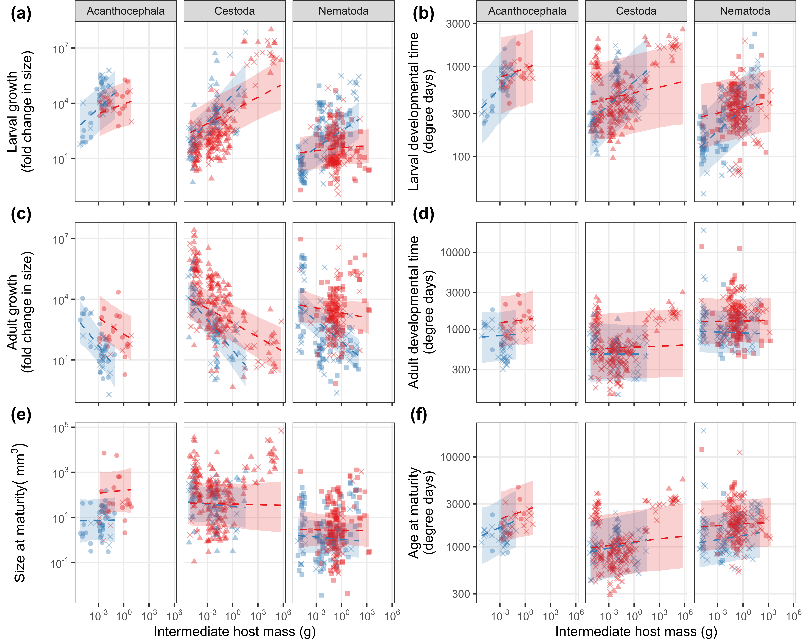
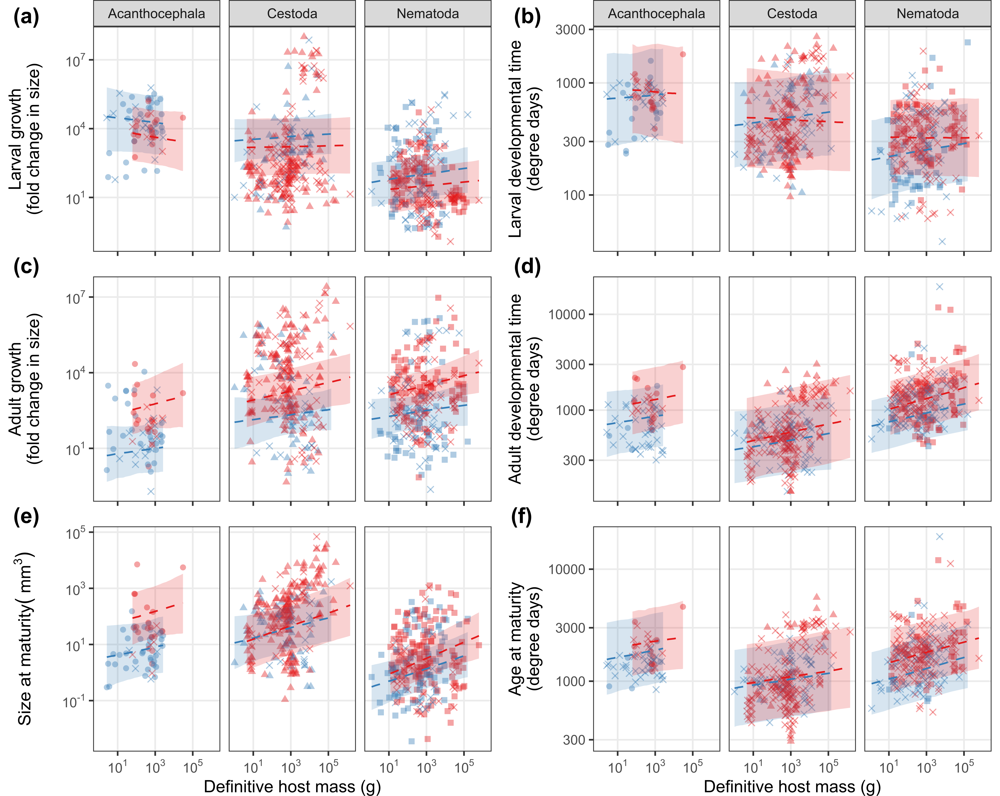

In this repository, I explore how parasitic worms divide their growth and development between successive hosts.

# Background

Parasitic worms like tapeworms, flukes, nematodes and acanthocephalans usually have complex life cycles where they infect multiple hosts in succession. Some parasites grow extensively as adults in their second (definitive) host, whereas others grow extensively as larvae in the first (intermediate) host. What explains this diversity? I explored the evolution of life-history strategies in parasites with two-host life cycles.

# Data

The main data source for this study is a [database](https://esajournals.onlinelibrary.wiley.com/doi/full/10.1002/ecy.1680) I published on the life cycles of parasitic worms. To that, I added data on host mass and trophic level from numerous sources. Taxonomic information was obtained from [NCBI taxonomy](https://www.ncbi.nlm.nih.gov/taxonomy) and the [Open Tree of Life](https://tree.opentreeoflife.org/).

# Results

We found that parasite species with large intermediate hosts were more likely to infect large, endothermic definitive hosts, suggesting some parasites may have access to more energy/resources across the whole life cycle. 

Parasites with complex life cycles are expected to spend more time in the hosts in which they can grow large, fast, and/or safely. Accordingly, helminths with two-host cycles grew less as larvae and more as adults when they infected smaller IHs and larger, endothermic DHs. 

Finally, growing more than expected in one host was not associated with growing less than expected in the next host, suggesting an absence of tradeoffs from one host to the next.

# Reference

To come...
