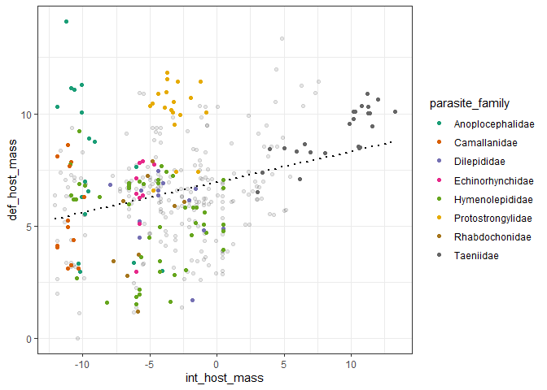
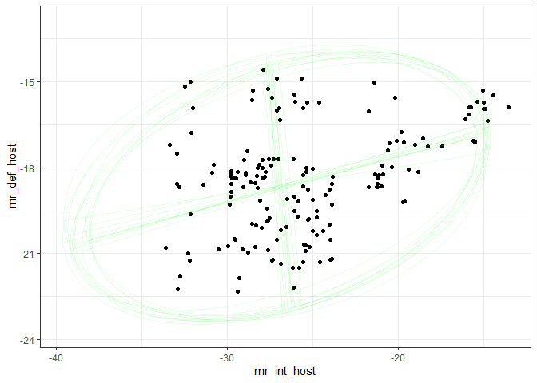
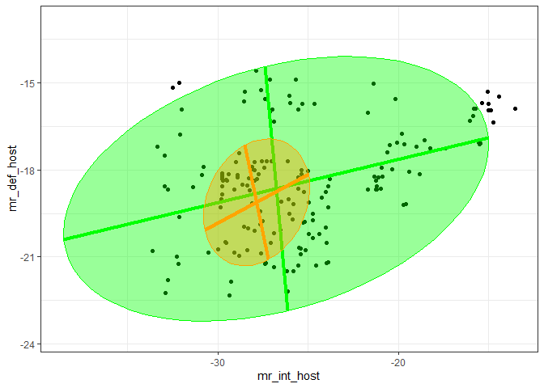

Environmental coupling of parasite stages
================

-   [Descriptives](#descriptives)
-   [Models - environmental coupling between
    stages](#models---environmental-coupling-between-stages)
    -   [Host mass](#host-mass)
        -   [Taxonomic covariance](#taxonomic-covariance)
-   [Intermediate host mass and definitive host
    endothermy](#intermediate-host-mass-and-definitive-host-endothermy)
    -   [Metabolic rate](#metabolic-rate)
-   [Conclusions](#conclusions)

Should we expect parasite larval and adult phenotypes to be correlated?
One reason for them to be correlated is if the kinds of hosts infected
at consecutive life stages are correlated. For example, if big
intermediate hosts are transmitted to big definitive hosts. In this
notebook, we explore whether there is this kind of “environmental”
coupling among parasite stages.

I rearranged the stage level parasite data so that pairs represent
values in the current host and then the next host. For simplicity let’s
restrict ourselves to two stages: first intermediate host and second
definitive host. In other words, we’re only looking at worms with
two-host life cycles.

# Descriptives

Number of species:

| parasite\_phylum | n\_spp |
|:-----------------|-------:|
| Acanthocephala   |     65 |
| Cestoda          |    267 |
| Nematoda         |    265 |

Species with missing data:

| int\_host\_mass | def\_host\_mass |
|----------------:|----------------:|
|             215 |              11 |

Range in intermediate host masses (orders of magnitude)

    ## [1] 11.00731

Range in definitive host masses

    ## [1] 6.122453

Quantiles for IH mass:

    ##     Min.  1st Qu.   Median     Mean  3rd Qu.     Max.     NA's 
    ## -12.0909  -6.3236  -3.7549  -3.2368  -0.7105  13.2544      215

Quantiles for DH mass:

    ##      Min.   1st Qu.    Median      Mean   3rd Qu.      Max.      NA's 
    ##  0.004189  4.648863  6.440296  6.323228  7.648798 14.101657        11

# Models - environmental coupling between stages

## Host mass

We’ll look at whether host quality is correlated among stages - do worms
with large first hosts have large second hosts?

We fit multivariate models with intermediate and definitive host masses
as the two response variables. We fit a series of models: 1)
intercept-only, no covariance between response variables, 2) allow
covariance, i.e. species with big intermediate hosts have big definitive
hosts, 3) add parasite taxonomy, 4) allow taxonomic covariance,
e.g. families with large intermediate hosts have big definitive hosts.
In this last model, I only allow covariance at the genus, family, and
order level, given that there were few classes and phyla (and there was
little variation explained by these taxonomic levels, see below).

A first way to compare these models is to look at the model deviance.
Allowing covariance between intermediate and definitive host mass
slightly improved the model (black vs red models), but this improvement
was small relative to adding taxonomy (green). Clearly different taxa
infect intermediate and definitive hosts of different mass. Allowing
taxonomic covariance (blue) was not a clear improvement.

<!-- -->

Here are the DIC values for the models.

    ## DIC, int-only: 5079.625

    ## DIC, + resid cov: 5043.151

    ## DIC, + taxonomy: 3883.273

    ## DIC, + taxonomic cov: 3880.623

Here is the delta DIC for adding the residual covariance.

    ## Delta DIC, int-only vs res covariance: 36.47417 (higher is better)

And then for adding taxonomy…

    ## Delta DIC, +taxonomy: 1159.878 (higher is better)

…and for adding taxonomic covariance.

    ## Delta DIC, +taxonomic cov in host mass: 2.649941 (higher is better)

The three main groups of parasites do not seem to differ fundamentally
in intermediate or definitive host mass. When we took parasite phylum
from the random to the fixed effects, it did not improve the model. This
can also be seen when we look at what taxonomic levels vary with regards
to host mass.

    ## Delta DIC, +phylum in fixed effects: -0.7889639 (higher is better)

Here is a likelihood ratio test for adding parasite phylum to an
intermediate host model without it. It is not an improvement. The reason
it is even marginally significant is that nematodes tend to infect
slightly bigger intermediate hosts on average.

|     | npar |      AIC |      BIC |    logLik | deviance |    Chisq |  Df | Pr(&gt;Chisq) |
|:----|-----:|---------:|---------:|----------:|---------:|---------:|----:|--------------:|
| lm1 |    6 | 1802.188 | 1825.861 | -895.0942 | 1790.188 |       NA |  NA |            NA |
| lm2 |    8 | 1802.332 | 1833.896 | -893.1662 | 1786.332 | 3.855819 |   2 |      0.145452 |

Here is the same test, but for definitive host mass. Also not
significant.

|     | npar |      AIC |      BIC |    logLik | deviance |    Chisq |  Df | Pr(&gt;Chisq) |
|:----|-----:|---------:|---------:|----------:|---------:|---------:|----:|--------------:|
| lm1 |    6 | 2456.359 | 2482.599 | -1222.179 | 2444.359 |       NA |  NA |            NA |
| lm2 |    8 | 2455.802 | 2490.789 | -1219.901 | 2439.802 | 4.556275 |   2 |     0.1024749 |

We are mainly interested in the coupling (covariance) between
intermediate and definitive host mass. When we look at the model without
worm taxonomy, we see that this covariance is significantly different
from zero, indicating worms with relatively large intermediate hosts
also have relatively large definitive hosts. Also of note: there is
about 4 times as much variance in intermediate host size compared to
definitive host size.

    ## 
    ##  Iterations = 501:30471
    ##  Thinning interval  = 30
    ##  Sample size  = 1000 
    ## 
    ##  DIC: 5043.151 
    ## 
    ##  R-structure:  ~us(trait):units
    ## 
    ##                                             post.mean l-95% CI u-95% CI
    ## traitint_host_mass:traitint_host_mass.units    28.995   25.045   33.337
    ## traitdef_host_mass:traitint_host_mass.units     3.968    2.524    5.162
    ## traitint_host_mass:traitdef_host_mass.units     3.968    2.524    5.162
    ## traitdef_host_mass:traitdef_host_mass.units     5.941    5.286    6.727
    ##                                             eff.samp
    ## traitint_host_mass:traitint_host_mass.units     1000
    ## traitdef_host_mass:traitint_host_mass.units     1000
    ## traitint_host_mass:traitdef_host_mass.units     1000
    ## traitdef_host_mass:traitdef_host_mass.units     1000
    ## 
    ##  Location effects: cbind(int_host_mass, def_host_mass) ~ trait - 1 
    ## 
    ##                    post.mean l-95% CI u-95% CI eff.samp  pMCMC    
    ## traitint_host_mass    -3.351   -3.855   -2.774     1000 <0.001 ***
    ## traitdef_host_mass     6.322    6.103    6.506     1000 <0.001 ***
    ## ---
    ## Signif. codes:  0 '***' 0.001 '**' 0.01 '*' 0.05 '.' 0.1 ' ' 1

When we express it as a correlation instead of a covariance, it is
around 0.3.

    ##           [,1]      [,2]
    ## [1,] 0.9998673 0.3084877
    ## [2,] 0.3084877 0.9998673

We can also express it as a univariate regression coefficient. Here is
the percent increase in definitive host mass with a doubling of
intermediate host mass.

    ## 
    ## Iterations = 501:30471
    ## Thinning interval = 30 
    ## Number of chains = 1 
    ## Sample size per chain = 1000 
    ## 
    ## 1. Empirical mean and standard deviation for each variable,
    ##    plus standard error of the mean:
    ## 
    ##           Mean             SD       Naive SE Time-series SE 
    ##      0.0996008      0.0161305      0.0005101      0.0005101 
    ## 
    ## 2. Quantiles for each variable:
    ## 
    ##    2.5%     25%     50%     75%   97.5% 
    ## 0.06810 0.08899 0.10007 0.11056 0.13061

Here is the percent increase in intermediate host mass with a doubling
of definitive host mass.

    ## 
    ## Iterations = 501:30471
    ## Thinning interval = 30 
    ## Number of chains = 1 
    ## Sample size per chain = 1000 
    ## 
    ## 1. Empirical mean and standard deviation for each variable,
    ##    plus standard error of the mean:
    ## 
    ##           Mean             SD       Naive SE Time-series SE 
    ##       0.593089       0.119032       0.003764       0.003906 
    ## 
    ## 2. Quantiles for each variable:
    ## 
    ##   2.5%    25%    50%    75%  97.5% 
    ## 0.3726 0.5107 0.5882 0.6704 0.8331

Assuming host masses are bivariate normal, we can plot the confidence
ellipse from the trait means and covariance matrix.

The ellipse is longer along the x than the y, indicating that
intermediate host mass varies among species more than definitive host
mass. The upward tilt indicates positive covariance; bigger intermediate
hosts are associated with bigger definitive hosts.

<!-- --> And
the trend appears similar in acanthocephalans, nematodes, and cestodes.

<!-- -->

The last two plots showed the most likely confidence ellipse. It does
not display the variation in the estimated relationship. Let’s draw 10
ellipses using the posterior distribution. The trend in the data is
quite consistent, which is not surprising, since we have not considered
taxonomy yet.

<!-- --> The
plot probably looks better without the ellipses, though.

<!-- -->

We can also make the same plot, but with the axes representing
residuals, i.e. the host sizes relative to expectations.

<!-- -->

When we add taxonomy to the model, the covariance between intermediate
and definitive host mass decreases.

    ##            [,1]       [,2]
    ## [1,] 0.99986728 0.08560265
    ## [2,] 0.08560265 0.99986728

Here’s a plot showing how the addition of taxonomy impacts the
correlation between intermediate and definitive host mass.

<!-- -->

We can visualize the ellipse from the taxonomic model as well. The
orange ellipse shows the residual (species-level) variance and
covariance after accounting for taxonomy. It is much smaller because
taxonomy accounts for considerable variation in both intermediate and
definitive host mass. The covariance also disappears, suggesting
taxonomy explains this correlation as well.

<!-- -->

To gauge how taxonomy might explain the covariance, let’s plot the
biggest taxonomic families. The 8 families with the most species are
color coded in the next plot. The families tend to differ more along the
x-axis than the y-axis, suggesting taxa vary more in their intermediate
hosts than definitive hosts. Also, some families that have big
intermediate hosts have big definitive hosts, suggesting there is
taxonomic covariance among life stages.

<!-- -->

### Taxonomic covariance

Let’s have a closer look at taxonomic covariance. Do parasite families
with large intermediate hosts infect large definitive hosts? Here is the
summary of the model allowing taxonomic covariance. Although this model
was not a clear improvement compared to the model without taxonomic
covariance, the family-level covariance is non-zero.

    ## 
    ##  Iterations = 501:30471
    ##  Thinning interval  = 30
    ##  Sample size  = 1000 
    ## 
    ##  DIC: 3880.623 
    ## 
    ##  G-structure:  ~us(trait):parasite_genus
    ## 
    ##                                                      post.mean l-95% CI
    ## traitint_host_mass:traitint_host_mass.parasite_genus    2.8152    1.720
    ## traitdef_host_mass:traitint_host_mass.parasite_genus   -0.5453   -1.220
    ## traitint_host_mass:traitdef_host_mass.parasite_genus   -0.5453   -1.220
    ## traitdef_host_mass:traitdef_host_mass.parasite_genus    2.0843    1.335
    ##                                                      u-95% CI eff.samp
    ## traitint_host_mass:traitint_host_mass.parasite_genus    4.099   1000.0
    ## traitdef_host_mass:traitint_host_mass.parasite_genus    0.204    849.8
    ## traitint_host_mass:traitdef_host_mass.parasite_genus    0.204    849.8
    ## traitdef_host_mass:traitdef_host_mass.parasite_genus    2.847   1000.0
    ## 
    ##                ~us(trait):parasite_family
    ## 
    ##                                                       post.mean l-95% CI
    ## traitint_host_mass:traitint_host_mass.parasite_family    12.593   7.3695
    ## traitdef_host_mass:traitint_host_mass.parasite_family     1.459  -0.2972
    ## traitint_host_mass:traitdef_host_mass.parasite_family     1.459  -0.2972
    ## traitdef_host_mass:traitdef_host_mass.parasite_family     1.225   0.3319
    ##                                                       u-95% CI eff.samp
    ## traitint_host_mass:traitint_host_mass.parasite_family   18.982    756.7
    ## traitdef_host_mass:traitint_host_mass.parasite_family    3.421    804.6
    ## traitint_host_mass:traitdef_host_mass.parasite_family    3.421    804.6
    ## traitdef_host_mass:traitdef_host_mass.parasite_family    2.315    985.8
    ## 
    ##                ~us(trait):parasite_order
    ## 
    ##                                                      post.mean l-95% CI
    ## traitint_host_mass:traitint_host_mass.parasite_order     6.564  0.08369
    ## traitdef_host_mass:traitint_host_mass.parasite_order     2.173 -0.34003
    ## traitint_host_mass:traitdef_host_mass.parasite_order     2.173 -0.34003
    ## traitdef_host_mass:traitdef_host_mass.parasite_order     1.198  0.10954
    ##                                                      u-95% CI eff.samp
    ## traitint_host_mass:traitint_host_mass.parasite_order   17.245    565.2
    ## traitdef_host_mass:traitint_host_mass.parasite_order    5.865    582.6
    ## traitint_host_mass:traitdef_host_mass.parasite_order    5.865    582.6
    ## traitdef_host_mass:traitdef_host_mass.parasite_order    2.831    788.7
    ## 
    ##                ~idh(trait):parasite_class
    ## 
    ##                                   post.mean l-95% CI u-95% CI eff.samp
    ## traitint_host_mass.parasite_class    0.7418  0.02979   2.9671     1000
    ## traitdef_host_mass.parasite_class    0.2700  0.02664   0.7505     1000
    ## 
    ##                ~idh(trait):parasite_phylum
    ## 
    ##                                    post.mean l-95% CI u-95% CI eff.samp
    ## traitint_host_mass.parasite_phylum    0.8341  0.03263    2.904     1000
    ## traitdef_host_mass.parasite_phylum    0.4326  0.02704    1.288     1000
    ## 
    ##  R-structure:  ~us(trait):units
    ## 
    ##                                             post.mean l-95% CI u-95% CI
    ## traitint_host_mass:traitint_host_mass.units    2.6978   2.1805   3.1919
    ## traitdef_host_mass:traitint_host_mass.units    0.2461  -0.1325   0.5557
    ## traitint_host_mass:traitdef_host_mass.units    0.2461  -0.1325   0.5557
    ## traitdef_host_mass:traitdef_host_mass.units    2.1973   1.8702   2.5500
    ##                                             eff.samp
    ## traitint_host_mass:traitint_host_mass.units     1000
    ## traitdef_host_mass:traitint_host_mass.units     1000
    ## traitint_host_mass:traitdef_host_mass.units     1000
    ## traitdef_host_mass:traitdef_host_mass.units     1116
    ## 
    ##  Location effects: cbind(int_host_mass, def_host_mass) ~ trait - 1 
    ## 
    ##                    post.mean l-95% CI u-95% CI eff.samp  pMCMC    
    ## traitint_host_mass    -3.906   -6.035   -1.981    876.4 <0.001 ***
    ## traitdef_host_mass     6.350    5.295    7.466   1175.9 <0.001 ***
    ## ---
    ## Signif. codes:  0 '***' 0.001 '**' 0.01 '*' 0.05 '.' 0.1 ' ' 1

Since taxonomy is so important, let’s plot how much variance it explains
in intermediate and definitive host mass.

Here is how the variance in intermediate and definitive host mass is
divided among taxonomic levels. Clearly, there is more variance in
intermediate host mass than definitive host mass. It also has a
different taxonomic distribution. IH mass varies more among families; DH
mass varies most among genera.

<!-- -->

Since there is more variance in intermediate host mass than definitive
host mass, we should probably plot the taxonomic variance components
proportionally. That is, what proportion of the total variance can be
explained by taxonomy (i.e. like phylogenetic signal)?

Proportionally more variance in intermediate host mass is explained by
taxonomy than for definitive host mass. Also more variation in
intermediate host mass is explained by taxonomy.

<!-- -->
Since we report some of these values in the ms, here is the proportion
of variance explained by genus,

| t\_level | trait                  | vc.lwr | vc.fit | vc.upr |
|:---------|:-----------------------|-------:|-------:|-------:|
| genus    | intermediate host mass |   0.06 |   0.12 |   0.19 |
| genus    | definitive host mass   |   0.19 |   0.31 |   0.42 |

family,

| t\_level | trait                  | vc.lwr | vc.fit | vc.upr |
|:---------|:-----------------------|-------:|-------:|-------:|
| family   | intermediate host mass |   0.26 |   0.51 |   0.73 |
| family   | definitive host mass   |   0.06 |   0.16 |   0.32 |

and overall.

| t\_level | trait                  | vc.lwr | vc.fit | vc.upr |
|:---------|:-----------------------|-------:|-------:|-------:|
| total    | intermediate host mass |   0.84 |   0.89 |   0.93 |
| total    | definitive host mass   |   0.59 |   0.69 |   0.78 |

Now we look at the correlation between host masses at the taxonomic
level. To see where covariance arises, we add taxonomic levels from root
to tip. For example, we test covariance among orders and then,
controlling for order-level effects, we test whether there is covariance
among parasite families and so on. At each level, we then take averages
for the conditional residuals and plot them, along with the covariance.

First, we can plot how much variance in IH and DH host mass is explained
by adding each taxonomic level. IH mass varies among families, whereas
DH mass varies among and within genera.

<!-- -->

<!-- -->

Here are the taxonomic covariances. The points are conditional
residuals, i.e. values after accounting for all higher-level taxonomic
effects. The black line is the species-level, non-taxonomic covariance.
The more that the points fill the black ellipse, the more variance
attributed to that level. Genera differ in definitive host mass but not
intermediate host mass, so there is no covariance at that level.
Families differ at both levels, particularly in the kinds of
intermediate hosts they infect. There is also covariance at the order
level, but it is variable, because more variance is attributed to lower
levels.

<!-- -->

We can make the same plot but change the axes so that it expresses the
residual values as fold-change from expectations, e.g. 10x
bigger/smaller than expected given the order, family, etc.

<!-- -->

# Intermediate host mass and definitive host endothermy

[Elsewhere](life_history_stragies_rg.md) we found that endothermy also
facilitated parasite growth. So are worms with larger intermediate hosts
also more likely to infect endotherms? To test this, let’s fit a
logistic regression with definitive host endothermy as response and
intermediate host mass as predictor. We do not include worm phylogeny
because it causes problems with parameter estimation due to complete
separation (e.g. worms of a given family or order always infect
endotherms).

The parameter for intermediate host mass is significantly positive,
suggesting larger intermediate hosts are more likely to be transmitted
to endotherm definitive hosts.

    ## 
    ##  Iterations = 501:250251
    ##  Thinning interval  = 250
    ##  Sample size  = 1000 
    ## 
    ##  DIC: 433.9373 
    ## 
    ##  R-structure:  ~units
    ## 
    ##       post.mean l-95% CI u-95% CI eff.samp
    ## units         1        1        1        0
    ## 
    ##  Location effects: endo_def ~ int_host_mass 
    ## 
    ##               post.mean l-95% CI u-95% CI eff.samp  pMCMC    
    ## (Intercept)      1.6510   1.2779   2.0531     1000 <0.001 ***
    ## int_host_mass    0.2146   0.1520   0.2735     1000 <0.001 ***
    ## ---
    ## Signif. codes:  0 '***' 0.001 '**' 0.01 '*' 0.05 '.' 0.1 ' ' 1

Here is the predicted percent increase in the odds of infecting an
endotherm with a doubling of intermediate host mass.

    ## 
    ## Iterations = 501:250251
    ## Thinning interval = 250 
    ## Number of chains = 1 
    ## Sample size per chain = 1000 
    ## 
    ## 1. Empirical mean and standard deviation for each variable,
    ##    plus standard error of the mean:
    ## 
    ##           Mean             SD       Naive SE Time-series SE 
    ##      0.1606182      0.0252950      0.0007999      0.0007999 
    ## 
    ## 2. Quantiles for each variable:
    ## 
    ##   2.5%    25%    50%    75%  97.5% 
    ## 0.1127 0.1437 0.1608 0.1759 0.2131

However this effect is dependent on parasite group; adding a parasite
group by intermediate host mass interaction was a significant
improvement.

<!-- --> In
particular, nematodes and especially cestodes are less likely to infect
an endotherm next host when their intermediate host is large.

    ## 
    ##  Iterations = 501:250251
    ##  Thinning interval  = 250
    ##  Sample size  = 1000 
    ## 
    ##  DIC: 416.9644 
    ## 
    ##  R-structure:  ~units
    ## 
    ##       post.mean l-95% CI u-95% CI eff.samp
    ## units         1        1        1        0
    ## 
    ##  Location effects: endo_def ~ int_host_mass * parasite_phylum 
    ## 
    ##                                       post.mean  l-95% CI  u-95% CI eff.samp
    ## (Intercept)                             8.86750   1.56075  17.73866    231.8
    ## int_host_mass                           1.69041   0.35888   3.20499    223.0
    ## parasite_phylumCestoda                 -7.19024 -16.39067   0.03021    233.0
    ## parasite_phylumNematoda                -7.09436 -15.71916   0.26116    232.8
    ## int_host_mass:parasite_phylumCestoda   -1.55277  -3.05107  -0.17498    223.2
    ## int_host_mass:parasite_phylumNematoda  -1.38233  -2.79287   0.05475    226.0
    ##                                        pMCMC    
    ## (Intercept)                           <0.001 ***
    ## int_host_mass                         <0.001 ***
    ## parasite_phylumCestoda                 0.030 *  
    ## parasite_phylumNematoda                0.028 *  
    ## int_host_mass:parasite_phylumCestoda  <0.001 ***
    ## int_host_mass:parasite_phylumNematoda  0.014 *  
    ## ---
    ## Signif. codes:  0 '***' 0.001 '**' 0.01 '*' 0.05 '.' 0.1 ' ' 1

<!-- --><!-- -->

Here is the predicted percent increase in the odds of infecting an
endotherm with a doubling of worm size for Acanthocephalans.

    ## 
    ## Iterations = 501:250251
    ## Thinning interval = 250 
    ## Number of chains = 1 
    ## Sample size per chain = 1000 
    ## 
    ## 1. Empirical mean and standard deviation for each variable,
    ##    plus standard error of the mean:
    ## 
    ##           Mean             SD       Naive SE Time-series SE 
    ##        2.77059        2.54738        0.08056        0.18628 
    ## 
    ## 2. Quantiles for each variable:
    ## 
    ##    2.5%     25%     50%     75%   97.5% 
    ##  0.4274  1.1856  1.9645  3.3926 10.2014

for nematodes,

    ## 
    ## Iterations = 501:250251
    ## Thinning interval = 250 
    ## Number of chains = 1 
    ## Sample size per chain = 1000 
    ## 
    ## 1. Empirical mean and standard deviation for each variable,
    ##    plus standard error of the mean:
    ## 
    ##           Mean             SD       Naive SE Time-series SE 
    ##       0.238838       0.043999       0.001391       0.001391 
    ## 
    ## 2. Quantiles for each variable:
    ## 
    ##   2.5%    25%    50%    75%  97.5% 
    ## 0.1616 0.2091 0.2355 0.2680 0.3354

and for cestodes.

    ## 
    ## Iterations = 501:250251
    ## Thinning interval = 250 
    ## Number of chains = 1 
    ## Sample size per chain = 1000 
    ## 
    ## 1. Empirical mean and standard deviation for each variable,
    ##    plus standard error of the mean:
    ## 
    ##           Mean             SD       Naive SE Time-series SE 
    ##      0.1005329      0.0306802      0.0009702      0.0009702 
    ## 
    ## 2. Quantiles for each variable:
    ## 
    ##    2.5%     25%     50%     75%   97.5% 
    ## 0.04366 0.07920 0.09895 0.12126 0.16357

These effect sizes were comparable, but a bit lower when estimated with
`glm` instead of `MCMCglmm`.

    ## [1] "Acanths, increase in endotherm odds with doubling IH mass: 1.228 [-0.013 - 4.028]"

    ## [1] "Cestodes, increase in endotherm odds with doubling IH mass: 0.081 [0.032 - 0.134]"

    ## [1] "Nematodes, increase in endotherm odds with doubling IH mass: 0.199 [0.125 - 0.277]"

Let’s plot the pattern. Here are the logistic regressions with the data
put in 10 bins

The pattern is clearest for acanthocephalans. The trend in weak in
cestodes because they generally infect endotherms.
<!-- -->
Alternatively, and perhaps more simply, we can just separate species
with and without an endotherm definitive host.
<!-- -->

## Metabolic rate

Let’s fit the same series of models but with metabolic rate instead of
host mass. Here we want to acknowledge that parasite life history is
also impacted by temperature.

The change in model deviance looks similar to that with host mass, which
is not surprising, since host mass had a stronger impact on metabolic
rate than temperature.

<!-- -->

Here are the DIC values for the models.

    ## DIC, int-only: 3086.865

    ## DIC, + resid cov: 3055.98

    ## DIC, + taxonomy: 2074.282

    ## DIC, + taxonomic cov: 2073.625

Here is the delta DIC for adding the residual covariance.

    ## Delta DIC, int-only vs res covariance: 30.88543 (higher is better)

And then for adding taxonomy…

    ## Delta DIC, +taxonomy: 981.6977 (higher is better)

…and for adding taxonomic covariance.

    ## Delta DIC, +taxonomic cov in host mass: 0.6565563 (higher is better)

The simple non-taxonomic model suggests that the metabolic rate of a
definitive host is about 4000 times that of typical intermediate host.

    ## 
    ## Iterations = 501:30471
    ## Thinning interval = 30 
    ## Number of chains = 1 
    ## Sample size per chain = 1000 
    ## 
    ## 1. Empirical mean and standard deviation for each variable,
    ##    plus standard error of the mean:
    ## 
    ##           Mean             SD       Naive SE Time-series SE 
    ##        3520.91        1121.04          35.45          35.45 
    ## 
    ## 2. Quantiles for each variable:
    ## 
    ##  2.5%   25%   50%   75% 97.5% 
    ##  1810  2740  3364  4099  6128

This effect is just as large but more variable when we account for
taxonomy.

    ## 
    ## Iterations = 501:30471
    ## Thinning interval = 30 
    ## Number of chains = 1 
    ## Sample size per chain = 1000 
    ## 
    ## 1. Empirical mean and standard deviation for each variable,
    ##    plus standard error of the mean:
    ## 
    ##           Mean             SD       Naive SE Time-series SE 
    ##          13500          34465           1090           1090 
    ## 
    ## 2. Quantiles for each variable:
    ## 
    ##    2.5%     25%     50%     75%   97.5% 
    ##   891.9  3799.0  7130.1 13793.4 55059.4

The metabolic rate of intermediate and definitive hosts are correlated,
partly because big intermediate hosts are associated with big definitive
hosts, but also because bigger intermediate hosts are more likely to be
associated with endotherm definitive hosts. Consequently, the
correlation for metabolic rate is a bit higher than for host mass.

    ##           [,1]      [,2]
    ## [1,] 0.9998673 0.4141174
    ## [2,] 0.4141174 0.9998673

If we assume bivariate normality, we can plot the confidence ellipse
from the trait means and covariance matrix.

Variance and covariance in metabolic rates mirror those for host mass.

<!-- -->

But, again, when we add taxonomy to the model it decreases to around
zero.

    ##           [,1]      [,2]
    ## [1,] 0.9998673 0.1654405
    ## [2,] 0.1654405 0.9998673

We can again plot those correlations - the correlation between
intermediate host MR and definitive host MR mirrors that for host mass,
though the species-level correlation is a little stronger for MR than
mass.

<!-- -->

When we plot the species-level confidence ellipse after accounting for
taxonomy, we again see the ellipse shrink, because taxonomy explains
considerable variation in host MR.

<!-- -->

To gauge how taxonomy might explain the covariance, let’s plot the
biggest taxonomic families. The 8 families with the most species are
color coded in the next plot. The families tend to differ more along the
x-axis than the y-axis, suggesting taxa vary more in their intermediate
hosts than definitive hosts. Also, some families that have big
intermediate hosts have big definitive hosts, suggesting there is
taxonomic covariance among life stages.

<!-- -->

Let’s have a closer look at taxonomic covariance. Do parasite families
with large intermediate hosts infect large definitive hosts? Here is the
summary of the model allowing taxonomic covariance. Although this model
was not a clear improvement compared to the model without taxonomic
covariance, the family-level covariance is non-zero.

    ## 
    ##  Iterations = 501:30471
    ##  Thinning interval  = 30
    ##  Sample size  = 1000 
    ## 
    ##  DIC: 2073.625 
    ## 
    ##  G-structure:  ~us(trait):parasite_genus
    ## 
    ##                                                  post.mean l-95% CI u-95% CI
    ## traitmr_int_host:traitmr_int_host.parasite_genus     2.053   1.0047    3.160
    ## traitmr_def_host:traitmr_int_host.parasite_genus    -0.260  -0.9348    0.345
    ## traitmr_int_host:traitmr_def_host.parasite_genus    -0.260  -0.9348    0.345
    ## traitmr_def_host:traitmr_def_host.parasite_genus     1.840   1.3038    2.379
    ##                                                  eff.samp
    ## traitmr_int_host:traitmr_int_host.parasite_genus    591.4
    ## traitmr_def_host:traitmr_int_host.parasite_genus    668.3
    ## traitmr_int_host:traitmr_def_host.parasite_genus    668.3
    ## traitmr_def_host:traitmr_def_host.parasite_genus    890.1
    ## 
    ##                ~us(trait):parasite_family
    ## 
    ##                                                   post.mean l-95% CI u-95% CI
    ## traitmr_int_host:traitmr_int_host.parasite_family    9.7716  5.04060   15.241
    ## traitmr_def_host:traitmr_int_host.parasite_family    1.1591 -0.40124    2.749
    ## traitmr_int_host:traitmr_def_host.parasite_family    1.1591 -0.40124    2.749
    ## traitmr_def_host:traitmr_def_host.parasite_family    0.6288  0.07904    1.276
    ##                                                   eff.samp
    ## traitmr_int_host:traitmr_int_host.parasite_family    587.9
    ## traitmr_def_host:traitmr_int_host.parasite_family    434.0
    ## traitmr_int_host:traitmr_def_host.parasite_family    434.0
    ## traitmr_def_host:traitmr_def_host.parasite_family    529.0
    ## 
    ##                ~us(trait):parasite_order
    ## 
    ##                                                  post.mean l-95% CI u-95% CI
    ## traitmr_int_host:traitmr_int_host.parasite_order    2.1013  0.05299    6.765
    ## traitmr_def_host:traitmr_int_host.parasite_order    0.6786 -0.86063    2.764
    ## traitmr_int_host:traitmr_def_host.parasite_order    0.6786 -0.86063    2.764
    ## traitmr_def_host:traitmr_def_host.parasite_order    1.0361  0.11588    2.538
    ##                                                  eff.samp
    ## traitmr_int_host:traitmr_int_host.parasite_order    455.4
    ## traitmr_def_host:traitmr_int_host.parasite_order    537.8
    ## traitmr_int_host:traitmr_def_host.parasite_order    537.8
    ## traitmr_def_host:traitmr_def_host.parasite_order    870.9
    ## 
    ##                ~idh(trait):parasite_class
    ## 
    ##                                 post.mean l-95% CI u-95% CI eff.samp
    ## traitmr_int_host.parasite_class    0.6003  0.03479    2.274     1000
    ## traitmr_def_host.parasite_class    0.2761  0.03239    0.811     1000
    ## 
    ##                ~idh(trait):parasite_phylum
    ## 
    ##                                  post.mean l-95% CI u-95% CI eff.samp
    ## traitmr_int_host.parasite_phylum    0.7177  0.02787    2.412    802.1
    ## traitmr_def_host.parasite_phylum    0.3780  0.02821    1.144   1000.0
    ## 
    ##  R-structure:  ~us(trait):units
    ## 
    ##                                         post.mean   l-95% CI u-95% CI eff.samp
    ## traitmr_int_host:traitmr_int_host.units    1.5422  1.1967557   1.9801    854.1
    ## traitmr_def_host:traitmr_int_host.units    0.2247 -0.0009013   0.4541    848.8
    ## traitmr_int_host:traitmr_def_host.units    0.2247 -0.0009013   0.4541    848.8
    ## traitmr_def_host:traitmr_def_host.units    0.8403  0.6870346   1.0065   1000.0
    ## 
    ##  Location effects: cbind(mr_int_host, mr_def_host) ~ trait - 1 
    ## 
    ##                  post.mean l-95% CI u-95% CI eff.samp  pMCMC    
    ## traitmr_int_host    -27.78   -29.46   -25.82    717.5 <0.001 ***
    ## traitmr_def_host    -19.09   -20.10   -18.01   1000.0 <0.001 ***
    ## ---
    ## Signif. codes:  0 '***' 0.001 '**' 0.01 '*' 0.05 '.' 0.1 ' ' 1

Since taxonomy is so important, let’s plot how much variance it explains
in intermediate and definitive host MR.

Here is how the variance in intermediate and definitive host MR is
divided among taxonomic levels. Clearly, there is more taxonomic
variance in intermediate host MR than definitive host MR. It also has a
different taxonomic distribution. IH mass varies more among families; DH
mass varies most among genera.

<!-- -->

We can also express this plot proportionally. That is, what proportion
of the total variance can be explained by taxonomy (i.e. like
phylogenetic signal)?

The pattern is similar to that for host mass.

<!-- -->

# Conclusions

Parasite species with two-host life cycles infect a wider range of
intermediate hosts than definitive hosts (sizes). Also, species that
infect larger intermediate hosts tend to infect larger definitive hosts.
This correlation arises because families tend to infect different sized
intermediate hosts, suggestive of niche conservatism.
