Environmental coupling of parasite stages
================

-   [Descriptives](#descriptives)
-   [Models - environmental coupling between
    stages](#models---environmental-coupling-between-stages)
    -   [Host mass](#host-mass)
        -   [Taxonomic covariance](#taxonomic-covariance)
-   [Intermediate host mass and definitive host
    endothermy](#intermediate-host-mass-and-definitive-host-endothermy)
-   [Conclusions](#conclusions)

Should we expect parasite larval and adult phenotypes to be correlated?
One reason for them to be correlated is if the kinds of hosts infected
at consecutive life stages are correlated. For example, if big
intermediate hosts are transmitted to big definitive hosts. In this
notebook, we explore whether there is this kind of “environmental”
coupling among parasite stages.

For simplicity let’s restrict ourselves to two stages: first
intermediate host and second definitive host. In other words, we’re only
looking at worms with two-host life cycles.

I rearranged the stage-level parasite data so that pairs represent
values in the current host and then the next host.

# Descriptives

Number of species:

| parasite\_phylum | n\_spp | n\_fams |
|:-----------------|-------:|--------:|
| Acanthocephala   |     65 |      15 |
| Cestoda          |    267 |      28 |
| Nematoda         |    265 |      43 |

Species with missing data:

| int\_host\_mass | def\_host\_mass |
|----------------:|----------------:|
|             215 |              11 |

Range in intermediate host masses (orders of magnitude)

    ## [1] 11.00731

Range in definitive host masses

    ## [1] 6.157578

Quantiles for IH mass:

    ##    Min. 1st Qu.  Median    Mean 3rd Qu.    Max. 
    ## -12.091  -6.544  -4.128  -3.823  -1.207  13.254

Quantiles for DH mass:

    ##      Min.   1st Qu.    Median      Mean   3rd Qu.      Max. 
    ##  0.004189  4.591460  6.382258  6.327452  7.680859 14.182536

# Models - environmental coupling between stages

## Host mass

We’ll look at whether host quality is correlated among stages - do worms
with large first hosts have large second hosts?

We fit multivariate models with intermediate and definitive host masses
as the two response variables. We fit a series of models: 1)
intercept-only, no covariance between response variables, 2) allow
covariance, i.e. species with big intermediate hosts have big definitive
hosts, 3) add parasite taxonomy, 4) allow taxonomic covariance,
e.g. families with large intermediate hosts have big definitive hosts.
In this last model, I only allow covariance at the genus, family, and
order level, given that there were few classes and phyla (and there was
little variation explained by these taxonomic levels, see below).

    ## [1] "imputation 1 finished"
    ## [1] "imputation 2 finished"
    ## [1] "imputation 3 finished"
    ## [1] "imputation 4 finished"
    ## [1] "imputation 5 finished"
    ## [1] "imputation 6 finished"
    ## [1] "imputation 7 finished"
    ## [1] "imputation 8 finished"
    ## [1] "imputation 9 finished"
    ## [1] "imputation 10 finished"
    ## [1] "imputation 11 finished"
    ## [1] "imputation 12 finished"
    ## [1] "imputation 13 finished"
    ## [1] "imputation 14 finished"
    ## [1] "imputation 15 finished"
    ## [1] "imputation 16 finished"
    ## [1] "imputation 17 finished"
    ## [1] "imputation 18 finished"
    ## [1] "imputation 19 finished"
    ## [1] "imputation 20 finished"
    ## [1] "imputation 21 finished"
    ## [1] "imputation 22 finished"
    ## [1] "imputation 23 finished"
    ## [1] "imputation 24 finished"
    ## [1] "imputation 25 finished"
    ## [1] "imputation 26 finished"
    ## [1] "imputation 27 finished"
    ## [1] "imputation 28 finished"
    ## [1] "imputation 29 finished"
    ## [1] "imputation 30 finished"
    ## [1] "imputation 31 finished"
    ## [1] "imputation 32 finished"
    ## [1] "imputation 33 finished"
    ## [1] "imputation 34 finished"
    ## [1] "imputation 35 finished"
    ## [1] "imputation 36 finished"
    ## [1] "imputation 37 finished"
    ## [1] "imputation 38 finished"
    ## [1] "imputation 39 finished"
    ## [1] "imputation 40 finished"
    ## [1] "imputation 41 finished"
    ## [1] "imputation 42 finished"
    ## [1] "imputation 43 finished"
    ## [1] "imputation 44 finished"
    ## [1] "imputation 45 finished"
    ## [1] "imputation 46 finished"
    ## [1] "imputation 47 finished"
    ## [1] "imputation 48 finished"
    ## [1] "imputation 49 finished"
    ## [1] "imputation 50 finished"
    ## [1] "imputation 51 finished"
    ## [1] "imputation 52 finished"
    ## [1] "imputation 53 finished"
    ## [1] "imputation 54 finished"
    ## [1] "imputation 55 finished"
    ## [1] "imputation 56 finished"
    ## [1] "imputation 57 finished"
    ## [1] "imputation 58 finished"
    ## [1] "imputation 59 finished"
    ## [1] "imputation 60 finished"
    ## [1] "imputation 61 finished"
    ## [1] "imputation 62 finished"
    ## [1] "imputation 63 finished"
    ## [1] "imputation 64 finished"
    ## [1] "imputation 65 finished"
    ## [1] "imputation 66 finished"
    ## [1] "imputation 67 finished"
    ## [1] "imputation 68 finished"
    ## [1] "imputation 69 finished"
    ## [1] "imputation 70 finished"
    ## [1] "imputation 71 finished"
    ## [1] "imputation 72 finished"
    ## [1] "imputation 73 finished"
    ## [1] "imputation 74 finished"
    ## [1] "imputation 75 finished"
    ## [1] "imputation 76 finished"
    ## [1] "imputation 77 finished"
    ## [1] "imputation 78 finished"
    ## [1] "imputation 79 finished"
    ## [1] "imputation 80 finished"
    ## [1] "imputation 81 finished"
    ## [1] "imputation 82 finished"
    ## [1] "imputation 83 finished"
    ## [1] "imputation 84 finished"
    ## [1] "imputation 85 finished"
    ## [1] "imputation 86 finished"
    ## [1] "imputation 87 finished"
    ## [1] "imputation 88 finished"
    ## [1] "imputation 89 finished"
    ## [1] "imputation 90 finished"
    ## [1] "imputation 91 finished"
    ## [1] "imputation 92 finished"
    ## [1] "imputation 93 finished"
    ## [1] "imputation 94 finished"
    ## [1] "imputation 95 finished"
    ## [1] "imputation 96 finished"
    ## [1] "imputation 97 finished"
    ## [1] "imputation 98 finished"
    ## [1] "imputation 99 finished"
    ## [1] "imputation 100 finished"

A first way to compare these models is to look at the model deviance.
Allowing covariance between intermediate and definitive host mass
slightly improved the model (black vs red models), but this improvement
was small relative to adding taxonomy (green). Clearly different taxa
infect intermediate and definitive hosts of different mass. Allowing
taxonomic covariance (blue) was not a clear improvement.

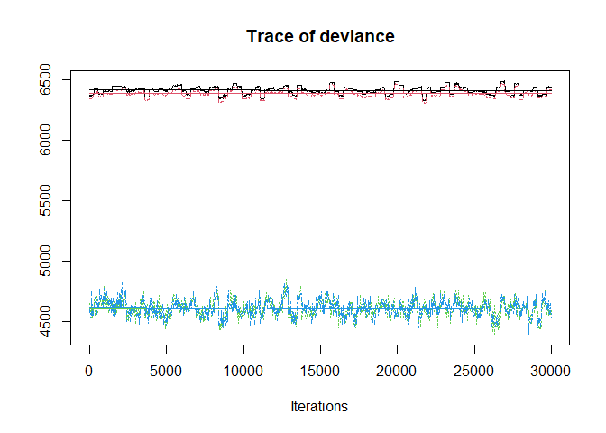<!-- -->

Here are the DIC values for the models.

    ## DIC, int-only: 6414.67

    ## DIC, host number (cont); 6389.321

    ## DIC, host number (cat); 4963.328

    ## DIC, host number (cat); 4961.758

Here is the delta DIC for adding the residual covariance.

    ## Delta DIC, int-only vs res covariance: 25.34919 (higher is better)

And then for adding taxonomy…

    ## Delta DIC, +taxonomy: 1425.993 (higher is better)

…and for adding taxonomic covariance.

    ## Delta DIC, +taxonomic cov in host mass: 1.569826 (higher is better)

The three main groups of parasites do not seem to differ fundamentally
in intermediate or definitive host mass. When we took parasite phylum
from the random to the fixed effects, it did not improve the model. This
can also be seen when we look at what taxonomic levels vary with regards
to host mass.

    ## Delta DIC, +phylum in fixed effects: 0.06830714 (higher is better)

We are mainly interested in the coupling (covariance) between
intermediate and definitive host mass.

When we look at the model without worm taxonomy, we see that this
covariance is significantly different from zero, indicating worms with
relatively large intermediate hosts also have relatively large
definitive hosts. Also of note: there is about 4 times as much variance
in intermediate host size compared to definitive host size.

    ## 
    ## Iterations = 1:29971
    ## Thinning interval = 30 
    ## Number of chains = 1 
    ## Sample size per chain = 1000 
    ## 
    ## 1. Empirical mean and standard deviation for each variable,
    ##    plus standard error of the mean:
    ## 
    ##                                               Mean     SD Naive SE
    ## traitint_host_mass:traitint_host_mass.units 24.423 1.5137  0.04787
    ## traitdef_host_mass:traitint_host_mass.units  2.646 0.6374  0.02016
    ## traitint_host_mass:traitdef_host_mass.units  2.646 0.6374  0.02016
    ## traitdef_host_mass:traitdef_host_mass.units  6.517 0.4709  0.01489
    ##                                             Time-series SE
    ## traitint_host_mass:traitint_host_mass.units        0.06517
    ## traitdef_host_mass:traitint_host_mass.units        0.03894
    ## traitint_host_mass:traitdef_host_mass.units        0.03894
    ## traitdef_host_mass:traitdef_host_mass.units        0.03150
    ## 
    ## 2. Quantiles for each variable:
    ## 
    ##                                               2.5%    25%    50%    75%  97.5%
    ## traitint_host_mass:traitint_host_mass.units 21.672 23.440 24.374 25.390 27.506
    ## traitdef_host_mass:traitint_host_mass.units  1.409  2.205  2.653  3.066  3.892
    ## traitint_host_mass:traitdef_host_mass.units  1.409  2.205  2.653  3.066  3.892
    ## traitdef_host_mass:traitdef_host_mass.units  5.721  6.162  6.484  6.839  7.522

When we express it as a correlation instead of a covariance, it is
around 0.2.

    ## 
    ## Iterations = 1:1000
    ## Thinning interval = 1 
    ## Number of chains = 1 
    ## Sample size per chain = 1000 
    ## 
    ## 1. Empirical mean and standard deviation for each variable,
    ##    plus standard error of the mean:
    ## 
    ##        Mean      SD Naive SE Time-series SE
    ## [1,] 1.0000 0.00000 0.000000       0.000000
    ## [2,] 0.2095 0.04778 0.001511       0.002973
    ## [3,] 0.2095 0.04778 0.001511       0.002973
    ## [4,] 1.0000 0.00000 0.000000       0.000000
    ## 
    ## 2. Quantiles for each variable:
    ## 
    ##        2.5%   25%    50%    75%  97.5%
    ## var1 1.0000 1.000 1.0000 1.0000 1.0000
    ## var2 0.1141 0.177 0.2105 0.2409 0.3017
    ## var3 0.1141 0.177 0.2105 0.2409 0.3017
    ## var4 1.0000 1.000 1.0000 1.0000 1.0000

We can also express it as a univariate regression coefficient. Here is
the percent increase in definitive host mass with a doubling of
intermediate host mass.

    ## 
    ## Iterations = 1:29971
    ## Thinning interval = 30 
    ## Number of chains = 1 
    ## Sample size per chain = 1000 
    ## 
    ## 1. Empirical mean and standard deviation for each variable,
    ##    plus standard error of the mean:
    ## 
    ##           Mean             SD       Naive SE Time-series SE 
    ##      0.0781432      0.0188544      0.0005962      0.0012094 
    ## 
    ## 2. Quantiles for each variable:
    ## 
    ##    2.5%     25%     50%     75%   97.5% 
    ## 0.04133 0.06583 0.07817 0.09032 0.11423

Here is the percent increase in intermediate host mass with a doubling
of definitive host mass.

    ## 
    ## Iterations = 1:29971
    ## Thinning interval = 30 
    ## Number of chains = 1 
    ## Sample size per chain = 1000 
    ## 
    ## 1. Empirical mean and standard deviation for each variable,
    ##    plus standard error of the mean:
    ## 
    ##           Mean             SD       Naive SE Time-series SE 
    ##       0.328065       0.087766       0.002775       0.004857 
    ## 
    ## 2. Quantiles for each variable:
    ## 
    ##   2.5%    25%    50%    75%  97.5% 
    ## 0.1640 0.2667 0.3228 0.3849 0.5143

Assuming host masses are bivariate normal, we can plot the confidence
ellipse from the trait means and covariance matrix.

The ellipse is longer along the x than the y, indicating that
intermediate host mass varies among species more than definitive host
mass. The upward tilt indicates positive covariance; bigger intermediate
hosts are associated with bigger definitive hosts.

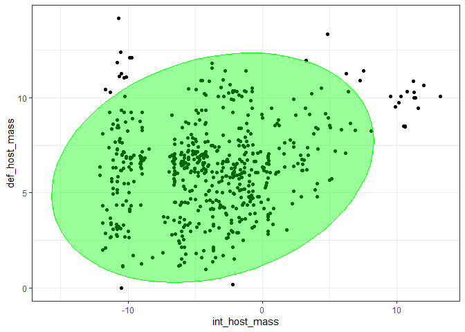<!-- -->
And the trend appears similar in acanthocephalans, nematodes, and
cestodes.

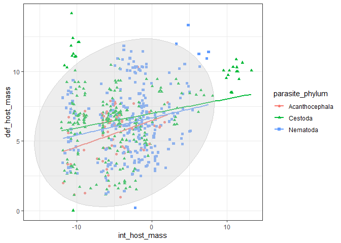<!-- -->

The last two plots showed the most likely confidence ellipse. It does
not display the variation in the estimated relationship? Let’s draw 10
ellipses using the posterior distribution. The trend in the data is
quite consistent, which is not surprising, since we have not considered
taxonomy yet.

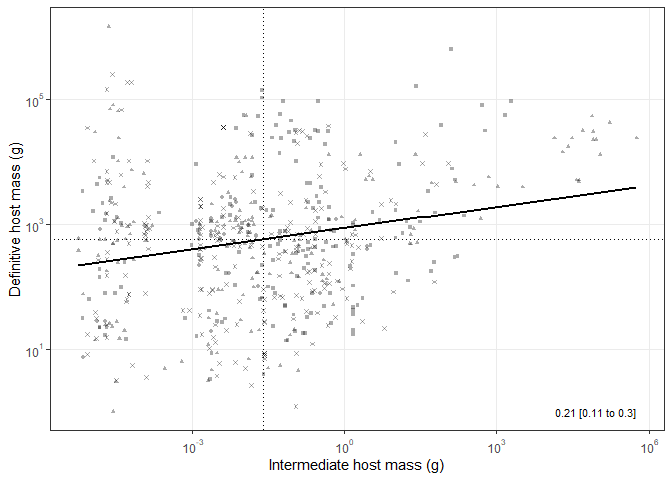<!-- -->

We can also make the same plot, but with the axes representing
residuals, i.e. the host sizes relative to expectations.
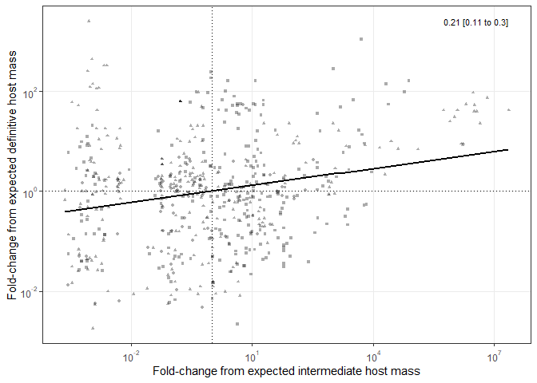<!-- -->

When we add taxonomy to the model, the covariance between intermediate
and definitive host mass decreases to around zero.

    ## 
    ## Iterations = 1:1000
    ## Thinning interval = 1 
    ## Number of chains = 1 
    ## Sample size per chain = 1000 
    ## 
    ## 1. Empirical mean and standard deviation for each variable,
    ##    plus standard error of the mean:
    ## 
    ##         Mean      SD Naive SE Time-series SE
    ## [1,] 1.00000 0.00000  0.00000       0.000000
    ## [2,] 0.02011 0.06229  0.00197       0.003275
    ## [3,] 0.02011 0.06229  0.00197       0.003275
    ## [4,] 1.00000 0.00000  0.00000       0.000000
    ## 
    ## 2. Quantiles for each variable:
    ## 
    ##          2.5%      25%    50%     75%  97.5%
    ## var1  1.00000  1.00000 1.0000 1.00000 1.0000
    ## var2 -0.09928 -0.02168 0.0184 0.06113 0.1353
    ## var3 -0.09928 -0.02168 0.0184 0.06113 0.1353
    ## var4  1.00000  1.00000 1.0000 1.00000 1.0000

Here’s a plot showing how the addition of taxonomy impacts the
correlation between intermediate and definitive host mass.

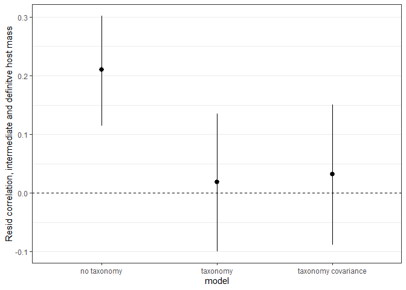<!-- -->

We can visualize the ellipse from the taxonomic model as well. The
orange ellipse shows the residual (species-level) variance and
covariance after accounting for taxonomy. It is much smaller because
taxonomy accounts for considerable variation in both intermediate and
definitive host mass. The covariance also disappears, suggesting
taxonomy explains this correlation as well.

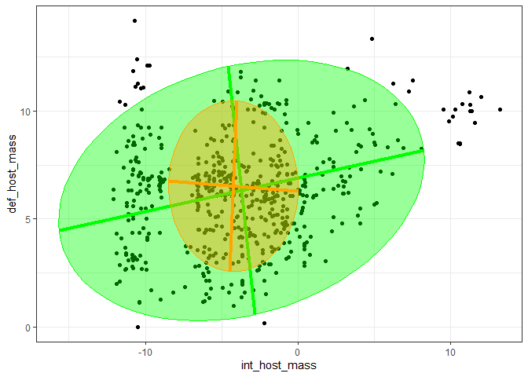<!-- -->

To gauge how taxonomy might explain the covariance, let’s plot the
biggest taxonomic families. The 8 families with the most species are
color coded in the next plot. The families tend to differ more along the
x-axis than the y-axis, suggesting taxa vary more in their intermediate
hosts than definitive hosts. Also, some families that have big
intermediate hosts have big definitive hosts, suggesting there is
taxonomic covariance among life stages.

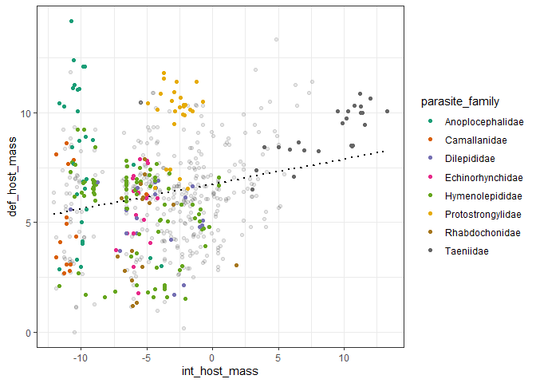<!-- -->

### Taxonomic covariance

Let’s have a closer look at taxonomic covariance. Do parasite families
with large intermediate hosts infect large definitive hosts? Here is the
summary of the model allowing taxonomic covariance. Although this model
was not a clear improvement compared to the model without taxonomic
covariance, the family-level covariance is non-zero.

    ## 
    ## Iterations = 1:29971
    ## Thinning interval = 30 
    ## Number of chains = 1 
    ## Sample size per chain = 1000 
    ## 
    ## 1. Empirical mean and standard deviation for each variable,
    ##    plus standard error of the mean:
    ## 
    ##                                                          Mean     SD Naive SE
    ## traitint_host_mass:traitint_host_mass.parasite_genus   2.9696 0.5661 0.017902
    ## traitdef_host_mass:traitint_host_mass.parasite_genus  -0.4160 0.3640 0.011510
    ## traitint_host_mass:traitdef_host_mass.parasite_genus  -0.4160 0.3640 0.011510
    ## traitdef_host_mass:traitdef_host_mass.parasite_genus   2.0990 0.4935 0.015605
    ## traitint_host_mass:traitint_host_mass.parasite_family 12.8579 3.0249 0.095657
    ## traitdef_host_mass:traitint_host_mass.parasite_family  1.8098 1.0098 0.031932
    ## traitint_host_mass:traitdef_host_mass.parasite_family  1.8098 1.0098 0.031932
    ## traitdef_host_mass:traitdef_host_mass.parasite_family  1.3862 0.6420 0.020302
    ## traitint_host_mass:traitint_host_mass.parasite_order   5.0372 4.3942 0.138956
    ## traitdef_host_mass:traitint_host_mass.parasite_order   1.9276 1.5990 0.050566
    ## traitint_host_mass:traitdef_host_mass.parasite_order   1.9276 1.5990 0.050566
    ## traitdef_host_mass:traitdef_host_mass.parasite_order   1.1815 0.8428 0.026652
    ## traitint_host_mass.parasite_class                      0.7453 1.6163 0.051113
    ## traitdef_host_mass.parasite_class                      0.2911 0.3180 0.010057
    ## traitint_host_mass.parasite_phylum                     0.7992 1.8184 0.057504
    ## traitdef_host_mass.parasite_phylum                     0.4561 0.7350 0.023243
    ## traitint_host_mass:traitint_host_mass.units            2.9594 0.2757 0.008719
    ## traitdef_host_mass:traitint_host_mass.units            0.0884 0.1780 0.005628
    ## traitint_host_mass:traitdef_host_mass.units            0.0884 0.1780 0.005628
    ## traitdef_host_mass:traitdef_host_mass.units            2.6725 0.2752 0.008702
    ##                                                       Time-series SE
    ## traitint_host_mass:traitint_host_mass.parasite_genus         0.02705
    ## traitdef_host_mass:traitint_host_mass.parasite_genus         0.01626
    ## traitint_host_mass:traitdef_host_mass.parasite_genus         0.01626
    ## traitdef_host_mass:traitdef_host_mass.parasite_genus         0.03307
    ## traitint_host_mass:traitint_host_mass.parasite_family        0.10597
    ## traitdef_host_mass:traitint_host_mass.parasite_family        0.04598
    ## traitint_host_mass:traitdef_host_mass.parasite_family        0.04598
    ## traitdef_host_mass:traitdef_host_mass.parasite_family        0.03473
    ## traitint_host_mass:traitint_host_mass.parasite_order         0.14685
    ## traitdef_host_mass:traitint_host_mass.parasite_order         0.05057
    ## traitint_host_mass:traitdef_host_mass.parasite_order         0.05057
    ## traitdef_host_mass:traitdef_host_mass.parasite_order         0.02665
    ## traitint_host_mass.parasite_class                            0.05469
    ## traitdef_host_mass.parasite_class                            0.01068
    ## traitint_host_mass.parasite_phylum                           0.05750
    ## traitdef_host_mass.parasite_phylum                           0.02324
    ## traitint_host_mass:traitint_host_mass.units                  0.01487
    ## traitdef_host_mass:traitint_host_mass.units                  0.01054
    ## traitint_host_mass:traitdef_host_mass.units                  0.01054
    ## traitdef_host_mass:traitdef_host_mass.units                  0.02185
    ## 
    ## 2. Quantiles for each variable:
    ## 
    ##                                                           2.5%      25%
    ## traitint_host_mass:traitint_host_mass.parasite_genus   2.02914  2.55085
    ## traitdef_host_mass:traitint_host_mass.parasite_genus  -1.13984 -0.65265
    ## traitint_host_mass:traitdef_host_mass.parasite_genus  -1.13984 -0.65265
    ## traitdef_host_mass:traitdef_host_mass.parasite_genus   1.22963  1.73884
    ## traitint_host_mass:traitint_host_mass.parasite_family  8.10542 10.56087
    ## traitdef_host_mass:traitint_host_mass.parasite_family  0.03517  1.10217
    ## traitint_host_mass:traitdef_host_mass.parasite_family  0.03517  1.10217
    ## traitdef_host_mass:traitdef_host_mass.parasite_family  0.37346  0.92745
    ## traitint_host_mass:traitint_host_mass.parasite_order   0.26302  1.85420
    ## traitdef_host_mass:traitint_host_mass.parasite_order  -0.02203  0.80471
    ## traitint_host_mass:traitdef_host_mass.parasite_order  -0.02203  0.80471
    ## traitdef_host_mass:traitdef_host_mass.parasite_order   0.17957  0.58426
    ## traitint_host_mass.parasite_class                      0.05773  0.15083
    ## traitdef_host_mass.parasite_class                      0.05023  0.11616
    ## traitint_host_mass.parasite_phylum                     0.05986  0.15743
    ## traitdef_host_mass.parasite_phylum                     0.04875  0.13480
    ## traitint_host_mass:traitint_host_mass.units            2.43336  2.76848
    ## traitdef_host_mass:traitint_host_mass.units           -0.25321 -0.03089
    ## traitint_host_mass:traitdef_host_mass.units           -0.25321 -0.03089
    ## traitdef_host_mass:traitdef_host_mass.units            2.16940  2.48361
    ##                                                            50%     75%   97.5%
    ## traitint_host_mass:traitint_host_mass.parasite_genus   2.91585  3.3328  4.1100
    ## traitdef_host_mass:traitint_host_mass.parasite_genus  -0.41210 -0.1702  0.2622
    ## traitint_host_mass:traitdef_host_mass.parasite_genus  -0.41210 -0.1702  0.2622
    ## traitdef_host_mass:traitdef_host_mass.parasite_genus   2.06361  2.3902  3.1817
    ## traitint_host_mass:traitint_host_mass.parasite_family 12.54078 14.7457 19.6987
    ## traitdef_host_mass:traitint_host_mass.parasite_family  1.75549  2.3906  4.0608
    ## traitint_host_mass:traitdef_host_mass.parasite_family  1.75549  2.3906  4.0608
    ## traitdef_host_mass:traitdef_host_mass.parasite_family  1.29969  1.7100  2.9222
    ## traitint_host_mass:traitint_host_mass.parasite_order   3.92710  6.9061 16.1175
    ## traitdef_host_mass:traitint_host_mass.parasite_order   1.52273  2.6386  5.8282
    ## traitint_host_mass:traitdef_host_mass.parasite_order   1.52273  2.6386  5.8282
    ## traitdef_host_mass:traitdef_host_mass.parasite_order   0.97517  1.5395  3.3439
    ## traitint_host_mass.parasite_class                      0.30402  0.7264  3.7846
    ## traitdef_host_mass.parasite_class                      0.18297  0.3403  1.0776
    ## traitint_host_mass.parasite_phylum                     0.32443  0.6840  5.0734
    ## traitdef_host_mass.parasite_phylum                     0.24349  0.4951  2.1651
    ## traitint_host_mass:traitint_host_mass.units            2.95027  3.1442  3.5448
    ## traitdef_host_mass:traitint_host_mass.units            0.08768  0.2060  0.4352
    ## traitint_host_mass:traitdef_host_mass.units            0.08768  0.2060  0.4352
    ## traitdef_host_mass:traitdef_host_mass.units            2.66455  2.8463  3.2256

Since taxonomy is so important, let’s plot how much variance it explains
in intermediate and definitive host mass.

Here is how the variance in intermediate and definitive host mass is
divided among taxonomic levels. Clearly, there is more variance in
intermediate host mass than definitive host mass. It also has a
different taxonomic distribution. IH mass varies more among families; DH
mass varies most among genera.

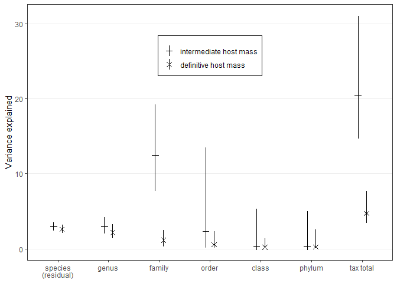<!-- -->

Since there is more variance in intermediate host mass than definitive
host mass, we should probably plot the taxonomic variance components
proportionally. That is, what proportion of the total variance can be
explained by taxonomy (i.e. like phylogenetic signal)?

Proportionally more variance in intermediate host mass is explained by
taxonomy than for definitive host mass. Also more variation in
intermediate host mass is explained by taxonomy.

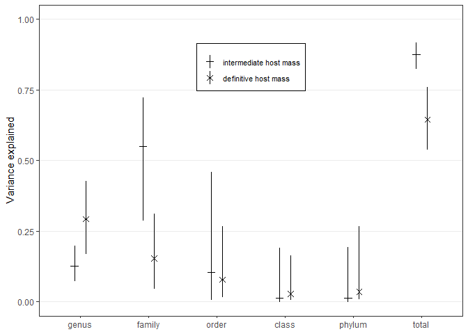<!-- -->
Since we report some of these values in the ms, here is the proportion
of variance explained by genus,

| t\_level | trait                  | vc.lwr | vc.fit | vc.upr |
|:---------|:-----------------------|-------:|-------:|-------:|
| genus    | intermediate host mass |   0.07 |   0.13 |   0.20 |
| genus    | definitive host mass   |   0.17 |   0.29 |   0.43 |

family,

| t\_level | trait                  | vc.lwr | vc.fit | vc.upr |
|:---------|:-----------------------|-------:|-------:|-------:|
| family   | intermediate host mass |   0.29 |   0.55 |   0.72 |
| family   | definitive host mass   |   0.04 |   0.15 |   0.31 |

and overall.

| t\_level | trait                  | vc.lwr | vc.fit | vc.upr |
|:---------|:-----------------------|-------:|-------:|-------:|
| total    | intermediate host mass |   0.82 |   0.87 |   0.92 |
| total    | definitive host mass   |   0.54 |   0.64 |   0.76 |

Now we look at the correlation between host masses at the taxonomic
level. To see where covariance arises, we add taxonomic levels from root
to tip. For example, we test covariance among orders and then,
controlling for order-level effects, we test whether there is covariance
among parasite families and so on. At each level, we then take averages
for the conditional residuals and plot them, along with the covariance.

First, we can plot how much variance in IH and DH host mass is explained
by adding each taxonomic level. IH mass varies among families, whereas
DH mass varies among and within genera.

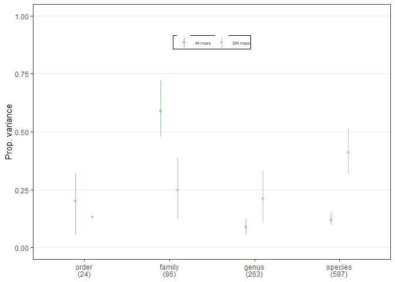<!-- -->

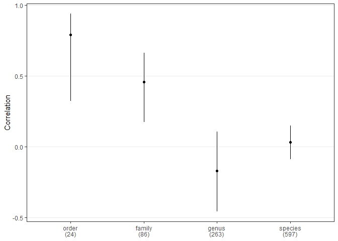<!-- -->

Here are the taxonomic covariances. The points are conditional
residuals, i.e. values after accounting for all higher-level taxonomic
effects. The black line is the species-level, non-taxonomic covariance.
The more that the points fill the black ellipse, the more variance
attributed to that level. Genera differ in definitive host mass but not
intermediate host mass, so there is no covariance at that level.
Families differ at both levels, particularly in the kinds of
intermediate hosts they infect. There is also covariance at the order
level, but it is variable, because more variance is attributed to lower
levels.

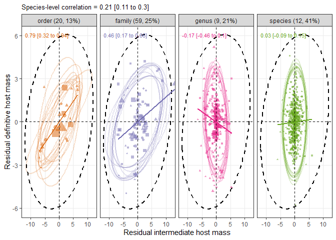<!-- -->

We can make the same plot but change the axes so that it expresses the
residual values as fold-change from expectations, e.g. 10x
bigger/smaller than expected given the order, family, etc.

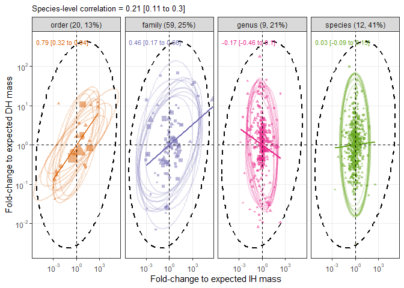<!-- -->

# Intermediate host mass and definitive host endothermy

[Elsewhere](life_history_stragies_rg.md) we found that endothermy also
facilitated parasite growth. So are worms with larger intermediate hosts
also more likely to infect endotherms? To test this, let’s fit a
logistic regression with definitive host endothermy as response and
intermediate host mass as predictor. We do not include worm phylogeny
because it causes problems with parameter estimation due to complete
separation (e.g. worms of a given family or order always infect
endotherms).

    ## [1] "logistic regression, imputation 1 finished"
    ## [1] "logistic regression, imputation 2 finished"
    ## [1] "logistic regression, imputation 3 finished"
    ## [1] "logistic regression, imputation 4 finished"
    ## [1] "logistic regression, imputation 5 finished"
    ## [1] "logistic regression, imputation 6 finished"
    ## [1] "logistic regression, imputation 7 finished"
    ## [1] "logistic regression, imputation 8 finished"
    ## [1] "logistic regression, imputation 9 finished"
    ## [1] "logistic regression, imputation 10 finished"
    ## [1] "logistic regression, imputation 11 finished"
    ## [1] "logistic regression, imputation 12 finished"
    ## [1] "logistic regression, imputation 13 finished"
    ## [1] "logistic regression, imputation 14 finished"
    ## [1] "logistic regression, imputation 15 finished"
    ## [1] "logistic regression, imputation 16 finished"
    ## [1] "logistic regression, imputation 17 finished"
    ## [1] "logistic regression, imputation 18 finished"
    ## [1] "logistic regression, imputation 19 finished"
    ## [1] "logistic regression, imputation 20 finished"
    ## [1] "logistic regression, imputation 21 finished"
    ## [1] "logistic regression, imputation 22 finished"
    ## [1] "logistic regression, imputation 23 finished"
    ## [1] "logistic regression, imputation 24 finished"
    ## [1] "logistic regression, imputation 25 finished"
    ## [1] "logistic regression, imputation 26 finished"
    ## [1] "logistic regression, imputation 27 finished"
    ## [1] "logistic regression, imputation 28 finished"
    ## [1] "logistic regression, imputation 29 finished"
    ## [1] "logistic regression, imputation 30 finished"
    ## [1] "logistic regression, imputation 31 finished"
    ## [1] "logistic regression, imputation 32 finished"
    ## [1] "logistic regression, imputation 33 finished"
    ## [1] "logistic regression, imputation 34 finished"
    ## [1] "logistic regression, imputation 35 finished"
    ## [1] "logistic regression, imputation 36 finished"
    ## [1] "logistic regression, imputation 37 finished"
    ## [1] "logistic regression, imputation 38 finished"
    ## [1] "logistic regression, imputation 39 finished"
    ## [1] "logistic regression, imputation 40 finished"
    ## [1] "logistic regression, imputation 41 finished"
    ## [1] "logistic regression, imputation 42 finished"
    ## [1] "logistic regression, imputation 43 finished"
    ## [1] "logistic regression, imputation 44 finished"
    ## [1] "logistic regression, imputation 45 finished"
    ## [1] "logistic regression, imputation 46 finished"
    ## [1] "logistic regression, imputation 47 finished"
    ## [1] "logistic regression, imputation 48 finished"
    ## [1] "logistic regression, imputation 49 finished"
    ## [1] "logistic regression, imputation 50 finished"
    ## [1] "logistic regression, imputation 51 finished"
    ## [1] "logistic regression, imputation 52 finished"
    ## [1] "logistic regression, imputation 53 finished"
    ## [1] "logistic regression, imputation 54 finished"
    ## [1] "logistic regression, imputation 55 finished"
    ## [1] "logistic regression, imputation 56 finished"
    ## [1] "logistic regression, imputation 57 finished"
    ## [1] "logistic regression, imputation 58 finished"
    ## [1] "logistic regression, imputation 59 finished"
    ## [1] "logistic regression, imputation 60 finished"
    ## [1] "logistic regression, imputation 61 finished"
    ## [1] "logistic regression, imputation 62 finished"
    ## [1] "logistic regression, imputation 63 finished"
    ## [1] "logistic regression, imputation 64 finished"
    ## [1] "logistic regression, imputation 65 finished"
    ## [1] "logistic regression, imputation 66 finished"
    ## [1] "logistic regression, imputation 67 finished"
    ## [1] "logistic regression, imputation 68 finished"
    ## [1] "logistic regression, imputation 69 finished"
    ## [1] "logistic regression, imputation 70 finished"
    ## [1] "logistic regression, imputation 71 finished"
    ## [1] "logistic regression, imputation 72 finished"
    ## [1] "logistic regression, imputation 73 finished"
    ## [1] "logistic regression, imputation 74 finished"
    ## [1] "logistic regression, imputation 75 finished"
    ## [1] "logistic regression, imputation 76 finished"
    ## [1] "logistic regression, imputation 77 finished"
    ## [1] "logistic regression, imputation 78 finished"
    ## [1] "logistic regression, imputation 79 finished"
    ## [1] "logistic regression, imputation 80 finished"
    ## [1] "logistic regression, imputation 81 finished"
    ## [1] "logistic regression, imputation 82 finished"
    ## [1] "logistic regression, imputation 83 finished"
    ## [1] "logistic regression, imputation 84 finished"
    ## [1] "logistic regression, imputation 85 finished"
    ## [1] "logistic regression, imputation 86 finished"
    ## [1] "logistic regression, imputation 87 finished"
    ## [1] "logistic regression, imputation 88 finished"
    ## [1] "logistic regression, imputation 89 finished"
    ## [1] "logistic regression, imputation 90 finished"
    ## [1] "logistic regression, imputation 91 finished"
    ## [1] "logistic regression, imputation 92 finished"
    ## [1] "logistic regression, imputation 93 finished"
    ## [1] "logistic regression, imputation 94 finished"
    ## [1] "logistic regression, imputation 95 finished"
    ## [1] "logistic regression, imputation 96 finished"
    ## [1] "logistic regression, imputation 97 finished"
    ## [1] "logistic regression, imputation 98 finished"
    ## [1] "logistic regression, imputation 99 finished"
    ## [1] "logistic regression, imputation 100 finished"

The parameter for intermediate host mass is significantly positive,
suggesting larger intermediate hosts are more likely to be transmitted
to endotherm definitive hosts.

    ## 
    ## Iterations = 1:249751
    ## Thinning interval = 250 
    ## Number of chains = 1 
    ## Sample size per chain = 1000 
    ## 
    ## 1. Empirical mean and standard deviation for each variable,
    ##    plus standard error of the mean:
    ## 
    ##                 Mean      SD  Naive SE Time-series SE
    ## (Intercept)   1.4884 0.16114 0.0050958      0.0050958
    ## int_host_mass 0.1619 0.02566 0.0008113      0.0009496
    ## 
    ## 2. Quantiles for each variable:
    ## 
    ##                 2.5%    25%    50%    75%  97.5%
    ## (Intercept)   1.1839 1.3703 1.4888 1.5996 1.7929
    ## int_host_mass 0.1129 0.1446 0.1615 0.1802 0.2135

Here is the predicted percent increase in the odds of infecting an
endotherm with a doubling of intermediate host mass.

    ## 
    ## Iterations = 1:249751
    ## Thinning interval = 250 
    ## Number of chains = 1 
    ## Sample size per chain = 1000 
    ## 
    ## 1. Empirical mean and standard deviation for each variable,
    ##    plus standard error of the mean:
    ## 
    ##           Mean             SD       Naive SE Time-series SE 
    ##      0.1189681      0.0199107      0.0006296      0.0007382 
    ## 
    ## 2. Quantiles for each variable:
    ## 
    ##    2.5%     25%     50%     75%   97.5% 
    ## 0.08142 0.10539 0.11847 0.13303 0.15953

However this effect is dependent on parasite group; adding a parasite
group by intermediate host mass interaction was a significant
improvement.

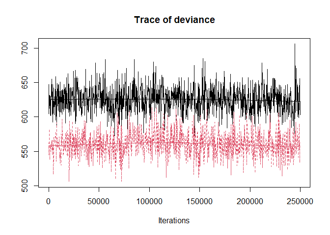<!-- -->
In particular, nematodes and especially cestodes are less likely to
infect an endotherm next host when their intermediate host is large.

    ## 
    ## Iterations = 1:249751
    ## Thinning interval = 250 
    ## Number of chains = 1 
    ## Sample size per chain = 1000 
    ## 
    ## 1. Empirical mean and standard deviation for each variable,
    ##    plus standard error of the mean:
    ## 
    ##                                          Mean     SD Naive SE Time-series SE
    ## (Intercept)                            3.8263 1.6945  0.05359        0.10465
    ## int_host_mass                          0.9858 0.3613  0.01142        0.02267
    ## parasite_phylumCestoda                -2.1162 1.7213  0.05443        0.10588
    ## parasite_phylumNematoda               -2.2070 1.7211  0.05443        0.10690
    ## int_host_mass:parasite_phylumCestoda  -0.9137 0.3636  0.01150        0.02259
    ## int_host_mass:parasite_phylumNematoda -0.6876 0.3663  0.01158        0.02322
    ## 
    ## 2. Quantiles for each variable:
    ## 
    ##                                          2.5%     25%     50%     75%   97.5%
    ## (Intercept)                            1.4906  2.6577  3.5773  4.6717  7.6462
    ## int_host_mass                          0.4902  0.7403  0.9155  1.1514  1.8172
    ## parasite_phylumCestoda                -6.1693 -2.9686 -1.8787 -0.9307  0.2810
    ## parasite_phylumNematoda               -6.1867 -3.0364 -1.9302 -1.0295  0.3550
    ## int_host_mass:parasite_phylumCestoda  -1.7527 -1.0815 -0.8468 -0.6680 -0.4146
    ## int_host_mass:parasite_phylumNematoda -1.5343 -0.8572 -0.6208 -0.4401 -0.1520

Here is the predicted percent increase in the odds of infecting an
endotherm with a doubling of worm size for Acanthocephalans.

    ## 
    ## Iterations = 1:249751
    ## Thinning interval = 250 
    ## Number of chains = 1 
    ## Sample size per chain = 1000 
    ## 
    ## 1. Empirical mean and standard deviation for each variable,
    ##    plus standard error of the mean:
    ## 
    ##           Mean             SD       Naive SE Time-series SE 
    ##        1.05417        0.68992        0.02182        0.04512 
    ## 
    ## 2. Quantiles for each variable:
    ## 
    ##   2.5%    25%    50%    75%  97.5% 
    ## 0.4047 0.6705 0.8862 1.2213 2.5240

for nematodes,

    ## 
    ## Iterations = 1:249751
    ## Thinning interval = 250 
    ## Number of chains = 1 
    ## Sample size per chain = 1000 
    ## 
    ## 1. Empirical mean and standard deviation for each variable,
    ##    plus standard error of the mean:
    ## 
    ##           Mean             SD       Naive SE Time-series SE 
    ##       0.230213       0.040021       0.001266       0.002113 
    ## 
    ## 2. Quantiles for each variable:
    ## 
    ##   2.5%    25%    50%    75%  97.5% 
    ## 0.1610 0.2017 0.2292 0.2562 0.3124

and for cestodes.

    ## 
    ## Iterations = 1:249751
    ## Thinning interval = 250 
    ## Number of chains = 1 
    ## Sample size per chain = 1000 
    ## 
    ## 1. Empirical mean and standard deviation for each variable,
    ##    plus standard error of the mean:
    ## 
    ##           Mean             SD       Naive SE Time-series SE 
    ##      0.0515211      0.0247453      0.0007825      0.0010300 
    ## 
    ## 2. Quantiles for each variable:
    ## 
    ##     2.5%      25%      50%      75%    97.5% 
    ## 0.005167 0.034389 0.051285 0.067437 0.102872

These effect sizes were comparable, but a bit lower when estimated with
`glm` instead of `MCMCglmm`.

    ## [1] "Acanths, increase in endotherm odds with doubling IH mass: 0.826 [0.314 - 1.539]"

    ## [1] "Cestodes, increase in endotherm odds with doubling IH mass: 0.043 [0.002 - 0.085]"

    ## [1] "Nematodes, increase in endotherm odds with doubling IH mass: 0.202 [0.137 - 0.271]"

Let’s plot the pattern. Here are the logistic regressions with the data
put in 10 bins

The pattern is clearest for acanthocephalans. The trend in weak in
cestodes because they generally infect endotherms.
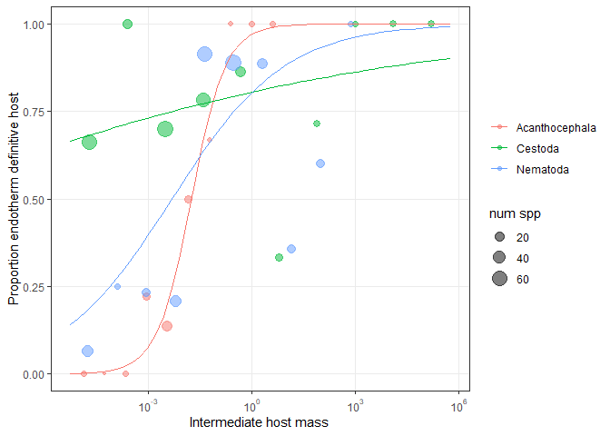<!-- -->

Alternatively, and perhaps more simply, we can just separate species
with and without an endotherm definitive host.

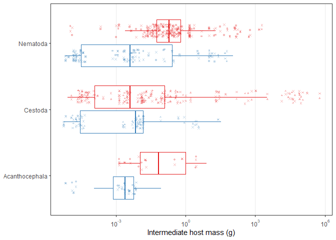<!-- -->

# Conclusions

Parasite species with two-host life cycles infect a wider range of
intermediate hosts than definitive hosts (sizes). Also, species that
infect larger intermediate hosts tend to infect larger definitive hosts,
though the spread of the data indicates that species with small
intermediate hosts infect both large and small hosts. This correlation
arises because families tend to infect different sized intermediate
hosts, suggestive of niche conservatism.
