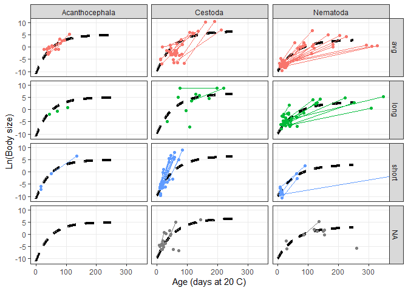
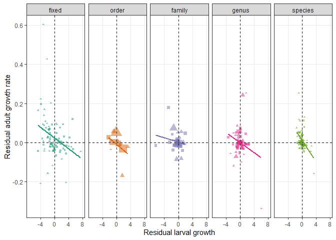
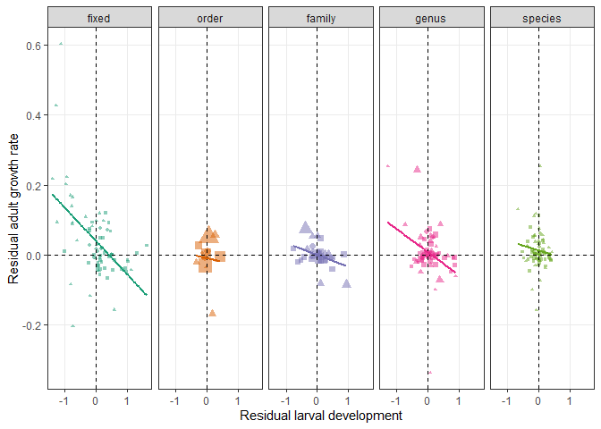
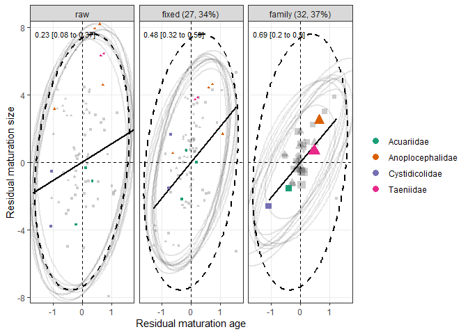

Life history strategies
================

-   [Optimal life history strategies?](#optimal-life-history-strategies)
    -   [Non-taxonomic models](#non-taxonomic-models)
    -   [Taxonomic mixed models](#taxonomic-mixed-models)
    -   [Model parameters](#model-parameters)
        -   [Larval growth](#larval-growth)
        -   [Larval development](#larval-development)
        -   [Adult growth](#adult-growth)
        -   [Adult development](#adult-development)
        -   [Size at maturity](#size-at-maturity)
        -   [Age at maturity](#age-at-maturity)
    -   [Plotted model predictions - Figs 3 and
        4](#plotted-model-predictions---figs-3-and-4)
    -   [Model effect sizes](#model-effect-sizes)
-   [Trait covariation](#trait-covariation)
    -   [Taxonomic trait covariation](#taxonomic-trait-covariation)
        -   [Correlations within stages](#correlations-within-stages)
        -   [Correlations across stages](#correlations-across-stages)
-   [Conclusions](#conclusions)

How should parasites divide their growth and development among the
multiple hosts of a complex life cycle? Here we look at parasite life
history strategies in two-host life cycles.

I rearranged the stage-level parasite data so that pairs represent
values in the current host and then the next host.

For simplicity let’s restrict ourselves to two stages: first
intermediate host and second definitive host. In other words, we’re only
looking at worms with two-host life cycles.

# Optimal life history strategies?

## Non-taxonomic models

When do worms spend more time in one host and less in another? We fit a
series of multivariate mixed models to explore parasite life history
strategies. Our response variables are parasite life history traits like
growth and development as well as their covariance (hence the
multivariate approach). We’ll first fit models without considering
parasite ancestry/taxonomy so that we can explore the correlations
between host traits and parasite life history. Life history models
suggest parasite growth should increase in hosts in which the growth
rate to mortality ratio is high, like big endothermic hosts. Moreover,
if the next host is large and endothermic, then growth should be
suppressed in the current host so as to avoid inducing mortality and
thus reducing the likelihood of transmission.

We took six parasite traits as response variables: growth in the
intermediate host, developmental time in the intermediate host, growth
in the definitive host, developmental time in the definitive host, and
size and age at maturity. We fit the following series of models: 1)
intercept-only, no covariance between traits, 2) allow covariance
between traits, 3) add fixed, main effects characterizing the parasite’s
hosts (intermediate host size, definitive host size, and endothermy of
definitive host), 4) interactions between fixed effects, and 5)
interactions between host traits and parasite group (acanths, nematodes,
cestodes). Regarding the fixed effects, we have a couple predictions
from theory, some of which have been shown previously: a) parasite size
and developmental time increase with host size, b) larval growth and
development decrease when the next host is relatively “good” (i.e. big
and endothermic).

Here are the number of species and families overall:

| n\_spp | n\_fams |
|-------:|--------:|
|    597 |      86 |

Here are the number of species and families with data for at least one
trait:

| n\_spp | n\_fams |
|-------:|--------:|
|    561 |      84 |

Here are the number of species for each trait:

| rg\_int | rg\_def | dd\_int | dd\_def | fs\_def | ag\_def | int\_host\_mass | def\_host\_mass |
|--------:|--------:|--------:|--------:|--------:|--------:|----------------:|----------------:|
|     364 |     379 |     277 |     167 |     494 |     105 |             382 |             586 |

Since intermediate host mass is used as a fixed effect in the model, we
need to restrict the data to these species.

The independent variables were host traits. Here is the average IH mass
in mg:

    ## [1] 40.09252

And DH mass in g:

    ## [1] 673.5744

There were more helminths with endotherm DHs than ectotherms in the
data.

| endo\_def |   n |      prop |
|----------:|----:|----------:|
|         0 | 129 | 0.3403694 |
|         1 | 250 | 0.6596306 |

Here is the model deviance for the non-taxonomic models. Allowing
covariance among life history traits (red) improves model fit, and we
explore these more below. Also, adding the fixed main effects (green)
and interactions (blue) improves model fit, as does adding phylum
interactions (light blue).

<!-- -->

There are a lot of parameters - the model has six response variables and
15 fixed effects. Let’s start by looking at larval growth. As expected,
growth increased with intermediate host mass. Also, worms grow less when
the next host is an endotherm, though this varies with worm phylum.

| param                                       |        lwr |        fit |        upr | sig |
|:--------------------------------------------|-----------:|-----------:|-----------:|:----|
| def\_host\_mass\_c                          | -0.5044882 |  0.1645234 |  0.7983450 | ns  |
| def\_host\_mass\_c:endo\_def\_c             | -0.3629917 | -0.0489568 |  0.2724104 | ns  |
| def\_host\_mass\_c:parasite\_phylumCestoda  | -0.7337451 | -0.0637176 |  0.6389462 | ns  |
| def\_host\_mass\_c:parasite\_phylumNematoda | -1.0322208 | -0.3817738 |  0.3440979 | ns  |
| endo\_def\_c                                | -6.0066861 | -3.7544502 | -1.5919922 | sig |
| endo\_def\_c:parasite\_phylumCestoda        | -2.0367076 |  0.3308610 |  2.8271911 | ns  |
| endo\_def\_c:parasite\_phylumNematoda       | -1.4510073 |  0.9231516 |  3.3191205 | ns  |
| int\_host\_mass\_c                          |  0.1450598 |  0.5968460 |  1.0060371 | sig |
| int\_host\_mass\_c:def\_host\_mass\_c       | -0.0122625 |  0.0187367 |  0.0481337 | ns  |
| int\_host\_mass\_c:endo\_def\_c             | -0.6840887 | -0.5063656 | -0.3195552 | sig |
| int\_host\_mass\_c:parasite\_phylumCestoda  | -0.2315352 |  0.1954128 |  0.6435940 | ns  |
| int\_host\_mass\_c:parasite\_phylumNematoda | -0.7610386 | -0.3310003 |  0.1198540 | ns  |
| parasite\_phylumCestoda                     | -4.4579077 | -3.0547431 | -1.5775886 | sig |
| parasite\_phylumNematoda                    | -7.7299593 | -6.5157573 | -5.0460226 | sig |
| traitrg\_int\_host                          | 10.0898480 | 11.4600059 | 12.6598347 | sig |

Now we move on to traits in the definitive host. Just looking at growth
(more data), it does not increase with definitive host mass,
surprisingly. It seems influenced by endothermy at least in some groups.
It also tends to decrease with intermediate host mass, suggesting growth
in a large intermediate hosts results in less growth in the definitive
host.

| param                                       |        lwr |        fit |       upr | sig |
|:--------------------------------------------|-----------:|-----------:|----------:|:----|
| def\_host\_mass\_c                          | -0.9550329 | -0.1395137 | 0.6517571 | ns  |
| def\_host\_mass\_c:endo\_def\_c             | -0.3435614 |  0.0112161 | 0.3962884 | ns  |
| def\_host\_mass\_c:parasite\_phylumCestoda  | -0.5147656 |  0.3021833 | 1.1913653 | ns  |
| def\_host\_mass\_c:parasite\_phylumNematoda | -0.5778006 |  0.2489820 | 1.1427637 | ns  |
| endo\_def\_c                                |  0.9938147 |  4.3242403 | 7.1612112 | sig |
| endo\_def\_c:parasite\_phylumCestoda        | -2.7063281 |  0.4250724 | 3.7586778 | ns  |
| endo\_def\_c:parasite\_phylumNematoda       | -4.4385132 | -1.2414048 | 2.2430984 | ns  |
| int\_host\_mass\_c                          | -0.8646428 | -0.3683495 | 0.1232842 | ns  |
| int\_host\_mass\_c:def\_host\_mass\_c       | -0.0358624 | -0.0032819 | 0.0314870 | ns  |
| int\_host\_mass\_c:endo\_def\_c             |  0.2868298 |  0.5002161 | 0.7082236 | sig |
| int\_host\_mass\_c:parasite\_phylumCestoda  | -0.8188194 | -0.3028449 | 0.2148528 | ns  |
| int\_host\_mass\_c:parasite\_phylumNematoda | -0.3046975 |  0.2191897 | 0.7367897 | ns  |
| parasite\_phylumCestoda                     |  0.8145812 |  2.6992962 | 4.4395087 | sig |
| parasite\_phylumNematoda                    |  1.1906440 |  3.1317743 | 4.8855493 | sig |
| traitrg\_def\_host                          |  1.3191847 |  3.0121975 | 4.8105890 | sig |

Instead of relative growth in the definitive host, we can look at the
overall size achieved. It also did not increase with definitive host
mass, though it tended to be larger in endotherms.

| param                                       |        lwr |        fit |        upr | sig |
|:--------------------------------------------|-----------:|-----------:|-----------:|:----|
| def\_host\_mass\_c                          | -0.5797750 |  0.0563680 |  0.7139803 | ns  |
| def\_host\_mass\_c:endo\_def\_c             | -0.2862990 |  0.0182771 |  0.2891557 | ns  |
| def\_host\_mass\_c:parasite\_phylumCestoda  | -0.3990350 |  0.2969094 |  0.9514588 | ns  |
| def\_host\_mass\_c:parasite\_phylumNematoda | -0.7525868 | -0.0573845 |  0.6168243 | ns  |
| endo\_def\_c                                | -1.3472476 |  1.3343970 |  3.9571286 | ns  |
| endo\_def\_c:parasite\_phylumCestoda        | -2.1718062 |  0.4759516 |  3.3506668 | ns  |
| endo\_def\_c:parasite\_phylumNematoda       | -3.7481528 | -0.8334205 |  1.8682993 | ns  |
| int\_host\_mass\_c                          | -0.1526523 |  0.2679062 |  0.6849244 | ns  |
| int\_host\_mass\_c:def\_host\_mass\_c       | -0.0211942 |  0.0048421 |  0.0322428 | ns  |
| int\_host\_mass\_c:endo\_def\_c             | -0.0188456 |  0.1521855 |  0.3191359 | ns  |
| int\_host\_mass\_c:parasite\_phylumCestoda  | -0.7257321 | -0.2982556 |  0.1259703 | ns  |
| int\_host\_mass\_c:parasite\_phylumNematoda | -0.6030001 | -0.1689825 |  0.2571094 | ns  |
| parasite\_phylumCestoda                     | -1.0523831 |  0.4397804 |  1.9803929 | ns  |
| parasite\_phylumNematoda                    | -4.0384040 | -2.5383601 | -1.0872180 | sig |
| traitfs\_def\_host                          |  1.9192933 |  3.4877521 |  4.9415694 | sig |

Let’s plot the effects of the larval environment on worm life history
and then the effects of the adult environment. Blue vs red points
distinguish worms with ecto vs endotherm definitive hosts. Larval growth
increases and adult growth decreases with intermediate host size. Final
worm size is unaffected by intermediate host size.

<!-- -->

Now, we plot how adult environment affects worm life history.

<!-- -->

So habitats that favor larval growth (big intermediate hosts) are
associated with less adult growth. We can see this by plotting relative
growth in the two hosts. They are negatively correlated.

<!-- -->
But are these still negatively correlated after we account for the model
fixed effects, like host mass and endothermy? We check this correlation
via the model residuals.

Here is the same plot as above. There is still a clear negative
correlation between relative growth in the two hosts (notice how the
endothermy effect was removed by using residuals).

<!-- -->
More generally, the correlations among response variables did not change
much after accounting for model fixed effects.

<!-- -->

<!-- -->

We also average the residuals for size and age to assess over and
under-performance. For example, here is the correlation between
developmental time and relative growth in the intermediate host. Points
are colored by their average residuals (i.e. whether they overperform or
underperform).

<!-- -->
We can calculate over and underperformance for three developmental
periods: in the intermediate host, in the definitive host, and over the
whole life. When we plot these against each other, we see that larval
and adult growth are unrelated, larval growth slightly increases
lifetime growth, and adult growth clearly increases lifetime growth.

<!-- -->
The absence of a negative relationship between larval and adult
performance is surprising, since higher larval growth resulted in less
adult growth. However, less adult growth was also associated with
shorter developmental times. Thus, in species with overachieving larvae,
the adults grow less but also have short development, suggesting they do
not underachieve as adults.

<!-- -->

## Taxonomic mixed models

Since both parasite life history and host traits are phylogenetically
structured, it is possible that some of these effects disappear when we
control for parasite ancestry. We next fit the same series of models,
but including parasite taxonomy as nested random effects. The residuals
can covary, since our response variables are clearly correlated.

Adding taxonomy is clearly important. It improves the model without
fixed effects…

<!-- -->

…as well as the model with fixed effects.

<!-- -->

This suggests that parasite traits are taxonomically structured, even
after controlling for host masses. We also compared models treating
phylogeny as nested taxonomic levels or as a phylogenetic tree. In the
models with the phylogeny, the variance components were very large,
which usually happens when closely related species are quite different
(i.e. big phenotypic change on short branches, which may be more
measurement error than evolution). Despite this, the phylogenetic models
were much worse than the taxonomic ones. This suggests that not all
parts of the tree are informative.

## Model parameters

### Larval growth

Since taxonomy clearly impacts parasite life history, we should
reexamine the fixed effects, starting with larval growth. Larval
parasites grow more when the intermediate host is large. The
relationship with endothermy seems to depend on intermediate host size.

| param                                       |        lwr |        fit |        upr | sig |
|:--------------------------------------------|-----------:|-----------:|-----------:|:----|
| def\_host\_mass\_c                          | -0.7176570 | -0.2008341 |  0.3358356 | ns  |
| def\_host\_mass\_c:endo\_def\_c             | -0.3877557 | -0.1252927 |  0.1522792 | ns  |
| def\_host\_mass\_c:parasite\_phylumCestoda  | -0.4811363 |  0.0608288 |  0.6035310 | ns  |
| def\_host\_mass\_c:parasite\_phylumNematoda | -0.3455584 |  0.2163164 |  0.7612063 | ns  |
| endo\_def\_c                                | -9.5805037 | -4.6889111 | -0.7710850 | sig |
| endo\_def\_c:parasite\_phylumCestoda        | -1.6069298 |  2.7839372 |  8.8793251 | ns  |
| endo\_def\_c:parasite\_phylumNematoda       | -1.9900978 |  2.4036467 |  8.1547617 | ns  |
| int\_host\_mass\_c                          |  0.2400148 |  0.5782570 |  0.9213746 | sig |
| int\_host\_mass\_c:def\_host\_mass\_c       | -0.0257979 | -0.0026804 |  0.0196800 | ns  |
| int\_host\_mass\_c:endo\_def\_c             | -0.7031504 | -0.4951499 | -0.2881776 | sig |
| int\_host\_mass\_c:parasite\_phylumCestoda  | -0.3490981 | -0.0079210 |  0.3397304 | ns  |
| int\_host\_mass\_c:parasite\_phylumNematoda | -0.6973708 | -0.3454576 |  0.0030596 | ns  |
| parasite\_phylumCestoda                     | -4.8720750 | -2.1026441 |  1.3728712 | ns  |
| parasite\_phylumNematoda                    | -9.4196289 | -6.6783263 | -3.8965258 | sig |
| traitrg\_int\_host                          |  8.6974656 | 10.8805759 | 12.9726135 | sig |

Here are the parameters from the model without parasite group.

| param                                 |        lwr |        fit |        upr | sig |
|:--------------------------------------|-----------:|-----------:|-----------:|:----|
| def\_host\_mass\_c                    | -0.1747461 | -0.0449962 |  0.0955507 | ns  |
| def\_host\_mass\_c:endo\_def\_c       | -0.4584605 | -0.1973289 |  0.0735370 | ns  |
| endo\_def\_c                          | -3.8269046 | -2.4041759 | -1.0068106 | sig |
| int\_host\_mass\_c                    |  0.2323729 |  0.3627710 |  0.4745432 | sig |
| int\_host\_mass\_c:def\_host\_mass\_c | -0.0233418 | -0.0001313 |  0.0220527 | ns  |
| int\_host\_mass\_c:endo\_def\_c       | -0.5539743 | -0.3516233 | -0.1338613 | sig |
| traitrg\_int\_host                    |  4.3209759 |  7.3382059 | 10.7728263 | sig |

Here is how much relative larval growth increased with a doubling of
intermediate host mass.

    ## 
    ## Iterations = 1001:50951
    ## Thinning interval = 50 
    ## Number of chains = 1 
    ## Sample size per chain = 1000 
    ## 
    ## 1. Empirical mean and standard deviation for each variable,
    ##    plus standard error of the mean:
    ## 
    ##           Mean             SD       Naive SE Time-series SE 
    ##       0.198261       0.037888       0.001198       0.001880 
    ## 
    ## 2. Quantiles for each variable:
    ## 
    ##   2.5%    25%    50%    75%  97.5% 
    ## 0.1267 0.1719 0.1976 0.2244 0.2722

However, this relationship depended on whether the next host was an
endotherm or not. Here is how much larval growth increased with
intermediate host mass when the definitive host was an ectotherm:

    ## 
    ## Iterations = 1001:50951
    ## Thinning interval = 50 
    ## Number of chains = 1 
    ## Sample size per chain = 1000 
    ## 
    ## 1. Empirical mean and standard deviation for each variable,
    ##    plus standard error of the mean:
    ## 
    ##           Mean             SD       Naive SE Time-series SE 
    ##       0.285541       0.054909       0.001736       0.004027 
    ## 
    ## 2. Quantiles for each variable:
    ## 
    ##   2.5%    25%    50%    75%  97.5% 
    ## 0.1748 0.2513 0.2859 0.3214 0.3895

And when it was an endotherm (though this was also dependent on the
parasite group):

    ## 
    ## Iterations = 1001:50951
    ## Thinning interval = 50 
    ## Number of chains = 1 
    ## Sample size per chain = 1000 
    ## 
    ## 1. Empirical mean and standard deviation for each variable,
    ##    plus standard error of the mean:
    ## 
    ##           Mean             SD       Naive SE Time-series SE 
    ##       0.138977       0.039640       0.001254       0.001586 
    ## 
    ## 2. Quantiles for each variable:
    ## 
    ##    2.5%     25%     50%     75%   97.5% 
    ## 0.06483 0.11244 0.13794 0.16416 0.21971

Here is how much larval growth decreased when the next host was an
endotherm (avg int and def host masses).

| int\_host\_mass\_c | def\_host\_mass\_c | endo\_def | rg\_int\_pred.lwr | rg\_int\_pred.fit | rg\_int\_pred.upr | fold\_change.lwr | fold\_change.fit | fold\_change.upr |
|-------------------:|-------------------:|----------:|------------------:|------------------:|------------------:|-----------------:|-----------------:|-----------------:|
|          0.0306098 |                  0 |         0 |          5.133411 |          8.586527 |         11.554119 |        169.59455 |        5358.9679 |       104205.395 |
|         -0.0469648 |                  0 |         1 |          2.451659 |          6.153271 |          9.119748 |         11.60759 |         470.2532 |         9133.902 |

Here is the average increase in size in an intermediate host (fold
change).

|                    | param              | avg\_fold\_change\_IH\_lwr | avg\_fold\_change\_IH | avg\_fold\_change\_IH\_upr |
|:-------------------|:-------------------|---------------------------:|----------------------:|---------------------------:|
| traitrg\_int\_host | traitrg\_int\_host |                   75.26204 |               1537.95 |                   47706.66 |

We can also explore how the average growth values depend on the model.

The models are reasonably consistent.

<!-- -->

### Larval development

The average time spent developing as larvae (days at 20 C):

| param              | avg\_dd\_IH\_lwr | avg\_dd\_IH | avg\_dd\_IH\_upr |
|:-------------------|-----------------:|------------:|-----------------:|
| traitdd\_int\_host |         13.09745 |    33.09754 |         87.91223 |

This estimate is not highly dependent on the model.

<!-- -->

Larval developmental time increased significantly with intermediate host
mass, but only when the next host was an ectotherm.

| param                                 |        lwr |        fit |        upr | sig |
|:--------------------------------------|-----------:|-----------:|-----------:|:----|
| def\_host\_mass\_c                    | -0.0298526 |  0.0133904 |  0.0535753 | ns  |
| def\_host\_mass\_c:endo\_def\_c       | -0.1185341 | -0.0393709 |  0.0413927 | ns  |
| endo\_def\_c                          | -0.4751317 | -0.1091131 |  0.2744590 | ns  |
| int\_host\_mass\_c                    |  0.0308970 |  0.0635611 |  0.0960248 | sig |
| int\_host\_mass\_c:def\_host\_mass\_c | -0.0068057 |  0.0003485 |  0.0078165 | ns  |
| int\_host\_mass\_c:endo\_def\_c       | -0.1237374 | -0.0608839 | -0.0003417 | sig |
| traitdd\_int\_host                    |  5.2804678 |  6.2075092 |  7.1843891 | sig |

Here is the percent increase in larval DT with a doubling of
intermediate host mass.

    ## 
    ## Iterations = 1001:50951
    ## Thinning interval = 50 
    ## Number of chains = 1 
    ## Sample size per chain = 1000 
    ## 
    ## 1. Empirical mean and standard deviation for each variable,
    ##    plus standard error of the mean:
    ## 
    ##           Mean             SD       Naive SE Time-series SE 
    ##      0.0345981      0.0093446      0.0002955      0.0004564 
    ## 
    ## 2. Quantiles for each variable:
    ## 
    ##    2.5%     25%     50%     75%   97.5% 
    ## 0.01667 0.02828 0.03480 0.04123 0.05270

However, this relationship depended on whether the next host was an
endotherm or not. Here is how much larval development increased with
intermediate host mass when the definitive host was an ectotherm:

    ## 
    ## Iterations = 1001:50951
    ## Thinning interval = 50 
    ## Number of chains = 1 
    ## Sample size per chain = 1000 
    ## 
    ## 1. Empirical mean and standard deviation for each variable,
    ##    plus standard error of the mean:
    ## 
    ##           Mean             SD       Naive SE Time-series SE 
    ##      0.0452554      0.0123481      0.0003905      0.0006924 
    ## 
    ## 2. Quantiles for each variable:
    ## 
    ##    2.5%     25%     50%     75%   97.5% 
    ## 0.02165 0.03666 0.04504 0.05341 0.06882

And when it was an endotherm; a doubling of intermediate host mass has
half the effect on larval developmental time.

    ## 
    ## Iterations = 1001:50951
    ## Thinning interval = 50 
    ## Number of chains = 1 
    ## Sample size per chain = 1000 
    ## 
    ## 1. Empirical mean and standard deviation for each variable,
    ##    plus standard error of the mean:
    ## 
    ##           Mean             SD       Naive SE Time-series SE 
    ##      0.0234352      0.0110261      0.0003487      0.0004195 
    ## 
    ## 2. Quantiles for each variable:
    ## 
    ##     2.5%      25%      50%      75%    97.5% 
    ## 0.000945 0.016242 0.023276 0.031234 0.044390

Here are the parameters from the full, final model.

| param                                       |        lwr |        fit |        upr | sig |
|:--------------------------------------------|-----------:|-----------:|-----------:|:----|
| def\_host\_mass\_c                          | -0.2407752 | -0.0579561 |  0.1091079 | ns  |
| def\_host\_mass\_c:endo\_def\_c             | -0.1258584 | -0.0366416 |  0.0589986 | ns  |
| def\_host\_mass\_c:parasite\_phylumCestoda  | -0.1144964 |  0.0659757 |  0.2498251 | ns  |
| def\_host\_mass\_c:parasite\_phylumNematoda | -0.0939693 |  0.0854108 |  0.2789717 | ns  |
| endo\_def\_c                                | -1.8272634 | -0.4712152 |  0.9374343 | ns  |
| endo\_def\_c:parasite\_phylumCestoda        | -1.4026217 |  0.1674498 |  1.6576033 | ns  |
| endo\_def\_c:parasite\_phylumNematoda       | -1.0218528 |  0.4320941 |  1.7581276 | ns  |
| int\_host\_mass\_c                          | -0.0284303 |  0.1103950 |  0.2490014 | ns  |
| int\_host\_mass\_c:def\_host\_mass\_c       | -0.0066148 |  0.0006077 |  0.0084504 | ns  |
| int\_host\_mass\_c:endo\_def\_c             | -0.1344208 | -0.0747442 | -0.0033274 | sig |
| int\_host\_mass\_c:parasite\_phylumCestoda  | -0.1722118 | -0.0348265 |  0.1114967 | ns  |
| int\_host\_mass\_c:parasite\_phylumNematoda | -0.1962027 | -0.0536247 |  0.0859197 | ns  |
| parasite\_phylumCestoda                     | -1.5749695 | -0.2051578 |  1.6964586 | ns  |
| parasite\_phylumNematoda                    | -2.5169612 | -1.2339181 | -0.0163855 | sig |
| traitdd\_int\_host                          |  5.8293494 |  6.7521008 |  7.6849818 | sig |

### Adult growth

For adult growth, there is an effect of endothermy and a negative
relationship with intermediate host size.

| param                                       |        lwr |        fit |       upr | sig |
|:--------------------------------------------|-----------:|-----------:|----------:|:----|
| def\_host\_mass\_c                          | -0.7390960 |  0.0182898 | 0.7192418 | ns  |
| def\_host\_mass\_c:endo\_def\_c             | -0.1944639 |  0.1244125 | 0.4753054 | ns  |
| def\_host\_mass\_c:parasite\_phylumCestoda  | -0.6471424 |  0.0950157 | 0.8631103 | ns  |
| def\_host\_mass\_c:parasite\_phylumNematoda | -0.5157142 |  0.1804415 | 0.9645476 | ns  |
| endo\_def\_c                                |  0.2741054 |  4.2800245 | 8.1491022 | sig |
| endo\_def\_c:parasite\_phylumCestoda        | -5.3279682 | -0.6525177 | 3.7649357 | ns  |
| endo\_def\_c:parasite\_phylumNematoda       | -4.8426652 | -0.4144209 | 3.7995267 | ns  |
| int\_host\_mass\_c                          | -0.8661070 | -0.3952368 | 0.0969728 | ns  |
| int\_host\_mass\_c:def\_host\_mass\_c       | -0.0279208 | -0.0001200 | 0.0310483 | ns  |
| int\_host\_mass\_c:endo\_def\_c             |  0.2730876 |  0.5079357 | 0.7494265 | sig |
| int\_host\_mass\_c:parasite\_phylumCestoda  | -0.6594864 | -0.1492856 | 0.3477228 | ns  |
| int\_host\_mass\_c:parasite\_phylumNematoda | -0.3612011 |  0.1658393 | 0.6551732 | ns  |
| parasite\_phylumCestoda                     | -0.3108676 |  2.4226026 | 5.4825714 | ns  |
| parasite\_phylumNematoda                    |  0.1311860 |  3.1088508 | 6.2370316 | sig |
| traitrg\_def\_host                          |  0.5721435 |  3.0797518 | 5.2594852 | sig |

There was not a clear relationship with definitive host mass, but that
is because the relationship varies somewhat among groups. When we look
at the parameters in the model without parasite groups, there is a
positive relationship between definitive host mass and adult growth.

| param                                 |        lwr |        fit |        upr | sig |
|:--------------------------------------|-----------:|-----------:|-----------:|:----|
| def\_host\_mass\_c                    | -0.0047481 |  0.1678281 |  0.3275859 | ns  |
| def\_host\_mass\_c:endo\_def\_c       | -0.1755020 |  0.1583272 |  0.5155908 | ns  |
| endo\_def\_c                          |  2.5487228 |  4.0814738 |  5.4648965 | sig |
| int\_host\_mass\_c                    | -0.5053405 | -0.3833397 | -0.2556697 | sig |
| int\_host\_mass\_c:def\_host\_mass\_c | -0.0204380 |  0.0078479 |  0.0368894 | ns  |
| int\_host\_mass\_c:endo\_def\_c       |  0.1634552 |  0.4063006 |  0.6448470 | sig |
| traitrg\_def\_host                    |  3.5439949 |  5.3394487 |  6.8900366 | sig |

Here is how much relative adult growth increased with a doubling of
definitive host mass overall.

    ## 
    ## Iterations = 1001:50951
    ## Thinning interval = 50 
    ## Number of chains = 1 
    ## Sample size per chain = 1000 
    ## 
    ## 1. Empirical mean and standard deviation for each variable,
    ##    plus standard error of the mean:
    ## 
    ##           Mean             SD       Naive SE Time-series SE 
    ##       0.110561       0.059780       0.001890       0.001989 
    ## 
    ## 2. Quantiles for each variable:
    ## 
    ##     2.5%      25%      50%      75%    97.5% 
    ## -0.00193  0.07198  0.10620  0.14654  0.23706

And here is how much adult growth decreased with a doubling of
intermediate host mass.

    ## 
    ## Iterations = 1001:50951
    ## Thinning interval = 50 
    ## Number of chains = 1 
    ## Sample size per chain = 1000 
    ## 
    ## 1. Empirical mean and standard deviation for each variable,
    ##    plus standard error of the mean:
    ## 
    ##           Mean             SD       Naive SE Time-series SE 
    ##     -0.1650742      0.0300355      0.0009498      0.0010147 
    ## 
    ## 2. Quantiles for each variable:
    ## 
    ##    2.5%     25%     50%     75%   97.5% 
    ## -0.2194 -0.1864 -0.1656 -0.1462 -0.1023

However, this decrease depended on whether the definitive host was an
endotherm or not. Adult growth decreased this much with a doubling of
intermediate host mass when the next host was an ectotherm:

    ## 
    ## Iterations = 1001:50951
    ## Thinning interval = 50 
    ## Number of chains = 1 
    ## Sample size per chain = 1000 
    ## 
    ## 1. Empirical mean and standard deviation for each variable,
    ##    plus standard error of the mean:
    ## 
    ##           Mean             SD       Naive SE Time-series SE 
    ##      -0.232311       0.034538       0.001092       0.001658 
    ## 
    ## 2. Quantiles for each variable:
    ## 
    ##    2.5%     25%     50%     75%   97.5% 
    ## -0.2955 -0.2569 -0.2333 -0.2107 -0.1624

But much less when the definitive host was an endotherm:

    ## 
    ## Iterations = 1001:50951
    ## Thinning interval = 50 
    ## Number of chains = 1 
    ## Sample size per chain = 1000 
    ## 
    ## 1. Empirical mean and standard deviation for each variable,
    ##    plus standard error of the mean:
    ## 
    ##           Mean             SD       Naive SE Time-series SE 
    ##      -0.115992       0.036145       0.001143       0.001143 
    ## 
    ## 2. Quantiles for each variable:
    ## 
    ##     2.5%      25%      50%      75%    97.5% 
    ## -0.18884 -0.14003 -0.11532 -0.09189 -0.04436

Here is the average increase in size in a definitive host (fold change).

| param              | avg\_fold\_change\_DH\_lwr | avg\_fold\_change\_DH | avg\_fold\_change\_DH\_upr |
|:-------------------|---------------------------:|----------------------:|---------------------------:|
| traitrg\_def\_host |                   34.60489 |              208.3978 |                   982.4374 |

Here is how much adult worms grew in endotherms vs ectotherms.

| def\_host\_mass\_c | endo\_def | rg\_def\_pred.lwr | rg\_def\_pred.fit | rg\_def\_pred.upr | fold\_change.lwr | fold\_change.fit | fold\_change.upr |
|-------------------:|----------:|------------------:|------------------:|------------------:|-----------------:|-----------------:|-----------------:|
|          0.0784601 |         0 |          1.517682 |          3.325447 |          5.260786 |         4.561641 |         27.81142 |         192.6328 |
|         -0.0193654 |         1 |          5.358344 |          7.374319 |          8.908271 |       212.372969 |       1594.50545 |        7392.8698 |

Here is how much adult worms grew in a small, endothermic definitive
host (10 g)…

| def\_host\_mass\_c | endo\_def | rg\_def\_pred.lwr | rg\_def\_pred.fit | rg\_def\_pred.upr | fold\_change.lwr | fold\_change.fit | fold\_change.upr |
|-------------------:|----------:|------------------:|------------------:|------------------:|-----------------:|-----------------:|-----------------:|
|          -4.290529 |         1 |          4.408295 |          6.327376 |          8.341182 |         82.12935 |         559.6861 |         4193.044 |

..and in a large endothermic definitive host (10 kg).

| def\_host\_mass\_c | endo\_def | rg\_def\_pred.lwr | rg\_def\_pred.fit | rg\_def\_pred.upr | fold\_change.lwr | fold\_change.fit | fold\_change.upr |
|-------------------:|----------:|------------------:|------------------:|------------------:|-----------------:|-----------------:|-----------------:|
|           5.154742 |         1 |          6.481758 |           8.64259 |          10.32229 |         653.1183 |         5667.992 |         30402.67 |

How does adult growth compare with larval growth?

<!-- -->

What percent of *relative* growth does an average worm (avg host masses)
do in the definitive host, controlling for taxonomy? Another way to
think of this is “doublings” per host. Here is the percent growth in the
definitive host. It is quite evenly split.

    ## 
    ## Iterations = 1001:50951
    ## Thinning interval = 50 
    ## Number of chains = 1 
    ## Sample size per chain = 1000 
    ## 
    ## 1. Empirical mean and standard deviation for each variable,
    ##    plus standard error of the mean:
    ## 
    ##           Mean             SD       Naive SE Time-series SE 
    ##       0.425024       0.071069       0.002247       0.002377 
    ## 
    ## 2. Quantiles for each variable:
    ## 
    ##   2.5%    25%    50%    75%  97.5% 
    ## 0.3015 0.3797 0.4212 0.4625 0.5750

But this depends on the group. Acanths grow relatively less in the
definitive host, because they have bigger larvae.

    ## 
    ## Iterations = 1001:50951
    ## Thinning interval = 50 
    ## Number of chains = 1 
    ## Sample size per chain = 1000 
    ## 
    ## 1. Empirical mean and standard deviation for each variable,
    ##    plus standard error of the mean:
    ## 
    ##           Mean             SD       Naive SE Time-series SE 
    ##       0.214709       0.077251       0.002443       0.002829 
    ## 
    ## 2. Quantiles for each variable:
    ## 
    ##    2.5%     25%     50%     75%   97.5% 
    ## 0.04497 0.16765 0.21949 0.26439 0.36055

cestodes:

    ## 
    ## Iterations = 1001:50951
    ## Thinning interval = 50 
    ## Number of chains = 1 
    ## Sample size per chain = 1000 
    ## 
    ## 1. Empirical mean and standard deviation for each variable,
    ##    plus standard error of the mean:
    ## 
    ##           Mean             SD       Naive SE Time-series SE 
    ##       0.383598       0.051906       0.001641       0.002287 
    ## 
    ## 2. Quantiles for each variable:
    ## 
    ##   2.5%    25%    50%    75%  97.5% 
    ## 0.2878 0.3500 0.3828 0.4153 0.4868

Nematodes grow relatively more as adults than larvae:

    ## 
    ## Iterations = 1001:50951
    ## Thinning interval = 50 
    ## Number of chains = 1 
    ## Sample size per chain = 1000 
    ## 
    ## 1. Empirical mean and standard deviation for each variable,
    ##    plus standard error of the mean:
    ## 
    ##           Mean             SD       Naive SE Time-series SE 
    ##       0.599871       0.068485       0.002166       0.003893 
    ## 
    ## 2. Quantiles for each variable:
    ## 
    ##   2.5%    25%    50%    75%  97.5% 
    ## 0.4769 0.5536 0.5940 0.6438 0.7394

It is also worth comparing *total* growth in the two hosts, not just
*relative* growth.

Most growth is conducted in the DH. That is not strongly dependent on
correcting for host size, taxonomy, etc.

<!-- -->

The average worm accumulates around 10 mg in the definitive host.

    ## 
    ## Iterations = 1001:50951
    ## Thinning interval = 50 
    ## Number of chains = 1 
    ## Sample size per chain = 1000 
    ## 
    ## 1. Empirical mean and standard deviation for each variable,
    ##    plus standard error of the mean:
    ## 
    ##           Mean             SD       Naive SE Time-series SE 
    ##        11.8557        26.7786         0.8468         0.8468 
    ## 
    ## 2. Quantiles for each variable:
    ## 
    ##   2.5%    25%    50%    75%  97.5% 
    ##  1.163  3.951  6.934 12.365 42.678

By contrast, they average less than 100 ug in the intermediate host.

    ## 
    ## Iterations = 1001:50951
    ## Thinning interval = 50 
    ## Number of chains = 1 
    ## Sample size per chain = 1000 
    ## 
    ## 1. Empirical mean and standard deviation for each variable,
    ##    plus standard error of the mean:
    ## 
    ##           Mean             SD       Naive SE Time-series SE 
    ##         274.10        1170.80          37.02          44.49 
    ## 
    ## 2. Quantiles for each variable:
    ## 
    ##     2.5%      25%      50%      75%    97.5% 
    ##    4.414   35.242   75.215  180.136 1626.064

Thus, essentially all of the *total* growth is in the DH, controlling
for host masses and taxonomy.

    ## 
    ## Iterations = 1001:50951
    ## Thinning interval = 50 
    ## Number of chains = 1 
    ## Sample size per chain = 1000 
    ## 
    ## 1. Empirical mean and standard deviation for each variable,
    ##    plus standard error of the mean:
    ## 
    ##           Mean             SD       Naive SE Time-series SE 
    ##       0.964277       0.086151       0.002724       0.002724 
    ## 
    ## 2. Quantiles for each variable:
    ## 
    ##   2.5%    25%    50%    75%  97.5% 
    ## 0.7456 0.9721 0.9886 0.9961 0.9996

This high percentage is essentially the same for acanths:

    ## 
    ## Iterations = 1001:50951
    ## Thinning interval = 50 
    ## Number of chains = 1 
    ## Sample size per chain = 1000 
    ## 
    ## 1. Empirical mean and standard deviation for each variable,
    ##    plus standard error of the mean:
    ## 
    ##           Mean             SD       Naive SE Time-series SE 
    ##        0.87724        0.17077        0.00540        0.01179 
    ## 
    ## 2. Quantiles for each variable:
    ## 
    ##   2.5%    25%    50%    75%  97.5% 
    ## 0.3308 0.8405 0.9465 0.9831 0.9983

cestodes:

    ## 
    ## Iterations = 1001:50951
    ## Thinning interval = 50 
    ## Number of chains = 1 
    ## Sample size per chain = 1000 
    ## 
    ## 1. Empirical mean and standard deviation for each variable,
    ##    plus standard error of the mean:
    ## 
    ##           Mean             SD       Naive SE Time-series SE 
    ##       0.933821       0.122353       0.003869       0.010314 
    ## 
    ## 2. Quantiles for each variable:
    ## 
    ##   2.5%    25%    50%    75%  97.5% 
    ## 0.5187 0.9367 0.9799 0.9939 1.0000

and nematodes:

    ## 
    ## Iterations = 1001:50951
    ## Thinning interval = 50 
    ## Number of chains = 1 
    ## Sample size per chain = 1000 
    ## 
    ## 1. Empirical mean and standard deviation for each variable,
    ##    plus standard error of the mean:
    ## 
    ##           Mean             SD       Naive SE Time-series SE 
    ##       0.989533       0.031934       0.001010       0.001567 
    ## 
    ## 2. Quantiles for each variable:
    ## 
    ##   2.5%    25%    50%    75%  97.5% 
    ## 0.9466 0.9918 0.9967 0.9987 0.9998

### Adult development

The average time spent in the definitive host (days at 20 C):

| param              | avg\_dd\_DH\_lwr | avg\_dd\_DH | avg\_dd\_DH\_upr |
|:-------------------|-----------------:|------------:|-----------------:|
| traitdd\_def\_host |         23.59313 |    57.12673 |         128.9325 |

Adult development was longer in big hosts, but mainly ectotherms, and
shorter when the intermediate host was large and the definitive host was
an ectotherm.

| param                                 |        lwr |        fit |       upr | sig |
|:--------------------------------------|-----------:|-----------:|----------:|:----|
| def\_host\_mass\_c                    | -0.0330124 |  0.0579314 | 0.1405567 | ns  |
| def\_host\_mass\_c:endo\_def\_c       | -0.1778290 | -0.0080479 | 0.1837708 | ns  |
| endo\_def\_c                          | -0.2265380 |  0.4435093 | 1.1274005 | ns  |
| int\_host\_mass\_c                    | -0.0925121 | -0.0116958 | 0.0502570 | ns  |
| int\_host\_mass\_c:def\_host\_mass\_c | -0.0173780 | -0.0067564 | 0.0061455 | ns  |
| int\_host\_mass\_c:endo\_def\_c       | -0.0609457 |  0.0654618 | 0.2071168 | ns  |
| traitdd\_def\_host                    |  5.8690059 |  6.7533223 | 7.5673396 | sig |

Here is the percent increase in adult DT with a doubling of intermediate
host mass.

    ## 
    ## Iterations = 1001:50951
    ## Thinning interval = 50 
    ## Number of chains = 1 
    ## Sample size per chain = 1000 
    ## 
    ## 1. Empirical mean and standard deviation for each variable,
    ##    plus standard error of the mean:
    ## 
    ##           Mean             SD       Naive SE Time-series SE 
    ##      0.0032679      0.0120492      0.0003810      0.0006393 
    ## 
    ## 2. Quantiles for each variable:
    ## 
    ##      2.5%       25%       50%       75%     97.5% 
    ## -0.019767 -0.004963  0.003217  0.010836  0.027544

Here is the percent increase in adult DT with a doubling of definitive
host mass.

    ## 
    ## Iterations = 1001:50951
    ## Thinning interval = 50 
    ## Number of chains = 1 
    ## Sample size per chain = 1000 
    ## 
    ## 1. Empirical mean and standard deviation for each variable,
    ##    plus standard error of the mean:
    ## 
    ##           Mean             SD       Naive SE Time-series SE 
    ##      0.0386873      0.0194675      0.0006156      0.0009737 
    ## 
    ## 2. Quantiles for each variable:
    ## 
    ##      2.5%       25%       50%       75%     97.5% 
    ## 0.0002655 0.0254300 0.0379389 0.0520862 0.0770116

However, this relationship depended on whether the definitive host was
an endotherm or not. Here is how much prepatent periods increased when
the definitive host was an ectotherm:

    ## 
    ## Iterations = 1001:50951
    ## Thinning interval = 50 
    ## Number of chains = 1 
    ## Sample size per chain = 1000 
    ## 
    ## 1. Empirical mean and standard deviation for each variable,
    ##    plus standard error of the mean:
    ## 
    ##           Mean             SD       Naive SE Time-series SE 
    ##       0.041416       0.032364       0.001023       0.003743 
    ## 
    ## 2. Quantiles for each variable:
    ## 
    ##     2.5%      25%      50%      75%    97.5% 
    ## -0.02262  0.02036  0.04097  0.06426  0.10233

And when it was an endotherm; a doubling of definitive host mass has
about half the effect on larval developmental time.

    ## 
    ## Iterations = 1001:50951
    ## Thinning interval = 50 
    ## Number of chains = 1 
    ## Sample size per chain = 1000 
    ## 
    ## 1. Empirical mean and standard deviation for each variable,
    ##    plus standard error of the mean:
    ## 
    ##           Mean             SD       Naive SE Time-series SE 
    ##       0.039850       0.022166       0.000701       0.001014 
    ## 
    ## 2. Quantiles for each variable:
    ## 
    ##      2.5%       25%       50%       75%     97.5% 
    ## -0.003933  0.025317  0.039682  0.054418  0.082177

Most trends were consistent across groups.

| param                                       |        lwr |        fit |       upr | sig |
|:--------------------------------------------|-----------:|-----------:|----------:|:----|
| def\_host\_mass\_c                          | -0.5433960 |  0.0129803 | 0.7424119 | ns  |
| def\_host\_mass\_c:endo\_def\_c             | -0.2254161 | -0.0288011 | 0.1775857 | ns  |
| def\_host\_mass\_c:parasite\_phylumCestoda  | -0.7285093 |  0.0308355 | 0.5781383 | ns  |
| def\_host\_mass\_c:parasite\_phylumNematoda | -0.6738705 |  0.0839073 | 0.6371808 | ns  |
| endo\_def\_c                                | -1.6527090 |  0.4012955 | 2.4450376 | ns  |
| endo\_def\_c:parasite\_phylumCestoda        | -2.7897602 | -0.7365688 | 1.3203280 | ns  |
| endo\_def\_c:parasite\_phylumNematoda       | -2.1730250 |  0.0373985 | 2.0408700 | ns  |
| int\_host\_mass\_c                          | -0.1441021 |  0.0298777 | 0.1985145 | ns  |
| int\_host\_mass\_c:def\_host\_mass\_c       | -0.0220302 | -0.0082348 | 0.0062863 | ns  |
| int\_host\_mass\_c:endo\_def\_c             | -0.1561393 |  0.0116710 | 0.1836575 | ns  |
| int\_host\_mass\_c:parasite\_phylumCestoda  | -0.1438760 |  0.0162538 | 0.1829306 | ns  |
| int\_host\_mass\_c:parasite\_phylumNematoda | -0.1973595 | -0.0361209 | 0.1190759 | ns  |
| parasite\_phylumCestoda                     | -1.9020266 |  0.0013188 | 1.4927798 | ns  |
| parasite\_phylumNematoda                    | -1.2756727 |  0.2537119 | 1.6782235 | ns  |
| traitdd\_def\_host                          |  5.5593870 |  6.7755302 | 8.1825479 | sig |

How does adult development compare with larval development?

<!-- -->

### Size at maturity

The pattern for adult size was similar to adult growth - it increases
with definitive host mass when we do not consider differences among
parasite groups.

| param                                 |        lwr |        fit |       upr | sig |
|:--------------------------------------|-----------:|-----------:|----------:|:----|
| def\_host\_mass\_c                    |  0.0577529 |  0.1700209 | 0.2745413 | sig |
| def\_host\_mass\_c:endo\_def\_c       | -0.1209022 |  0.1044002 | 0.3391130 | ns  |
| endo\_def\_c                          |  0.0408251 |  1.1200469 | 2.1458065 | sig |
| int\_host\_mass\_c                    | -0.0581567 |  0.0305539 | 0.1112823 | ns  |
| int\_host\_mass\_c:def\_host\_mass\_c | -0.0250754 | -0.0066560 | 0.0118071 | ns  |
| int\_host\_mass\_c:endo\_def\_c       | -0.1858243 | -0.0180541 | 0.1467636 | ns  |
| traitfs\_def\_host                    |  0.5919309 |  2.4632411 | 4.2918109 | sig |

Here is how much size at maturity increases with a doubling of
definitive host mass.

    ## 
    ## Iterations = 1001:50951
    ## Thinning interval = 50 
    ## Number of chains = 1 
    ## Sample size per chain = 1000 
    ## 
    ## 1. Empirical mean and standard deviation for each variable,
    ##    plus standard error of the mean:
    ## 
    ##           Mean             SD       Naive SE Time-series SE 
    ##       0.125395       0.043540       0.001377       0.001717 
    ## 
    ## 2. Quantiles for each variable:
    ## 
    ##    2.5%     25%     50%     75%   97.5% 
    ## 0.04084 0.09635 0.12507 0.15436 0.20961

But the effect is not evident once we allow interactions between
parasite phylua and host traits. Also, unlike for adult growth, there is
no relationship between adult size and intermediate host size.

| param                                       |        lwr |        fit |        upr | sig |
|:--------------------------------------------|-----------:|-----------:|-----------:|:----|
| def\_host\_mass\_c                          | -0.5636580 | -0.1237792 |  0.3679666 | ns  |
| def\_host\_mass\_c:endo\_def\_c             | -0.1225347 |  0.1189295 |  0.3404630 | ns  |
| def\_host\_mass\_c:parasite\_phylumCestoda  | -0.3424501 |  0.2261135 |  0.6820962 | ns  |
| def\_host\_mass\_c:parasite\_phylumNematoda | -0.1395890 |  0.3463222 |  0.8112160 | ns  |
| endo\_def\_c                                | -1.5884993 |  1.9851556 |  6.0689082 | ns  |
| endo\_def\_c:parasite\_phylumCestoda        | -5.1973555 | -0.6481579 |  3.1224313 | ns  |
| endo\_def\_c:parasite\_phylumNematoda       | -5.3662935 | -0.8518267 |  2.9244289 | ns  |
| int\_host\_mass\_c                          | -0.2185183 |  0.1802138 |  0.5455235 | ns  |
| int\_host\_mass\_c:def\_host\_mass\_c       | -0.0335133 | -0.0142110 |  0.0061797 | ns  |
| int\_host\_mass\_c:endo\_def\_c             | -0.1780431 | -0.0073363 |  0.1640906 | ns  |
| int\_host\_mass\_c:parasite\_phylumCestoda  | -0.5232698 | -0.1615253 |  0.2455116 | ns  |
| int\_host\_mass\_c:parasite\_phylumNematoda | -0.5366436 | -0.1468624 |  0.2538267 | ns  |
| parasite\_phylumCestoda                     | -2.2691387 |  0.6323330 |  3.5639709 | ns  |
| parasite\_phylumNematoda                    | -5.6368906 | -2.8797137 | -0.2849093 | sig |
| traitfs\_def\_host                          |  1.3010967 |  3.4493206 |  5.6580100 | sig |

### Age at maturity

Age at maturity tended to increase with definitive host mass.

| param                                 |        lwr |        fit |       upr | sig |
|:--------------------------------------|-----------:|-----------:|----------:|:----|
| def\_host\_mass\_c                    | -0.0749375 |  0.0270854 | 0.1454424 | ns  |
| def\_host\_mass\_c:endo\_def\_c       | -0.1416807 |  0.0925427 | 0.3025423 | ns  |
| endo\_def\_c                          | -1.3238235 | -0.0970299 | 0.8748695 | ns  |
| int\_host\_mass\_c                    | -0.0453906 |  0.0599518 | 0.1666011 | ns  |
| int\_host\_mass\_c:def\_host\_mass\_c | -0.0210258 | -0.0079251 | 0.0042829 | ns  |
| int\_host\_mass\_c:endo\_def\_c       | -0.2642403 | -0.0494869 | 0.1615421 | ns  |
| traitag\_def\_host                    |  6.5457060 |  7.5259952 | 8.5630684 | sig |

Here is how much age at maturity increased with a doubling of definitive
host mass.

    ## 
    ## Iterations = 1001:50951
    ## Thinning interval = 50 
    ## Number of chains = 1 
    ## Sample size per chain = 1000 
    ## 
    ## 1. Empirical mean and standard deviation for each variable,
    ##    plus standard error of the mean:
    ## 
    ##           Mean             SD       Naive SE Time-series SE 
    ##       0.021547       0.040580       0.001283       0.007840 
    ## 
    ## 2. Quantiles for each variable:
    ## 
    ##      2.5%       25%       50%       75%     97.5% 
    ## -0.050617 -0.008351  0.018952  0.048573  0.106070

Here are the parameters from the larger model:

| param                                       |        lwr |        fit |       upr | sig |
|:--------------------------------------------|-----------:|-----------:|----------:|:----|
| def\_host\_mass\_c                          | -0.4529747 |  0.0813536 | 0.9061681 | ns  |
| def\_host\_mass\_c:endo\_def\_c             | -0.2815058 | -0.0236502 | 0.2171776 | ns  |
| def\_host\_mass\_c:parasite\_phylumCestoda  | -0.8186983 | -0.0218946 | 0.5016097 | ns  |
| def\_host\_mass\_c:parasite\_phylumNematoda | -0.7359367 |  0.0232653 | 0.5284521 | ns  |
| endo\_def\_c                                | -1.3372829 |  0.4302454 | 2.8012555 | ns  |
| endo\_def\_c:parasite\_phylumCestoda        | -2.3176866 | -0.3676518 | 1.4687629 | ns  |
| endo\_def\_c:parasite\_phylumNematoda       | -1.4723175 |  0.3669603 | 2.2857057 | ns  |
| int\_host\_mass\_c                          | -0.1613059 |  0.0234787 | 0.2096072 | ns  |
| int\_host\_mass\_c:def\_host\_mass\_c       | -0.0234625 | -0.0087260 | 0.0056730 | ns  |
| int\_host\_mass\_c:endo\_def\_c             | -0.0903802 |  0.0768195 | 0.2736968 | ns  |
| int\_host\_mass\_c:parasite\_phylumCestoda  | -0.1704903 |  0.0035179 | 0.1579823 | ns  |
| int\_host\_mass\_c:parasite\_phylumNematoda | -0.2278061 | -0.0586818 | 0.0934799 | ns  |
| parasite\_phylumCestoda                     | -2.3017995 | -0.1422454 | 1.6071246 | ns  |
| parasite\_phylumNematoda                    | -1.8919908 | -0.1441658 | 1.5723536 | ns  |
| traitag\_def\_host                          |  6.0176159 |  7.2332471 | 8.7208782 | sig |

## Plotted model predictions - Figs 3 and 4

We plot the model predictions over the data to understand the patterns,
starting with how the larval host affects life history strategies.

Larval worms grow more and develop longer when the intermediate host is
large, but less when the definitive host is an endotherm (a and b).
Large intermediate hosts are also associated with less adult growth, but
not a small size or age at maturity. This suggests that more growth in
the intermediate host reduces the amount of growth needed to reach an
optimal size for reproduction.

<!-- -->

What about the effect of the adult environment?

Larval growth is unrelated to definitive host size (a and b). Adult
growth is also only weakly related to definitive host size, though it
tends to be greater in an endotherm.

<!-- -->

Look at growth rates as function of host traits.

Neither adult or larval growth depended much on host mass or endothermy.
<!-- -->
Here is the average larval growth rate for a worm infecting typically
sized hosts.

| int\_host\_mass\_c | def\_host\_mass\_c | endo\_def | rgr\_int\_pred.lwr | rgr\_int\_pred.fit | rgr\_int\_pred.upr |
|-------------------:|-------------------:|----------:|-------------------:|-------------------:|-------------------:|
|                  0 |          0.0784601 |         0 |          0.0565351 |          0.1829263 |          0.6471480 |
|                  0 |         -0.0193654 |         1 |          0.0548098 |          0.1829584 |          0.6069461 |

Here is the average adult growth rate. It is very similar to the larval
growth rate.

| int\_host\_mass\_c | def\_host\_mass\_c | endo\_def | rgr\_def\_pred.lwr | rgr\_def\_pred.fit | rgr\_def\_pred.upr |
|-------------------:|-------------------:|----------:|-------------------:|-------------------:|-------------------:|
|                  0 |          0.0784601 |         0 |         -0.1153919 |          0.0136256 |          0.2244547 |
|                  0 |         -0.0193654 |         1 |          0.0155634 |          0.0678938 |          0.2648101 |

## Model effect sizes

These results suggest that life history is determined by both
intermediate and definitive hosts, whereas adult strategies are
determined by just the definitive host.

Here’s the R2 for these models.

The host trait interactions explain variation in larval growth, as does
the parasite group by host traits interaction. However, adding parasite
group mostly shifted explanatory power from the random to the fixed
effects (i.e. overall conditional R2 did not change much).

| trait          | model                                  | r2m                   | r2c                   |
|:---------------|:---------------------------------------|:----------------------|:----------------------|
| larval\_growth | int-only                               | 0 \[0-0\]             | 0.818 \[0.719-0.922\] |
| larval\_growth | host traits, main effects              | 0.11 \[0.036-0.229\]  | 0.827 \[0.726-0.933\] |
| larval\_growth | host traits, second-order interactions | 0.201 \[0.062-0.343\] | 0.843 \[0.755-0.941\] |
| larval\_growth | host traits x parasite group           | 0.652 \[0.482-0.752\] | 0.876 \[0.819-0.925\] |

The pattern for larval development was similar.

| trait      | model                                  | r2m                   | r2c                   |
|:-----------|:---------------------------------------|:----------------------|:----------------------|
| larval\_dt | int-only                               | 0 \[0-0\]             | 0.874 \[0.777-0.954\] |
| larval\_dt | host traits, main effects              | 0.064 \[0.014-0.15\]  | 0.857 \[0.766-0.952\] |
| larval\_dt | host traits, second-order interactions | 0.092 \[0.024-0.197\] | 0.869 \[0.776-0.955\] |
| larval\_dt | host traits x parasite group           | 0.387 \[0.138-0.646\] | 0.892 \[0.805-0.96\]  |

The model explained less variation in adult growth.

| trait         | model                                  | r2m                   | r2c                   |
|:--------------|:---------------------------------------|:----------------------|:----------------------|
| adult\_growth | int-only                               | 0 \[0-0\]             | 0.569 \[0.44-0.704\]  |
| adult\_growth | host traits, main effects              | 0.214 \[0.1-0.349\]   | 0.588 \[0.477-0.712\] |
| adult\_growth | host traits, second-order interactions | 0.328 \[0.183-0.454\] | 0.66 \[0.549-0.775\]  |
| adult\_growth | host traits x parasite group           | 0.461 \[0.333-0.579\] | 0.666 \[0.561-0.759\] |

Adult developmental times seem to be specific to parasite groups.

| trait     | model                                  | r2m                   | r2c                   |
|:----------|:---------------------------------------|:----------------------|:----------------------|
| adult\_dt | int-only                               | 0 \[0-0\]             | 0.761 \[0.581-0.919\] |
| adult\_dt | host traits, main effects              | 0.059 \[0.008-0.167\] | 0.775 \[0.611-0.909\] |
| adult\_dt | host traits, second-order interactions | 0.105 \[0.021-0.323\] | 0.793 \[0.629-0.921\] |
| adult\_dt | host traits x parasite group           | 0.306 \[0.123-0.565\] | 0.848 \[0.71-0.937\]  |

Variation in adult size was mostly taxonomic.

| trait       | model                                  | r2m                   | r2c                   |
|:------------|:---------------------------------------|:----------------------|:----------------------|
| adult\_size | int-only                               | 0 \[0-0\]             | 0.724 \[0.604-0.857\] |
| adult\_size | host traits, main effects              | 0.076 \[0.017-0.177\] | 0.756 \[0.645-0.877\] |
| adult\_size | host traits, second-order interactions | 0.086 \[0.03-0.185\]  | 0.757 \[0.649-0.882\] |
| adult\_size | host traits x parasite group           | 0.378 \[0.152-0.598\] | 0.808 \[0.698-0.889\] |

As was age at maturity.

| trait      | model                                  | r2m                   | r2c                   |
|:-----------|:---------------------------------------|:----------------------|:----------------------|
| adult\_age | int-only                               | 0 \[0-0\]             | 0.773 \[0.601-0.914\] |
| adult\_age | host traits, main effects              | 0.073 \[0.011-0.217\] | 0.799 \[0.63-0.93\]   |
| adult\_age | host traits, second-order interactions | 0.184 \[0.037-0.496\] | 0.823 \[0.674-0.928\] |
| adult\_age | host traits x parasite group           | 0.384 \[0.171-0.622\] | 0.871 \[0.731-0.96\]  |

For all traits, taxonomy is very important. For comparison, we can also
look at the models without taxonomy. The marginal R2 values
are higher, particularly for larval traits, which suggests that some of
the explanatory power of e.g. host mass is confounded with worm
taxonomy. Even so, much of the variation in parasite life history is
explained better by worm taxonomy than by host traits.

| trait          | model                                  | r2m                   |
|:---------------|:---------------------------------------|:----------------------|
| adult\_age     | int-only                               | 0 \[0-0\]             |
| adult\_age     | host traits, main effects              | 0.226 \[0.1-0.362\]   |
| adult\_age     | host traits, second-order interactions | 0.251 \[0.132-0.403\] |
| adult\_age     | host traits x parasite group           | 0.42 \[0.279-0.565\]  |
| adult\_dt      | int-only                               | 0 \[0-0\]             |
| adult\_dt      | host traits, main effects              | 0.16 \[0.055-0.29\]   |
| adult\_dt      | host traits, second-order interactions | 0.231 \[0.108-0.385\] |
| adult\_dt      | host traits x parasite group           | 0.411 \[0.283-0.564\] |
| adult\_growth  | int-only                               | 0 \[0-0\]             |
| adult\_growth  | host traits, main effects              | 0.252 \[0.165-0.337\] |
| adult\_growth  | host traits, second-order interactions | 0.305 \[0.215-0.393\] |
| adult\_growth  | host traits x parasite group           | 0.442 \[0.355-0.527\] |
| adult\_size    | int-only                               | 0 \[0-0\]             |
| adult\_size    | host traits, main effects              | 0.076 \[0.028-0.136\] |
| adult\_size    | host traits, second-order interactions | 0.093 \[0.045-0.156\] |
| adult\_size    | host traits x parasite group           | 0.372 \[0.3-0.441\]   |
| larval\_dt     | int-only                               | 0 \[0-0\]             |
| larval\_dt     | host traits, main effects              | 0.255 \[0.16-0.356\]  |
| larval\_dt     | host traits, second-order interactions | 0.32 \[0.221-0.411\]  |
| larval\_dt     | host traits x parasite group           | 0.52 \[0.422-0.609\]  |
| larval\_growth | int-only                               | 0 \[0-0\]             |
| larval\_growth | host traits, main effects              | 0.291 \[0.201-0.377\] |
| larval\_growth | host traits, second-order interactions | 0.351 \[0.256-0.445\] |
| larval\_growth | host traits x parasite group           | 0.7 \[0.636-0.749\]   |

Below, we partition trait variance by taxonomic level to determine where
in the taxonomic hierarchy parasite differ most.

# Trait covariation

Trait covariation can be assessed before or after accounting for the
fixed effects documented above (i.e. with or without correcting for host
mass and endothermy). It can also be affected by including parasite
taxonomy and taxonomic covariance in the model, i.e. taxonomy may drive
covariance. Therefore, let’s examine how trait covariance estimates
depended on model structure. We examine five models: 1) without fixed
effects or taxonomy (species-level), 2) with fixed effects but not
taxonomy, 3) with taxonomy but not fixed effects, 4) with taxonomy and
fixed effects, and 5) with fixed effects and taxonomic covariance. For
each of these models, we extract the residual covariance between traits
and convert it to a correlation coefficient.

Here are the correlations from the five models for the 15 trait
combinations. Adding fixed effects to a non-taxonomic model (compare red
points) sometimes shrank the correlation (6 cases), sometimes increased
the correlation (4), or had no effect (5). Once taxonomy was included in
the model, the correlations were not sensitive to the fixed effects
(compare green points), presumably because the fixed effects like host
mass were taxonomically structured. This is presumably also why adding
taxonomy moved correlations in the same direction as adding fixed
effects (compare red vs green points). In a few cases (\~7), the
correlations disappeared after we added taxonomic covariance (blue
points), indicating that the species-level correlation is entirely
explained by correlations at higher taxonomic levels.

<!-- -->

Here is another way to visualize the differences. We focus on just the
relationship between growth and development in intermediate hosts and we
plot the marginal residuals (i.e. accounting for fixed effects but not
taxonomy) from the taxonomic mixed model. The covariance matrix that
fits best is the one estimated with fixed effects but without taxonomy.
The covariance is too wide when estimated without fixed effects and too
narrow when accounting for taxonomy.

<!-- -->

Even though taxonomy and the fixed effects can alter trait correlations,
the estimates were still rather similar. Here is the pearson correlation
for the covariances with and without fixed effects (no taxonomy).

    ## 
    ##  Pearson's product-moment correlation
    ## 
    ## data:  cors_wide$cor.fit_no_fixed_no_tax and cors_wide$cor.fit_fixed_no_tax
    ## t = 7.031, df = 13, p-value = 8.919e-06
    ## alternative hypothesis: true correlation is not equal to 0
    ## 95 percent confidence interval:
    ##  0.6938168 0.9630877
    ## sample estimates:
    ##       cor 
    ## 0.8898221

With taxonomy, the correlation with and without fixed effects is much
tighter.

    ## 
    ##  Pearson's product-moment correlation
    ## 
    ## data:  cors_wide$cor.fit_no_fixed_tax and cors_wide$cor.fit_fixed_tax
    ## t = 64.625, df = 13, p-value < 2.2e-16
    ## alternative hypothesis: true correlation is not equal to 0
    ## 95 percent confidence interval:
    ##  0.9951935 0.9994989
    ## sample estimates:
    ##       cor 
    ## 0.9984473

Here is the trend with fixed effects, but with and without taxonomy. It
is quite high.

    ## 
    ##  Pearson's product-moment correlation
    ## 
    ## data:  cors_wide$cor.fit_fixed_no_tax and cors_wide$cor.fit_fixed_tax
    ## t = 13.661, df = 13, p-value = 4.35e-09
    ## alternative hypothesis: true correlation is not equal to 0
    ## 95 percent confidence interval:
    ##  0.9007940 0.9892006
    ## sample estimates:
    ##       cor 
    ## 0.9668913

It is lower, though, when we compare correlations without taxonomy and
fixed effects to those with taxonomy and fixed effects. This indicates
that taxonomy and fixed effects can shift correlations somewhat.

    ## 
    ##  Pearson's product-moment correlation
    ## 
    ## data:  cors_wide$cor.fit_no_fixed_no_tax and cors_wide$cor.fit_fixed_tax
    ## t = 4.5619, df = 13, p-value = 0.0005334
    ## alternative hypothesis: true correlation is not equal to 0
    ## 95 percent confidence interval:
    ##  0.4552436 0.9250410
    ## sample estimates:
    ##       cor 
    ## 0.7845467

We therefore proceed with residuals “correcting” for fixed effects but
not taxonomy; taxonomic covariance is considered later. To visualize
covariances, we calculate confidence ellipses. The width of the ellipses
represent variance, whereas the tilt represents covariance.

Let’s look at the correlations between size and age within growth
periods, i.e. within intermediate hosts, within definitive hosts and
over the whole life cycle. In each case, it is significantly positive,
though some species grow faster than others (upper left quadrant). The
colors code the residual growth rate (i.e. worms that grew faster/slower
than expected from the model).

<!-- -->

We can also simply plot the best estimate of the covariance matrix,
instead of multiple ones.

<!-- -->

What about correlations across life stages? We consider 5 adult traits:
adult growth, adult developmental time (prepatent period), adult growth
rate, size at maturity, and age at maturity. We looked at how those
traits were affected by larval strategies (larval growth, developmental
time, and growth rate). These correlations are calculated after
accounting for host traits and parasite group (i.e. with fixed effects
removed). So these are worms that grow more/less, fast/slow, etc.
relative to host size and parasite group. Note though that host traits
had little impact on growth rate, so the residuals for larval growth
rate are similar to observed rates.

We start with adult growth.

We expected that worms that grow more in intermediate hosts should grow
less in definitive hosts. This is clearly the case. Parasite species
that grew more and faster as larvae grew less as adults. Long larval
development did not affect adult growth. Slow larval growth was
associated with more adult growth.

<!-- -->
Moving on to the next adult trait: prepatent period.

Species that had slow larval growth and long larval development tended
to have longer prepatent periods. By contrast, worms with fast larval
growth tended to have slightly shorter prepatent periods.

<!-- -->

Since fast growing larvae exhibit shorter adult development and less
adult growth, we would not expect adult growth rates to depend on larval
traits. Let’s check.

Indeed, larval and adult growth rates were uncorrelated. However, worms
that grew more and longer as larvae tended to grow slower as adults.
However, this trend might be a bit spurious, since the 3 groups seem to
separate out.

<!-- -->

Here is the same plot separated for each group. It is less clear that
there is a consistent negative relationship. Also, cestodes and
nematodes separate along the x-axis, suggesting that the model considers
their growth relative to the host different. This is probably influenced
by taxonomic effects, i.e. some points have more weight than others.

<!-- -->

Here is the simple pearson correlation for acanths,

    ## 
    ##  Pearson's product-moment correlation
    ## 
    ## data:  rg_int_res and rgr_def_res
    ## t = -1.1551, df = 6, p-value = 0.292
    ## alternative hypothesis: true correlation is not equal to 0
    ## 95 percent confidence interval:
    ##  -0.8697730  0.3976872
    ## sample estimates:
    ##        cor 
    ## -0.4265108

cestodes, and…

    ## 
    ##  Pearson's product-moment correlation
    ## 
    ## data:  rg_int_res and rgr_def_res
    ## t = -1.8946, df = 28, p-value = 0.06851
    ## alternative hypothesis: true correlation is not equal to 0
    ## 95 percent confidence interval:
    ##  -0.6218430  0.0263799
    ## sample estimates:
    ##       cor 
    ## -0.337093

nematodes.

    ## 
    ##  Pearson's product-moment correlation
    ## 
    ## data:  rg_int_res and rgr_def_res
    ## t = -1.7257, df = 49, p-value = 0.0907
    ## alternative hypothesis: true correlation is not equal to 0
    ## 95 percent confidence interval:
    ##  -0.4830802  0.0387790
    ## sample estimates:
    ##        cor 
    ## -0.2393627

One reason that adult growth rate may decrease with larval growth is
that growth rates overall decrease with size/age. In other words, the
biggest larvae are on the part of the curve where growth typically
slows. Let’s examine this.

We fit growth curves (age vs size) separately for each helminth group.

The curve is a better fit than a line, as the residual standard errors
are lower for acanths…

| line\_res\_se | curve\_res\_se | prop\_dec |
|--------------:|---------------:|----------:|
|      1.996016 |       1.251883 | 0.3728091 |

…cestodes…

| line\_res\_se | curve\_res\_se | prop\_dec |
|--------------:|---------------:|----------:|
|      3.186086 |       2.652662 | 0.1674231 |

…and nematodes.

| line\_res\_se | curve\_res\_se | prop\_dec |
|--------------:|---------------:|----------:|
|      2.885639 |       1.638074 | 0.4323359 |

We confirm this by plotting the curves (dotted lines). They fit better
than a straight line (red; this pure exponential growth given the log
transformed y-axis). Growth clearly slows with size/age.

<!-- -->

We can also reformulate the data to plot growth rate as a function of
age. The dashed lines are from the fitted curves. Relative growth rate
decreases with age. Moreover, this formulation shows us that growth
rates vary more among young worms (i.e. when there is a low value for
age in the denominator of the growth rate calculation).

<!-- -->

We can make the same plot with size instead of age on the x-axis.
Relative growth rate decreases in larger worms, though there is more
variation when worms are small.

<!-- -->

Therefore, the worms that grow more and longer as larvae (i.e. are
further to right on the last two plots) are expected to have lower adult
growth rates. Here is an easier way to see that. The species are split
by their larval style (i.e. if they grew more/longer than expected or
less/shorter). Species that grew more/longer as larvae tended to have
slower adult growth.

<!-- -->

Decelerating growth is not obviously driven by single taxa. When we fit
curves to family averages (red), they are quite comparable to the curves
fit to species values (blue).

<!-- -->

Taxa that fall above or below these curves grew faster or slower than
expected, given the deceleration in growth rates overall. Thus, the
residuals around the curve can hint at whether more larval growth is
associated with slower adult growth than expected.

Here are the curves’ residuals plotted as a function of larval growth.
There is not a trend for larger larvae to end up with larger adults than
expected.

<!-- -->

Here are the residuals plotted as a function of larval developmental
time. At least in cestodes, species with longer larval development
tended to have smaller adult sizes than expected.

<!-- -->

But are growth *rates* slower than expected when worms enter their
definitive host as large larvae? Let’s calculate the expected adult
growth rate for a given starting size and adult prepatent period. For a
given starting size and developmental time, we calculated where we would
end on the curve. Using that end point, we calculated the relative
growth rate (end size - start size)/devo time.

Large larvae seemed to have slower adult growth rates than expected from
the curve, at least in cestodes and nematodes. However, the predicted
adult growth rates did not match observed ones that well, because the
residuals (observed - expected from curve) were positive for cestodes
(grow faster than expected from curve) and negative for acanths and
nematodes (grow slower as adults than expected from curve). This makes
me somewhat suspicious about this approach.

<!-- -->

So maybe there is a distinction between “fast” and “slow” groups
(i.e. slow species grow more/longer as larvae and then grow slow as
adults). Here’s the size-age plot with species color-coded by whether
they reproduced younger/smaller or older/larger than expected. The lines
are the adult growth rates. The size of the colored points is the
reproductive size.

<!-- -->

<!-- -->

Now let’s move on to size at maturity. Even if worms grow more than
expected as larvae, they are not predicted to have a
larger-than-expected size at maturity.

Indeed, worms that grew more than expected as larvae did not reach
larger final sizes. However, prolonged larval development was associated
with larger sizes at maturity. As a consequence, slow larval growth was
associated with larger reproductive sizes.

<!-- -->

The final adult trait is age at maturity, which depends on the time
spent developing both as a larva and as an adult.

Species with larvae that had prolonged larval development and slow
growth had later ages at maturity, as we would expect.

<!-- -->

When we put it all together, we find that species that grow more as
larvae grow less as adults but do not mature at a smaller final size.
Slow larval development is associated with slow adult development and
larger final adult sizes. This is consistent with developmental rate as
a species (or taxon) trait.

<!-- -->

## Taxonomic trait covariation

Are the correlations above happening at a deeper taxonomic level? For
example, are species that grow more as larvae and less as adults all in
the same genus, family, etc. To get at this, we can ask what taxonomic
levels account for the variation in parasite growth and development? Are
the differences between genera or between classes? And is it the same
for every parasite trait? we can extract this information from the mixed
models.

Here is the variance explained by each taxonomic level in the models
without fixed effects. Uncertainty in the effects increase up the
taxonomic hierarchy. Growth traits vary most among families.
Developmental times also vary among families, but among orders and
classes too.

<!-- -->

Here is the same plot but for the model including fixed effects.
Overall, the taxonomic effects decrease. Adult traits still tend to vary
more among genera than larval traits, but the differences deeper in the
phylogeny are not as clear.

<!-- -->

Now let’s fit a model allowing taxonomic trait covariance, i.e. taxa
with high values for trait 1 may have higher or lower values for trait
2. To see where covariance arises, we add taxonomic levels from root to
tip. For example, we test covariance among orders and then, controlling
for order-level effects, we test whether there is covariance among
parasite families and so on.

Overall, adding taxonomic covariance is an improvement, at least judged
by model DIC. Also, below we see that covariances are significantly
different from zero.

    ## Delta DIC, +taxonomic covariance:  200.0774

Here are the number of distinct families that were included in the model

    ## [1] 71

Here are families that grew more as larvae than expected (large random
effects).

| fam              |    re\_lwr |       re |  re\_upr |
|:-----------------|-----------:|---------:|---------:|
| Taeniidae        |  4.3418200 | 6.790018 | 9.172896 |
| Acrobothriidae   | -0.2230987 | 3.577472 | 7.056598 |
| Habronematidae   |  0.7669245 | 3.179212 | 5.394606 |
| Hedruridae       |  0.3214109 | 3.076518 | 5.914166 |
| Ophidascaridae   | -0.5977767 | 2.476430 | 5.667172 |
| Cystidicolidae   |  0.1769490 | 2.341444 | 4.548991 |
| Physalopteridae  | -0.2726697 | 1.752859 | 3.719625 |
| Spiruridae       | -0.8226819 | 1.287373 | 3.247437 |
| Pomphorhynchidae | -1.9781016 | 1.162922 | 4.139483 |
| Illiosentidae    | -1.8293039 | 1.142889 | 4.084590 |

Here are the families that grew less as larvae than expected.

| fam              |   re\_lwr |        re |    re\_upr |
|:-----------------|----------:|----------:|-----------:|
| Dracunculidae    | -7.311021 | -4.412305 | -1.2936700 |
| Philometridae    | -5.896133 | -3.302196 | -0.7935628 |
| Hymenolepididae  | -4.846686 | -3.021605 | -1.3770013 |
| Anoplocephalidae | -4.882291 | -2.858941 | -0.8153996 |
| Serendipidae     | -6.176337 | -2.470240 |  1.2315188 |
| Davaineidae      | -3.974131 | -2.089722 |  0.0493891 |
| Syngamidae       | -4.862032 | -1.889335 |  1.1033797 |
| Guyanemidae      | -4.708152 | -1.806626 |  1.2404909 |
| Trichosomoididae | -7.064555 | -1.538199 |  3.5243614 |
| Amabiliidae      | -4.243836 | -1.457629 |  1.4001606 |

Here are the worm families that developed longer than expected as
larvae.

| fam              |    re\_lwr |        re |   re\_upr |
|:-----------------|-----------:|----------:|----------:|
| Taeniidae        |  0.2931534 | 0.8154937 | 1.3650227 |
| Habronematidae   | -0.0825717 | 0.4545063 | 0.9767711 |
| Anoplocephalidae | -0.0323608 | 0.4382451 | 0.9227425 |
| Ophidascaridae   | -0.2493227 | 0.4067675 | 1.1148342 |
| Hedruridae       | -0.2121570 | 0.3929049 | 1.0535505 |
| Toxocaridae      | -0.1872535 | 0.3466784 | 0.9087268 |
| Gongylonematidae | -0.1962010 | 0.3027106 | 0.8067846 |
| Acrobothriidae   | -0.5950499 | 0.2932467 | 1.1239481 |
| Physalopteridae  | -0.1762127 | 0.2889352 | 0.8084480 |
| Ascarididae      | -0.2414076 | 0.2750935 | 0.8185985 |

Here are the families that developed shorter than expected as larvae.

| fam              |    re\_lwr |         re |    re\_upr |
|:-----------------|-----------:|-----------:|-----------:|
| Hymenolepididae  | -1.1368596 | -0.7281356 | -0.3578995 |
| Rhabdochonidae   | -0.8647626 | -0.4213642 |  0.0198418 |
| Crenosomatidae   | -0.9322150 | -0.4136047 |  0.1599216 |
| Trichosomoididae | -1.1249696 | -0.3328630 |  0.4416226 |
| Davaineidae      | -0.8103220 | -0.3194628 |  0.1790765 |
| Amabiliidae      | -1.0453906 | -0.2895256 |  0.4665074 |
| Serendipidae     | -1.1716072 | -0.2884749 |  0.4541634 |
| Rictulariidae    | -0.7438448 | -0.2701503 |  0.1468724 |
| Subuluridae      | -0.7986289 | -0.2442345 |  0.2951679 |
| Dracunculidae    | -0.9000443 | -0.2102089 |  0.4202535 |

Let’s combine these into a single measure for larval growth/development.
We standardize the random effects for larval growth and development,
then we average them. Positive values are families that grew more/longer
than expected. Here are those families:

| fam              |    re\_lwr |        re |  re\_upr |    t1\_lwr |        t1 |  t1\_upr |    t2\_lwr |        t2 |  t2\_upr |
|:-----------------|-----------:|----------:|---------:|-----------:|----------:|---------:|-----------:|----------:|---------:|
| Taeniidae        |  1.5634761 | 2.5257263 | 3.394192 |  0.7057702 | 2.0464781 | 3.238686 |  1.9745552 | 2.9994038 | 3.976375 |
| Habronematidae   |  0.3297071 | 1.2622095 | 2.108886 | -0.2144691 | 1.1202489 | 2.255307 |  0.3384947 | 1.4131879 | 2.340378 |
| Acrobothriidae   | -0.3985070 | 1.1897519 | 2.474478 | -1.4445538 | 0.7436518 | 2.529349 | -0.1122109 | 1.6263014 | 2.941252 |
| Hedruridae       |  0.0317144 | 1.1533450 | 2.193080 | -0.5680620 | 0.9843746 | 2.446407 |  0.1377527 | 1.3815617 | 2.530292 |
| Ophidascaridae   | -0.1682090 | 1.0540914 | 2.251745 | -0.6566581 | 1.0217017 | 2.449356 | -0.2795555 | 1.1193104 | 2.385867 |
| Physalopteridae  | -0.0985696 | 0.7335888 | 1.628579 | -0.4283908 | 0.7133925 | 1.881187 | -0.1283861 | 0.7759480 | 1.713860 |
| Gongylonematidae | -0.2980291 | 0.5693930 | 1.365368 | -0.5019419 | 0.7521023 | 1.946421 | -0.4944729 | 0.3724729 | 1.169777 |
| Ascarididae      | -0.3682967 | 0.5673895 | 1.443923 | -0.6219167 | 0.6746707 | 1.933927 | -0.5463735 | 0.4448041 | 1.367547 |
| Schistotaeniidae | -0.6199134 | 0.5194586 | 1.654308 | -1.3076093 | 0.5059142 | 2.350661 | -0.5279961 | 0.4684288 | 1.539756 |
| Spiruridae       | -0.3054139 | 0.5116371 | 1.301259 | -0.6320949 | 0.4299794 | 1.498110 | -0.3541779 | 0.5653935 | 1.496329 |

And here are the families that grew less than expected as larvae:

| fam                 |   re\_lwr |         re |    re\_upr |   t1\_lwr |         t1 |    t1\_upr |   t2\_lwr |         t2 |    t2\_upr |
|:--------------------|----------:|-----------:|-----------:|----------:|-----------:|-----------:|----------:|-----------:|-----------:|
| Hymenolepididae     | -2.393237 | -1.5827759 | -0.8318979 | -2.827843 | -1.8135991 | -0.7992888 | -2.249017 | -1.3649082 | -0.5801316 |
| Dracunculidae       | -2.452368 | -1.2347021 | -0.0430722 | -2.086113 | -0.5355981 |  1.0888168 | -3.133931 | -1.9638783 | -0.5409266 |
| Philometridae       | -1.956591 | -0.9798043 | -0.1167378 | -1.769540 | -0.4773323 |  0.6789925 | -2.488942 | -1.4713060 | -0.3390404 |
| Serendipidae        | -2.364239 | -0.9049435 |  0.5570875 | -2.689054 | -0.7521505 |  1.1620104 | -2.657986 | -1.1015166 |  0.5260088 |
| Davaineidae         | -1.658381 | -0.8587805 |  0.0659202 | -1.918438 | -0.7931151 |  0.3958269 | -1.779405 | -0.9229223 |  0.0208751 |
| Trichosomoididae    | -2.372985 | -0.7501158 |  0.9750090 | -2.542204 | -0.8170526 |  1.0710699 | -2.721455 | -0.7337639 |  1.5991348 |
| Syngamidae          | -2.062970 | -0.7158876 |  0.6528983 | -2.393583 | -0.5017646 |  1.3741185 | -2.081201 | -0.8374050 |  0.4966674 |
| Amabiliidae         | -1.807855 | -0.6965558 |  0.5699830 | -2.445580 | -0.7236490 |  1.1863354 | -1.848281 | -0.6469962 |  0.6402681 |
| Crenosomatidae      | -1.438842 | -0.5381545 |  0.4693094 | -2.241636 | -1.0424838 |  0.3968473 | -1.022936 | -0.0017287 |  1.0540232 |
| Neoechinorhynchidae | -1.797168 | -0.5138006 |  0.7826260 | -2.073122 | -0.5132220 |  1.1753613 | -1.957322 | -0.5470375 |  0.9434195 |

Here are the families that grew more as adults than expected.

| fam               |    re\_lwr |       re |  re\_upr |
|:------------------|-----------:|---------:|---------:|
| Dracunculidae     |  1.8360296 | 5.267218 | 8.556750 |
| Anoplocephalidae  |  2.7496493 | 5.056287 | 7.516326 |
| Philometridae     |  1.6362274 | 4.373874 | 7.422970 |
| Cystoopsidae      | -1.6379886 | 2.737607 | 7.236945 |
| Strongylidae      | -2.1040567 | 2.549582 | 7.191806 |
| Diplotriaenidae   | -0.2624869 | 2.118932 | 4.536411 |
| Linstowiidae      | -0.8033505 | 2.103816 | 5.297066 |
| Spirocercidae     | -1.4967053 | 1.747123 | 5.033212 |
| Bothriocephalidae | -1.2921994 | 1.683389 | 4.624939 |
| Syngamidae        | -1.2777693 | 1.567120 | 4.793642 |

Here are the families that grew less as adults than expected.

| fam               |   re\_lwr |        re |    re\_upr |
|:------------------|----------:|----------:|-----------:|
| Habronematidae    | -7.206154 | -4.403399 | -1.9084821 |
| Cystidicolidae    | -6.200195 | -3.837396 | -1.1155282 |
| Schistotaeniidae  | -5.863531 | -3.021139 | -0.3428967 |
| Acrobothriidae    | -5.992157 | -2.819682 |  0.4707301 |
| Taeniidae         | -5.659879 | -2.798251 | -0.1236483 |
| Hedruridae        | -5.984134 | -2.488759 |  0.8973937 |
| Nippotaeniidae    | -6.121431 | -2.371567 |  1.4997341 |
| Protostrongylidae | -4.243165 | -2.146173 | -0.0875723 |
| Filaroididae      | -5.299277 | -2.146002 |  0.9706247 |
| Gongylonematidae  | -3.923624 | -1.845639 |  0.2699857 |

Here are the families that had longer prepatent periods than expected.

| fam              |    re\_lwr |        re |  re\_upr |
|:-----------------|-----------:|----------:|---------:|
| Strongylidae     |  0.2644366 | 1.1600114 | 2.155090 |
| Dracunculidae    |  0.0861961 | 1.1357592 | 2.247526 |
| Anoplocephalidae |  0.1025922 | 0.9723914 | 1.785840 |
| Physalopteridae  |  0.0335899 | 0.7205164 | 1.457480 |
| Philometridae    | -0.6735503 | 0.6203425 | 1.963153 |
| Ophidascaridae   | -0.7012865 | 0.5882584 | 1.950619 |
| Cystoopsidae     | -0.7575201 | 0.5290367 | 1.938987 |
| Diplotriaenidae  | -0.3567131 | 0.4820552 | 1.218854 |
| Spirocercidae    | -0.6828995 | 0.4140322 | 1.638127 |
| Taeniidae        | -0.6398439 | 0.3656010 | 1.466941 |

Here are the families that had shorter prepatent periods than expected.

| fam            |   re\_lwr |         re |    re\_upr |
|:---------------|----------:|-----------:|-----------:|
| Cystidicolidae | -2.408602 | -1.3237285 | -0.4457855 |
| Capillariidae  | -1.789333 | -0.7759135 |  0.0744798 |
| Syngamidae     | -1.448258 | -0.7074941 | -0.0095398 |
| Filaroididae   | -1.587694 | -0.6717952 |  0.2190961 |
| Rhabdochonidae | -1.687233 | -0.5355902 |  0.6162998 |
| Amabiliidae    | -1.755163 | -0.5232184 |  0.6453610 |
| Habronematidae | -1.955844 | -0.5034340 |  0.6687007 |
| Crenosomatidae | -1.166250 | -0.4920802 |  0.1428769 |
| Nippotaeniidae | -1.859967 | -0.4498321 |  0.7159782 |
| Camallanidae   | -1.353303 | -0.3418210 |  0.6948406 |

Let’s combine adult growth/development into a single metric. We
standardize the random effects for adult growth and development, then we
average them. Positive values are families that grew more/longer than
expected. Here are those families:

| fam              |    re\_lwr |        re |  re\_upr |    t1\_lwr |        t1 |  t1\_upr |    t2\_lwr |        t2 |  t2\_upr |
|:-----------------|-----------:|----------:|---------:|-----------:|----------:|---------:|-----------:|----------:|---------:|
| Dracunculidae    |  0.7612214 | 1.8921528 | 2.964078 |  0.1610092 | 1.6888068 | 3.107354 |  0.7913500 | 2.1253869 | 3.296256 |
| Anoplocephalidae |  0.8440584 | 1.7585529 | 2.625312 |  0.1710988 | 1.4708592 | 2.673512 |  1.0914849 | 2.0605552 | 3.019898 |
| Strongylidae     |  0.1537612 | 1.4191285 | 2.580314 |  0.4381249 | 1.7668933 | 3.019425 | -0.8583238 | 1.0525738 | 2.680750 |
| Philometridae    |  0.1720795 | 1.3677393 | 2.515127 | -1.0187238 | 0.9812699 | 2.602944 |  0.6287617 | 1.7863830 | 2.913949 |
| Cystoopsidae     | -0.6357914 | 0.9830266 | 2.390710 | -1.1717949 | 0.8466084 | 2.538871 | -0.7366903 | 1.1211618 | 2.781893 |
| Physalopteridae  | -0.0158589 | 0.8032961 | 1.691437 |  0.0562816 | 1.1071664 | 2.151525 | -0.5078247 | 0.5247214 | 1.574325 |
| Diplotriaenidae  | -0.0896883 | 0.7791237 | 1.634673 | -0.5382632 | 0.7270969 | 1.804569 | -0.0994747 | 0.8683758 | 1.770186 |
| Spirocercidae    | -0.6477390 | 0.6785421 | 1.888434 | -1.0165936 | 0.6304944 | 2.216687 | -0.6347002 | 0.7108442 | 1.898090 |
| Ophidascaridae   | -0.7040709 | 0.6523705 | 1.994557 | -1.0041304 | 0.9245846 | 2.715984 | -0.9864227 | 0.3714691 | 1.671326 |
| Linstowiidae     | -0.5503854 | 0.6224599 | 1.854523 | -1.2881919 | 0.4208248 | 1.969385 | -0.3422973 | 0.8670224 | 2.099917 |

And here are the families that grew less than expected as adults:

| fam              |   re\_lwr |         re |    re\_upr |   t1\_lwr |         t1 |    t1\_upr |   t2\_lwr |         t2 |    t2\_upr |
|:-----------------|----------:|-----------:|-----------:|----------:|-----------:|-----------:|----------:|-----------:|-----------:|
| Cystidicolidae   | -2.768071 | -1.7936477 | -0.8103102 | -3.236714 | -2.0197315 | -0.7552514 | -2.556645 | -1.5538131 | -0.4659023 |
| Habronematidae   | -2.498501 | -1.2403110 | -0.1475718 | -2.594166 | -0.7703227 |  1.0920940 | -2.882747 | -1.8126323 | -0.7826117 |
| Filaroididae     | -1.981130 | -0.9334916 |  0.1236820 | -2.272410 | -0.9906833 |  0.3618793 | -2.041504 | -0.8826264 |  0.4072667 |
| Capillariidae    | -1.833503 | -0.8696160 |  0.1007143 | -2.604131 | -1.1887831 |  0.0978158 | -1.633380 | -0.5413985 |  0.5836069 |
| Schistotaeniidae | -2.016895 | -0.8423795 |  0.4594417 | -2.294216 | -0.4788038 |  1.4820196 | -2.352154 | -1.2056549 | -0.1419609 |
| Nippotaeniidae   | -2.214947 | -0.8261995 |  0.5474097 | -2.618202 | -0.6830508 |  1.0947080 | -2.402386 | -0.9613488 |  0.5796993 |
| Acrobothriidae   | -1.982509 | -0.7264225 |  0.6092330 | -2.183238 | -0.3225350 |  1.5475291 | -2.331239 | -1.1698766 |  0.2107434 |
| Rhabdochonidae   | -1.764430 | -0.7152255 |  0.3710566 | -2.416544 | -0.8318128 |  0.9062601 | -1.477452 | -0.6051608 |  0.2926141 |
| Amabiliidae      | -1.819040 | -0.6887782 |  0.6413908 | -2.412118 | -0.8117228 |  0.9385398 | -1.677668 | -0.5158439 |  0.6691607 |
| Camallanidae     | -1.646584 | -0.6556126 |  0.4604238 | -1.875009 | -0.5223386 |  1.0208877 | -1.899354 | -0.7613818 |  0.3302569 |

These also tend to be the families that attain larger sizes and ages at
maturity. Here are the families that are older/larger adults, relative
to expectations:

| fam              |    re\_lwr |        re |  re\_upr |    t1\_lwr |        t1 |  t1\_upr |    t2\_lwr |       t2 |  t2\_upr |
|:-----------------|-----------:|----------:|---------:|-----------:|----------:|---------:|-----------:|---------:|---------:|
| Dracunculidae    |  0.3572539 | 1.5159140 | 2.513800 |  0.2019197 | 1.7445248 | 2.929801 |  0.0153506 | 1.316938 | 2.460111 |
| Ophidascaridae   |  0.1135336 | 1.4229874 | 2.673928 | -0.9128409 | 1.1081110 | 2.784849 |  0.6934437 | 1.845821 | 2.944590 |
| Strongylidae     |  0.1088644 | 1.3529307 | 2.574313 |  0.0189820 | 1.5531267 | 2.969828 | -0.2493445 | 1.248744 | 2.505208 |
| Anoplocephalidae |  0.4133924 | 1.3306835 | 2.210693 | -0.0127168 | 1.2398103 | 2.388705 |  0.4846727 | 1.405792 | 2.444782 |
| Physalopteridae  |  0.4080415 | 1.2639343 | 2.107504 |  0.1575603 | 1.1579429 | 2.181120 |  0.4133535 | 1.363122 | 2.341391 |
| Taeniidae        |  0.0994853 | 1.1943405 | 2.241982 | -0.6039511 | 0.9626554 | 2.479642 |  0.3721967 | 1.449937 | 2.538609 |
| Cystoopsidae     | -0.4601335 | 1.0417705 | 2.470013 | -1.1434082 | 0.8000760 | 2.532899 | -0.2225128 | 1.308647 | 2.738964 |
| Philometridae    | -0.3360930 | 0.9865860 | 2.216933 | -0.9673680 | 0.8888303 | 2.567084 | -0.0183627 | 1.091075 | 2.193808 |
| Diplotriaenidae  |  0.0474159 | 0.8755434 | 1.702616 | -0.3870641 | 0.7463303 | 1.806948 |  0.1260922 | 1.022157 | 1.930744 |
| Spirocercidae    | -0.5075397 | 0.8179241 | 2.115928 | -1.0464771 | 0.6417461 | 2.296309 | -0.3911144 | 1.018573 | 2.340074 |

And here are the families that mature as small/young adults:

| fam             |   re\_lwr |         re |    re\_upr |   t1\_lwr |         t1 |    t1\_upr |   t2\_lwr |         t2 |    t2\_upr |
|:----------------|----------:|-----------:|-----------:|----------:|-----------:|-----------:|----------:|-----------:|-----------:|
| Cystidicolidae  | -2.579498 | -1.5888628 | -0.6579534 | -3.229735 | -1.9238796 | -0.5870387 | -2.251262 | -1.2787599 | -0.3066350 |
| Filaroididae    | -2.287254 | -1.2150191 | -0.0510858 | -2.302790 | -1.0458274 |  0.5409026 | -2.609688 | -1.4350672 | -0.1239707 |
| Capillariidae   | -2.190530 | -1.1634957 | -0.1612694 | -2.679878 | -1.2402596 |  0.0276211 | -2.188435 | -1.1103479 |  0.0075593 |
| Amabiliidae     | -2.357006 | -1.1311842 |  0.1594738 | -2.505721 | -0.8806217 |  0.9174250 | -2.573469 | -1.4365754 | -0.2035623 |
| Rhabdochonidae  | -2.037983 | -0.9930681 |  0.0848659 | -2.536930 | -0.9503771 |  0.7455385 | -1.862175 | -1.0182557 | -0.1642982 |
| Nippotaeniidae  | -2.312074 | -0.9283260 |  0.5543356 | -2.504837 | -0.7309695 |  1.0951523 | -2.674881 | -1.1454568 |  0.4287531 |
| Camallanidae    | -1.822228 | -0.7174490 |  0.3592870 | -1.873602 | -0.4343280 |  1.0519797 | -2.169426 | -1.0395050 |  0.0315315 |
| Habronematidae  | -2.020264 | -0.7063060 |  0.4701789 | -2.479306 | -0.6387165 |  1.2082390 | -1.905275 | -0.8353997 |  0.1965320 |
| Crenosomatidae  | -1.576319 | -0.6880146 |  0.2245159 | -1.790822 | -0.7892504 |  0.2636639 | -1.624888 | -0.5874435 |  0.4470369 |
| Hymenolepididae | -1.370661 | -0.6227493 |  0.1931119 | -1.715875 | -0.7204019 |  0.2949093 | -1.313387 | -0.5569447 |  0.2845680 |

Now let’s plot the covariance matrices. Above we plotted trait
covariance without taxonomic effects - the species that grew more or
less than expected from just the fixed effects (marginal residuals).
Now, we divide this covariance by taxonomic levels.

One way we can do that is by plotting the averages of the marginal
residuals for genera, families, and orders. In other words, we look at
whether species from the same genus, family, etc. grow more than
expected, given host mass, endothermy, etc. In other words, we control
for the fixed effects but not the other taxonomic random effects.

We can show how confident the model was in the estimated trait
covariance by randomly sampling covariance matrices from the posterior
distribution and plot them. However, when we plot multiple covariance
matrices from multiple groups the plot gets muddled. The black line is
the species-level covariance without accounting for worm taxonomy,
i.e. residual covariance from the non-taxonomic model.

<!-- -->

The plot is clearer when we break it down by taxonomic level. These are
the marginal residuals averaged within taxonomic groups. We can see that
there is more variance among genera than suggested by the model; many
points fall well outside the confidence ellipse. This is because the
points outside the ellipse, say on the upper right, all belong to the
same family. Therefore, trait variance and covariance is attributed to
families rather than genera. In other words, similarity within genera is
caused by similarity within families. It therefore makes more sense to
look at genus-level effects after controlling for family-level effects.

<!-- -->

We can also illustrate this by adding regression lines to the plot.
There is a positive correlation at the genus level that looks similar to
that at the family level. However, the model estimated trait variance
and covariance to be stronger at family level, which is indicated by the
wider ellipses (more variation among families) that are more tilted
(more covariation). This is because the genera that grow more (or less)
also belong to families that grow more (or less).

<!-- -->

The taxonomic covariances estimated by the model can be better
understood by plotting *conditional* residuals. In other, words, we take
the residuals accounting for fixed effects (host mass etc.) and
taxonomy. The conditional residuals represent high (or low) growth,
given host mass and taxonomy. Since we fit nested models (i.e. first
order, then add family, then add genus), we can look at conditional
residuals after controlling for higher level taxonomy. For instance, the
conditional residuals at the family level represent families that grow
more (or less) than expected given fixed effects like host mass but also
relative to the mean growth for their order.

The estimated covariances fit the conditional residuals much better.
This is what the model tries to estimate - the variance and covariance
attributed to e.g. family, given everything else. The plot also now
includes the impact of the fixed effects on the correlation, whereas the
dotted black line is the raw, species-level covariance (no fixed effects
or taxonomy).

<!-- -->

So how should we plot taxonomic covariance? On the one hand, averaged
marginal residuals are easier to understand. They are how much genera,
families, etc. grow more (or less) than expected given host mass,
endothermy, etc. But they can lead to a mismatch between plotted
averages and model predictions when higher taxonomic levels explain
variance at lower levels. Conditional residuals solve this, so residuals
and predicted covariances are concordant. However, the conditional
residuals are a little more difficult to interpret. Nonetheless, this is
probably the best way to plot the results.

### Correlations within stages

Let’s look at the correlations using conditional residuals, starting
within stages. Here is the correlation between larval growth and
development. The left plot shows the raw, unadjusted species-level
correlation, whereas the right plot shows how the correlation changes by
adding fixed effects like host mass and then taxonomic levels. The
correlation is weaker after accounting for host size, suggesting it is
at least partly driven by host mass. However, even after accounting for
host mass, there are correlations among families and genera, suggesting
some families grow more/longer than expected from the size of their
hosts.

<!-- -->

Here’s the same plot, but for adult growth and development. In this
case, correcting for size strengthens the relationship slightly,
suggesting species that grow large relative to their host also have
longer development. Interestingly, the correlation was tight among
genera, which mirrors a pattern in host masses.

<!-- -->

We can plot how these different factors impact these within-stage
correlations. Here we can see that family-level covariance is higher for
larvae than adults, whereas genus-level covariance is higher for adults.

<!-- -->

Since “order” explained little variance for any trait, and since there
is little covariance left at the “species/residual” level after
accounting for higher taxonomy, let’s remove those panels. We’ll also
separate the raw, uncorrected correlation out to show how it is reduced
by accounting for host masses and taxonomy. The correlation between
larval growth and development is caused by host masses more than adult
growth and development. Even after accounting for host masses, though,
some taxa, mainly families, grow more and longer than expected.

<!-- -->

Let’s also plot which families drive the relationships. Here are the
estimated random effects for the families with long/short larval growth
and development.

<!-- -->

And here are the families that grew long/short as adults.

<!-- -->

We can also see this by plotting the residuals of the different models
and highlighting the families with large or small larvae.

<!-- -->

Parasites that are have older ages at maturity are also larger. This
correlation was stronger after accounting for host traits, which
indicates that species with large sizes, relative to their host, also
have older ages than expected. This is at least somewhat caused by
taxonomy; even after controlling for host traits, there were taxon-level
correlations.

<!-- -->

Here are the taxon-level correlations;

<!-- -->
Here are the families driving the size-age relationship:

<!-- -->

At the family level, a 10% increase in age at maturity was associated
with a 20% increase in reproductive size.

    ## 
    ## Iterations = 1001:101901
    ## Thinning interval = 100 
    ## Number of chains = 1 
    ## Sample size per chain = 1010 
    ## 
    ## 1. Empirical mean and standard deviation for each variable,
    ##    plus standard error of the mean:
    ## 
    ##           Mean             SD       Naive SE Time-series SE 
    ##       0.222659       0.079196       0.002492       0.003624 
    ## 
    ## 2. Quantiles for each variable:
    ## 
    ##    2.5%     25%     50%     75%   97.5% 
    ## 0.06784 0.17459 0.21958 0.27209 0.39230

The slope is basically the same among species after accounting for fixed
effects, though the CI is smaller.

    ## 
    ## Iterations = 1001:50951
    ## Thinning interval = 50 
    ## Number of chains = 1 
    ## Sample size per chain = 1000 
    ## 
    ## 1. Empirical mean and standard deviation for each variable,
    ##    plus standard error of the mean:
    ## 
    ##           Mean             SD       Naive SE Time-series SE 
    ##       0.224035       0.040152       0.001270       0.001431 
    ## 
    ## 2. Quantiles for each variable:
    ## 
    ##   2.5%    25%    50%    75%  97.5% 
    ## 0.1430 0.1975 0.2245 0.2505 0.3006

### Correlations across stages

Now let’s make the same plots across stages.

#### Larval growth vs adult traits

We start by looking at the relationship between larval and adult growth.
Larval and adult growth were negatively correlated and this relationship
was seen at the family, genus, and species level. The correlation
weakened after we accounted for host traits, suggesting some of the
overall correlation was driven by host traits.

<!-- -->

If a e.g. 100% increase in larval growth results in a 50% decrease in
adult growth, then the slope of the correlation should be -1. The dotted
diagonal line has this slope. The observed correlation is flatter than
this until we account for higher taxonomy. Once we account for class and
order, then we see closer adherence to the line. Thus, species or genera
that increase growth by X%, relative to expectations, tend to see a
corresponding decrease in adult growth.

<!-- -->

For each of these panels, we can look at the slope and its CI in each
panel (the slope is calculated as the larval-adult covariance divided by
the variance in larval growth; cov(x,y)/var(x) ). The overall slope
(i.e. for the black ellipse) was greater than -1, suggesting that
species with more larval growth also had less than proportionate
decreases in adult growth:

    ## 
    ## Iterations = 1001:50951
    ## Thinning interval = 50 
    ## Number of chains = 1 
    ## Sample size per chain = 1000 
    ## 
    ## 1. Empirical mean and standard deviation for each variable,
    ##    plus standard error of the mean:
    ## 
    ##           Mean             SD       Naive SE Time-series SE 
    ##      -0.657168       0.044803       0.001417       0.001489 
    ## 
    ## 2. Quantiles for each variable:
    ## 
    ##    2.5%     25%     50%     75%   97.5% 
    ## -0.7452 -0.6873 -0.6552 -0.6271 -0.5685

It was a bit lower, but still greater than -1 after we accounted for
host traits:

    ## 
    ## Iterations = 1001:50951
    ## Thinning interval = 50 
    ## Number of chains = 1 
    ## Sample size per chain = 1000 
    ## 
    ## 1. Empirical mean and standard deviation for each variable,
    ##    plus standard error of the mean:
    ## 
    ##           Mean             SD       Naive SE Time-series SE 
    ##      -0.737171       0.070090       0.002216       0.002216 
    ## 
    ## 2. Quantiles for each variable:
    ## 
    ##    2.5%     25%     50%     75%   97.5% 
    ## -0.8698 -0.7843 -0.7371 -0.6923 -0.5916

With this slope, a doubling of larval growth was not quite associated
with a corresponding 50% decrease in adult growth.

    ## 
    ## Iterations = 1001:50951
    ## Thinning interval = 50 
    ## Number of chains = 1 
    ## Sample size per chain = 1000 
    ## 
    ## 1. Empirical mean and standard deviation for each variable,
    ##    plus standard error of the mean:
    ## 
    ##           Mean             SD       Naive SE Time-series SE 
    ##     -0.3993766      0.0292612      0.0009253      0.0009253 
    ## 
    ## 2. Quantiles for each variable:
    ## 
    ##    2.5%     25%     50%     75%   97.5% 
    ## -0.4528 -0.4194 -0.4000 -0.3811 -0.3364

It got much closer to -1 after accounting for class and order. Here is
the slope at the family level:

    ## 
    ## Iterations = 1001:101901
    ## Thinning interval = 100 
    ## Number of chains = 1 
    ## Sample size per chain = 1010 
    ## 
    ## 1. Empirical mean and standard deviation for each variable,
    ##    plus standard error of the mean:
    ## 
    ##           Mean             SD       Naive SE Time-series SE 
    ##      -0.718152       0.179065       0.005634       0.006412 
    ## 
    ## 2. Quantiles for each variable:
    ## 
    ##    2.5%     25%     50%     75%   97.5% 
    ## -1.0745 -0.8347 -0.7126 -0.5985 -0.3666

At the genus level:

    ## 
    ## Iterations = 1001:101901
    ## Thinning interval = 100 
    ## Number of chains = 1 
    ## Sample size per chain = 1010 
    ## 
    ## 1. Empirical mean and standard deviation for each variable,
    ##    plus standard error of the mean:
    ## 
    ##           Mean             SD       Naive SE Time-series SE 
    ##      -0.872790       0.226595       0.007130       0.007754 
    ## 
    ## 2. Quantiles for each variable:
    ## 
    ##    2.5%     25%     50%     75%   97.5% 
    ## -1.2981 -1.0283 -0.8699 -0.7280 -0.4189

And within genera (among species):

    ## 
    ## Iterations = 1001:101901
    ## Thinning interval = 100 
    ## Number of chains = 1 
    ## Sample size per chain = 1010 
    ## 
    ## 1. Empirical mean and standard deviation for each variable,
    ##    plus standard error of the mean:
    ## 
    ##           Mean             SD       Naive SE Time-series SE 
    ##      -1.000822       0.100829       0.003173       0.003173 
    ## 
    ## 2. Quantiles for each variable:
    ## 
    ##    2.5%     25%     50%     75%   97.5% 
    ## -1.1925 -1.0748 -1.0005 -0.9323 -0.8049

We can also plot the families that tended to grow more/less at both life
stages.

<!-- -->

Moving on to the relationship between larval growth and adult
development (prepatent period).

<!-- -->

More larval growth tended to reduce adult prepatent period, but this was
mainly observed among genera not families. There is thus a mismatch in
the levels at which these traits vary: larval growth varies mostly among
families. By contrast, adult development varies more among genera.

<!-- -->

Because adult growth decreased more with larval growth than adult
development, there was a tendency for adult growth *rates* to be slower
for species/taxa that grew more as larvae. As explored above, this trend
is somewhat related to slowing growth rates with larger sizes.

<!-- -->

Here are the Pearson correlations associated with the plot above.

| level   |    cor.lwr |        cor |    cor.upr |  pval |
|:--------|-----------:|-----------:|-----------:|------:|
| raw     | -0.3201814 | -0.1199210 |  0.0905984 | 0.263 |
| fixed   | -0.4949012 | -0.3195828 | -0.1192637 | 0.002 |
| order   | -0.8105209 | -0.4424108 |  0.1762376 | 0.150 |
| family  | -0.4877126 | -0.1844434 |  0.1585483 | 0.289 |
| genus   | -0.4520305 | -0.2376234 |  0.0027417 | 0.053 |
| species | -0.6081453 | -0.4578791 | -0.2759345 | 0.000 |

Now let’s examine how larval growth affects size at maturity. Worms that
grow more as larvae tend to be larger adults. However, this correlation
is partly driven by variance in host mass (correlation weakens with
fixed effects) and higher-level taxonomy (differences among orders).
Within orders, parasites that grew more than expected as larvae did not
mature at larger sizes.

<!-- -->

<!-- -->

Finally, there was very little relationship between larval growth and
age at maturity. Growing more (or less) than expected is not associated
with later (or earlier) reproductive ages.

<!-- -->

#### Larval development vs adult traits

Now we move from larval growth to larval developmental times. We start
by examining how larval development affects adult growth. Species that
develop longer tended to grow less as adults.

<!-- -->

Families, genera, and species tended to grow less as adults when they
developed longer.

<!-- -->

If spending more time in the intermediate host reduces the time needed
in the definitive host, then developmental times in the two hosts should
be negatively correlated, especially after accounting for fixed effects.
However, spending more time in the intermediate hosts was associated
with spending more time in the definitive hosts, suggesting that
developmental rates are species traits. Perhaps they are better
considered family traits, since the positive correlation was clearest at
the level.

<!-- -->

<!-- -->

After accounting for fixed effects, here is how much a 10% increase in
larval developmental time increases adult developmental time:

    ## 
    ## Iterations = 1001:50951
    ## Thinning interval = 50 
    ## Number of chains = 1 
    ## Sample size per chain = 1000 
    ## 
    ## 1. Empirical mean and standard deviation for each variable,
    ##    plus standard error of the mean:
    ## 
    ##           Mean             SD       Naive SE Time-series SE 
    ##      0.0131053      0.0118778      0.0003756      0.0005516 
    ## 
    ## 2. Quantiles for each variable:
    ## 
    ##      2.5%       25%       50%       75%     97.5% 
    ## -0.009665  0.005111  0.013399  0.020923  0.035211

The family level correlation was similar in magnitude, though with much
more uncertainty.

    ## 
    ## Iterations = 1001:101901
    ## Thinning interval = 100 
    ## Number of chains = 1 
    ## Sample size per chain = 1010 
    ## 
    ## 1. Empirical mean and standard deviation for each variable,
    ##    plus standard error of the mean:
    ## 
    ##           Mean             SD       Naive SE Time-series SE 
    ##       0.029239       0.043024       0.001354       0.001889 
    ## 
    ## 2. Quantiles for each variable:
    ## 
    ##      2.5%       25%       50%       75%     97.5% 
    ## -0.054836  0.001165  0.029204  0.057639  0.115030

Here are the parasite families characterized by longer (or shorter)
development than expected at both stages.

<!-- -->

We can also put the slow developers (both stages) in a table:

| fam              |   n |    re\_lwr |        re |  re\_upr |
|:-----------------|----:|-----------:|----------:|---------:|
| Taeniidae        |  24 |  0.2114139 | 1.2967480 | 2.419855 |
| Anoplocephalidae |  17 |  0.3987495 | 1.2775532 | 2.135734 |
| Strongylidae     |   1 | -0.2211354 | 1.0234554 | 2.388931 |
| Ophidascaridae   |   5 | -0.3037630 | 0.9432219 | 2.152852 |
| Physalopteridae  |   5 |  0.1112180 | 0.9241709 | 1.705140 |
| Dracunculidae    |   2 | -0.6113132 | 0.5774706 | 1.703731 |
| Toxocaridae      |   6 | -0.3285921 | 0.4944745 | 1.371544 |
| Anisakidae       |   2 | -0.9349737 | 0.4440009 | 1.635144 |
| Diplotriaenidae  |   5 | -0.4644634 | 0.4281534 | 1.274541 |
| Gongylonematidae |   6 | -0.4166218 | 0.4202596 | 1.209904 |

And here are the fast developers:

| fam             |   n |   re\_lwr |         re |    re\_upr |
|:----------------|----:|----------:|-----------:|-----------:|
| Hymenolepididae |  47 | -1.928000 | -1.1681845 | -0.4249014 |
| Cystidicolidae  |   6 | -1.981278 | -1.0406556 | -0.1543798 |
| Rhabdochonidae  |   9 | -1.966114 | -0.9215544 |  0.1044379 |
| Crenosomatidae  |   3 | -1.750916 | -0.8868347 | -0.0243788 |
| Syngamidae      |   3 | -1.990746 | -0.7834340 |  0.3705635 |
| Amabiliidae     |   3 | -2.074060 | -0.7679778 |  0.5137420 |
| Filaroididae    |   2 | -1.908614 | -0.7434181 |  0.4305746 |
| Capillariidae   |  13 | -1.692008 | -0.6121374 |  0.4190837 |
| Davaineidae     |   8 | -1.304245 | -0.4871736 |  0.3980085 |
| Serendipidae    |   1 | -2.063611 | -0.4814614 |  1.0274867 |

Since slow larval development was associated with slow adult development
and only marginally less growth, there was a tendency for adult growth
rates to decrease with larval development at most taxonomic levels.

<!-- -->
Here are the Pearson correlations associated with the plot above:

| level   |    cor.lwr |        cor |    cor.upr |  pval |
|:--------|-----------:|-----------:|-----------:|------:|
| raw     | -0.5372266 | -0.3474743 | -0.1242425 | 0.003 |
| fixed   | -0.6776153 | -0.5277425 | -0.3357816 | 0.000 |
| order   | -0.6224569 | -0.0755406 |  0.5209455 | 0.816 |
| family  | -0.6462272 | -0.3840801 | -0.0408581 | 0.030 |
| genus   | -0.5567031 | -0.3506034 | -0.1038447 | 0.006 |
| species | -0.3388373 | -0.1145923 |  0.1219723 | 0.341 |

Despite the slower adult growth rates, parasites with slow larval
development tended to mature at larger adult sizes.

<!-- -->

The trend was clearest among families.

<!-- -->

A 10% increase in larval developmental time, beyond expectations from
host traits, was associated with a 12% increase in maturation size.

    ## 
    ## Iterations = 1001:50951
    ## Thinning interval = 50 
    ## Number of chains = 1 
    ## Sample size per chain = 1000 
    ## 
    ## 1. Empirical mean and standard deviation for each variable,
    ##    plus standard error of the mean:
    ## 
    ##           Mean             SD       Naive SE Time-series SE 
    ##       0.141212       0.033035       0.001045       0.001171 
    ## 
    ## 2. Quantiles for each variable:
    ## 
    ##    2.5%     25%     50%     75%   97.5% 
    ## 0.08055 0.11733 0.13967 0.16429 0.20422

The family level correlation was similar in magnitude, though with much
more uncertainty.

    ## 
    ## Iterations = 1001:101901
    ## Thinning interval = 100 
    ## Number of chains = 1 
    ## Sample size per chain = 1010 
    ## 
    ## 1. Empirical mean and standard deviation for each variable,
    ##    plus standard error of the mean:
    ## 
    ##           Mean             SD       Naive SE Time-series SE 
    ##       0.150066       0.107798       0.003392       0.003753 
    ## 
    ## 2. Quantiles for each variable:
    ## 
    ##     2.5%      25%      50%      75%    97.5% 
    ## -0.04661  0.07405  0.14752  0.21818  0.37123

Here are the families characterized by long larval development and large
reproductive sizes (or vice versa).

<!-- -->
Here are the slow-larvae, large-adult families in a table:

| fam              |   n |    re\_lwr |        re |  re\_upr |
|:-----------------|----:|-----------:|----------:|---------:|
| Taeniidae        |  24 |  0.8163751 | 1.7536919 | 2.645821 |
| Ophidascaridae   |   5 |  0.3255663 | 1.4076432 | 2.443058 |
| Anoplocephalidae |  17 |  0.4517649 | 1.2416080 | 2.203426 |
| Physalopteridae  |   5 |  0.3015060 | 1.0271033 | 1.825546 |
| Strongylidae     |   1 | -0.5621122 | 0.7772180 | 2.118640 |
| Toxocaridae      |   6 | -0.1004021 | 0.7593365 | 1.651971 |
| Ascarididae      |  10 | -0.1924482 | 0.6777419 | 1.589890 |
| Diplotriaenidae  |   5 | -0.1644400 | 0.5927374 | 1.398362 |
| Spirocercidae    |   1 | -0.5822800 | 0.5886184 | 1.632461 |
| Cystoopsidae     |   1 | -0.8180351 | 0.5451029 | 1.816573 |

Here are the fast-larvae, small-adult families in a table:

| fam              |   n |   re\_lwr |         re |    re\_upr |
|:-----------------|----:|----------:|-----------:|-----------:|
| Hymenolepididae  |  47 | -1.894697 | -1.2107620 | -0.4195662 |
| Amabiliidae      |   3 | -2.205517 | -1.0270627 |  0.1290987 |
| Rhabdochonidae   |   9 | -1.732403 | -1.0021353 | -0.2493244 |
| Filaroididae     |   2 | -2.197642 | -0.9266562 |  0.1929043 |
| Trichosomoididae |   1 | -2.165430 | -0.8734315 |  0.4441997 |
| Crenosomatidae   |   3 | -1.692173 | -0.8117022 |  0.1716777 |
| Nippotaeniidae   |   1 | -2.006417 | -0.7063380 |  0.7370427 |
| Serendipidae     |   1 | -2.114392 | -0.6922590 |  0.6204245 |
| Cystidicolidae   |   6 | -1.503824 | -0.6410824 |  0.1766912 |
| Davaineidae      |   8 | -1.370889 | -0.6203521 |  0.2619109 |

Longer larval development increased age at maturity, as expected.

<!-- -->

#### Growth rates in the two hosts

They were uncorrelated across hosts.

<!-- -->

Since growth rates were not explicitly modeled, there was not covariance
returned by the model. Thus, here are the pearson correlations for the
plot above.

| level   |    cor.lwr |        cor |    cor.upr |      pval |
|:--------|-----------:|-----------:|-----------:|----------:|
| raw     |  0.0221261 |  0.2609478 |  0.4715959 | 0.0329364 |
| fixed   | -0.0745298 |  0.1686990 |  0.3929828 | 0.1723543 |
| order   | -0.7556535 | -0.3209297 |  0.3100838 | 0.3091013 |
| family  | -0.0354843 |  0.3171336 |  0.5995300 | 0.0769646 |
| genus   | -0.2026692 |  0.0636212 |  0.3211502 | 0.6413359 |
| species | -0.4862486 | -0.2785783 | -0.0411213 | 0.0224456 |

#### Size and age at maturity - determined by larval or adult traits?

Larvae that grew more did not have larger adult sizes or younger ages,
although genera that grew relatively large had shorter prepatent
periods. Species that have longer larval development have older age at
maturity. This trend was mostly due to variation within genera. Families
that developed longer as larvae tended to be larger adults, but only
weakly.

Here are the plots of adult growth and development vs size and age at
maturity.

Species that grew more as adults tended to have bigger maturation sizes
at the family, genus, and species levels. Age at maturity was also
correlated with adult growth, but not within genera.

<!-- -->
Size and age at maturity also increased with adult development, but not
within genera for development.

<!-- -->

Rapid adult growth is associated with a younger age at maturity but not
a larger size at maturity.

<!-- -->
Slow larval growth, though, tends to be associated with larger sizes and
older ages at maturity.

<!-- -->

Since parasites grow more and longer as adults, it is not surprising
that size and age at maturity is primarily determined by adult
strategies.

Since correlations among orders, among genera, and within-genera usually
did not diverge from family-level correlations, let’s simplify the
plots. Also, we can pick out a couple families to show how they achieved
large sizes - through more growth or faster growth, and at what stage?

On this plot 4 families with different growth strategies are
highlighted: 1) Anoplocephalidae (more adult growth than expected, also
relative to larval size), 2) Taeniidae (more larval growth than
expected, and proprtionally more adult growth), 3) Acuariidae (a little
less growth than expected in both hosts), 4) Cystidicolidae (more larval
growth than expected, but much less adult growth).

<!-- -->
These differences are reflected in developmental times. Longer
development is associated with proportionally more growth.

<!-- -->
If we look at the growth rates of these families, we see that they are
not consistently faster or slower than expected. Thus, their position on
the size-age continuum is mainly due to variation in developmental time,
not growth rate.

<!-- -->

Overall, these patterns result in a continuum of size-age at maturity.
<!-- -->

Instead of plotting species values and family average, we can also plot
the family-level random effects from the mixed model.

Here is how random effects for development look. Some families with long
larval development also have long adult development.

<!-- -->

Here are the random effects for growth showing which families grow a bit
more as larvae and adults than expected.

<!-- -->

Combining growth and development, we see which parasite families are
characterized by large sizes and long lives.

<!-- -->

Maybe forest plots are a better way to show this. This way the CIs can
also be shown.

<!-- -->

# Conclusions

Some changes in life history are consistent with theoretical
expectations. Others are not. Overperformance as larvae is not
associated with over or under-performance as adults, suggestive of
decoupling.
